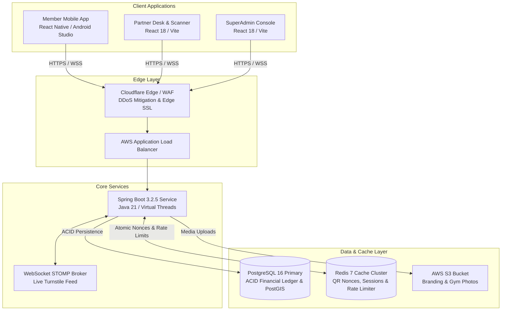

# 🏋️‍♂️ FitEmpire — Enterprise Omni-Channel Fitness Platform

[](https://www.oracle.com/java/)
[](https://spring.io/projects/spring-boot)
[](https://reactnative.dev/)
[](https://www.typescriptlang.org/)
[](https://www.postgresql.org/)
[](https://redis.io/)
[](https://www.docker.com/)
[](https://opensource.org/licenses/MIT)

FitEmpire is an omni-channel fitness aggregation marketplace, boutique gym operating system (B2B SaaS), and corporate wellness benefit platform designed for India's metro fitness ecosystems. It unifies retail members, boutique gym partners, and corporate enterprises through dynamic membership passes, optical turnstile access gates, and automated financial settlements.

---

## 📚 Core Architecture & Engineering Documentation

| Document | Description | Target Audience |
|---|---|---|
| 🏛️ [**`SYSTEM_DESIGN.md`**](SYSTEM_DESIGN.md) | **Master 16-Section FAANG-Grade Architecture Blueprint** (Capacity Math, PostgreSQL 16 DDL, Sequence Diagrams, Concurrency Locks, STRIDE Security, Resilience4j, SRE Metrics, and 14-Week Roadmap). | Staff / Principal Engineers, Architects, Backend Leads |
| 📱 [**`ANDROID_STUDIO_APP_GUIDE.md`**](ANDROID_STUDIO_APP_GUIDE.md) | **Native Android Compilation & Mobile Guide** (Gradle build configs, ProGuard rules, ABI splits, Expo SDK 51, and hardware camera scanner). | Mobile Engineers, Android Developers |
| 📋 [**`jira_issues_final_200.csv`**](jira_issues_final_200.csv) | **Production Jira Backlog (200 Issues)** formatted for 1-click Atlassian CSV import across Dev, Mobile, and DevOps teams. | Product Managers, Engineering Leads, Scrum Masters |

---

## 🌐 Live Production Deployments

| Subsystem Portal | Target Audience | Deployment Provider | Production URL |
|---|---|---|---|
| **API Gateway / Backend** | Core REST & WebSocket API | Hugging Face Spaces (Docker) | [`https://ayush150152-fitempire-api.hf.space/api/v1`](https://ayush150152-fitempire-api.hf.space/api/v1) |
| **SuperAdmin Backoffice** | Platform Operations & KYC | Netlify (Static CDN) | [`https://fitempire.netlify.app`](https://fitempire.netlify.app) |
| **Partner Turnstile Desk** | Gym Receptionists & Turnstiles | Netlify (Static CDN) | [`https://fitempirepartner.netlify.app`](https://fitempirepartner.netlify.app) |
| **Member Web Application** | Retail Gym Goers & Pass Holders | Netlify (Static CDN) | [`https://firmempireapp.netlify.app`](https://firmempireapp.netlify.app) |
| **Interactive Showcase** | Dual-Screen Simulator Mockup | Netlify (Static CDN) | [`https://firmempireapp-showcase.netlify.app`](https://firmempireapp-showcase.netlify.app) |

---

## 🏗️ System Architecture & Monorepo Structure

FitEmpire is organized as a unified monorepo separating client frontends, mobile runtimes, and core backend services:

```text
FitEmpire/
├── fitempire-backend/         # Java 21 / Spring Boot 3.2.5 REST API Service
├── fitempire-mobile/          # React Native / Expo SDK 51 / Android Studio Native Shell
├── fitempire-partner/         # React 18 / Vite / Tailwind Partner Reception Desk
├── fitempire-web/             # React 18 / Vite SuperAdmin Backoffice & Landing Page
├── fitempire-showcase/        # Dual-device live iframe interactive demonstration console
├── scripts/                   # AWS deployment scripts, CSV validators, and design generators
│   └── design_sections/       # 16 individual modular architecture specification chapters
├── SYSTEM_DESIGN.md           # Master compiled 2,300+ line technical architecture specification
├── ANDROID_STUDIO_APP_GUIDE.md# Native Android compilation and ProGuard reference manual
├── docker-compose.yml         # Container definitions for Backend, PostgreSQL, and Redis
└── start-all.bat              # 1-Click local development bootstrapper
```



---

## 🛠️ Technology Stack & Decisions

### 1. Core Backend (`fitempire-backend`)
* **Language & Runtime:** Java 21 LTS with **Project Loom Virtual Threads** (`spring.threads.virtual.enabled: true`) for high-concurrency, low-memory I/O.
* **Framework:** Spring Boot 3.2.5 (Spring Security, Spring Data JPA, Hibernate 6.4).
* **Database & ORM:** PostgreSQL 16 (hosted on **Neon Database** serverless connection pooler), HikariCP connection pool (`poolSize = 10`).
* **Caching & Nonces:** Redis 7 (Lettuce client) supporting dynamic 60-second turnstile single-use nonces via atomic `GETDEL`.
* **Payments:** Razorpay Java SDK with HMAC-SHA256 server-to-server webhook verification (`/v1/payments/webhook`).
* **Telecom & Messaging:** Twilio Programmable SMS API for real phone OTP delivery.
* **Resilience:** Resilience4j Circuit Breakers guarding outbound third-party HTTP integrations.

### 2. Mobile App (`fitempire-mobile`)
* **Framework:** React Native 0.74 with **Expo SDK 51** (TypeScript).
* **Native Android Runtime:** Android Studio Gradle (`compileSdkVersion 34`, `targetSdkVersion 34`, Hermes JavaScript Engine).
* **Hardware Integrations:**
  * `expo-brightness`: Instant screen brightness boost for high-contrast optical turnstile barcode readers.
  * `expo-camera`: Real-time QR scanner for front-desk reception tablets.
  * `expo-haptics`: Tactile haptic confirmation feedback on scan approval.
  * `expo-secure-store`: Hardware keystore encryption for long-lived refresh tokens.

### 3. Partner & Admin Frontends (`fitempire-partner` & `fitempire-web`)
* **Framework:** React 18, Vite 5, TypeScript.
* **Styling & Icons:** Tailwind CSS 3 with dark-mode palette tokens, Lucide React icons.
* **Real-Time Turnstiles:** STOMP protocol over SockJS WebSocket subscribing to `/topic/turnstile/{branchId}`.
* **Analytics Panels:** Recharts data visualization charts for footfall and occupancy tracking.

---

## 🚀 Quick Start — Local Development

### Prerequisites
* [Node.js](https://nodejs.org/) (v18 or v20 LTS)
* [Java JDK 21](https://www.oracle.com/java/technologies/downloads/)
* [Maven 3.9+](https://maven.apache.org/download.cgi)
* [Git](https://git-scm.com/)

---

### Step 1: Clone and Configure Environment

```bash
git clone https://github.com/ayushgupta9906/FitEmpire.git
cd FitEmpire
```

Create or verify the root `.env` file:

```env
# Database Configuration (PostgreSQL / Neon)
DB_HOST=your-neon-hostname.aws.neon.tech
DB_USER=your_db_username
DB_PASSWORD=your_neon_password
SPRING_DATASOURCE_URL=jdbc:postgresql://your-neon-hostname.aws.neon.tech:5432/neondb?sslmode=require

# Razorpay Payment Gateway
RAZORPAY_KEY_ID=rzp_test_your_key_id
RAZORPAY_KEY_SECRET=your_razorpay_secret
RAZORPAY_WEBHOOK_SECRET=your_webhook_secret

# Twilio SMS OTP Gateway
TWILIO_ACCOUNT_SID=your_twilio_account_sid
TWILIO_AUTH_TOKEN=your_twilio_auth_token
TWILIO_FROM_NUMBER=+1234567890

# JWT Security
JWT_SECRET=your_256_bit_secure_cryptographic_secret_key_here
```

---

### Step 2: 1-Click Service Bootstrapper

#### On Windows:
Double-click **`start-all.bat`** (or run via PowerShell):
```powershell
.\start-all.ps1
```

#### On Linux / macOS:
```bash
chmod +x start.sh
./start.sh
```

The script automatically terminates conflicting ports and launches:
| Service | Local URL | Port |
|---|---|:---:|
| **Spring Boot API** | `http://localhost:8080` | `8080` |
| **Admin Console** | `http://localhost:3000` | `3000` |
| **Partner Desk Portal**| `http://localhost:3001` | `3001` |
| **Expo Mobile Dev Server** | `http://localhost:8081` | `8081` |
| **Interactive Showcase** | `http://localhost:8082` | `8082` |

---

### Step 3: Run with Docker Compose (Alternative)

To spin up the entire backend, PostgreSQL, and Redis in isolated containers:

```bash
docker-compose up -d --build
```

Verify running containers:
```bash
docker-compose ps
```

---

## 📡 REST API Reference Summary

All API responses strictly implement the standardized JSON envelope:

```json
{
  "success": true,
  "data": { ... },
  "error": null,
  "meta": { "timestamp": "2026-09-08T11:45:00.000Z", "requestId": "req_123" }
}
```

### Core API Endpoints

| Method | Route | Description | Auth Required |
|---|---|---|:---:|
| `POST` | `/v1/auth/register` | Register retail member or corporate employee | No |
| `POST` | `/v1/auth/login` | Authenticate credentials; sets HttpOnly refresh cookie | No |
| `POST` | `/v1/auth/otp/send` | Dispatch 6-digit phone OTP via Twilio | No |
| `POST` | `/v1/auth/otp/verify` | Verify phone OTP and issue JWT access token | No |
| `GET` | `/v1/membership/qr-token` | Generate dynamic 60s rotating single-use QR pass | `ROLE_USER` |
| `POST` | `/v1/partner/check-in` | Optical turnstile barcode verification and gate relay | `ROLE_PARTNER_STAFF` |
| `POST` | `/v1/payments/create-order` | Register order with Razorpay and apply subsidies | `ROLE_USER` |
| `POST` | `/v1/payments/webhook` | Server-to-server Razorpay payment capture fulfillment | HMAC Signature |
| `POST` | `/v1/classes/{classId}/book` | Book class slot under pessimistic row lock (`SELECT FOR UPDATE`) | `ROLE_USER` |
| `GET` | `/v1/gyms/explore` | PostGIS spatial radius search with amenity filters | No |

*For complete request/response JSON schemas and error codes, refer to [**`SYSTEM_DESIGN.md` (Section 8)**](SYSTEM_DESIGN.md).*

---

## 🛡️ Security & Compliance Highlights

- **STRIDE Threat Modeling:** Comprehensive defenses against spoofing, tampering, repudiation, information disclosure, DoS, and privilege elevation.
- **PCI-DSS SAQ A Scope Reduction:** Zero raw credit/debit card numbers touch FitEmpire servers. All payment fields are tokenized directly via Razorpay PCI-certified client vault.
- **Anti-Replay Turnstiles:** Single-use cryptographic nonces auto-destruct in Redis via `GETDEL`, rendering screenshot sharing useless.
- **Indian DPDP Act 2023 & GDPR:** Data localization inside AWS Mumbai (`ap-south-1`), right-to-be-forgotten PII scrubbing, and purpose-limited permission prompts.

---

## 🤝 Project Tracking & Backlog (Jira)

The repository includes **200 production-ready Jira issues** organized across 4 release batches in [`jira_issues_final_200.csv`](jira_issues_final_200.csv):
* **Batch 1 (FE-1 to FE-60):** Security, Auth, Core API, and Payment Gateways.
* **Batch 2 (FE-61 to FE-120):** Hardware Turnstile Scanners, PostGIS Discovery, and Partner Desk.
* **Batch 3 (FE-121 to FE-180):** Mobile Native Performance, Dynamic QR Nonces, and Class Booking Concurrency.
* **Batch 4 (FE-181 to FE-240):** High Availability, Multi-AZ RDS Failover, SRE Metrics, and Corporate Enterprise SSO.

---

## 📄 License

FitEmpire is distributed under the **MIT License**. See the [`LICENSE`](LICENSE) file for complete details.
