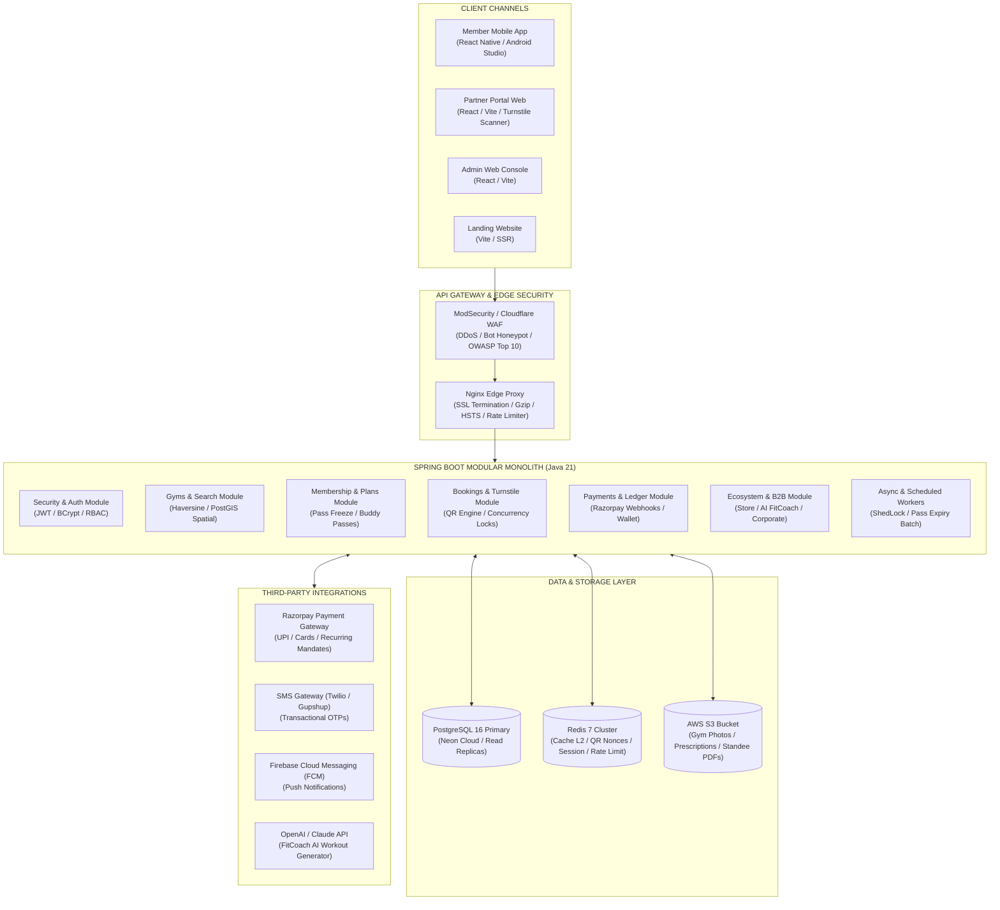
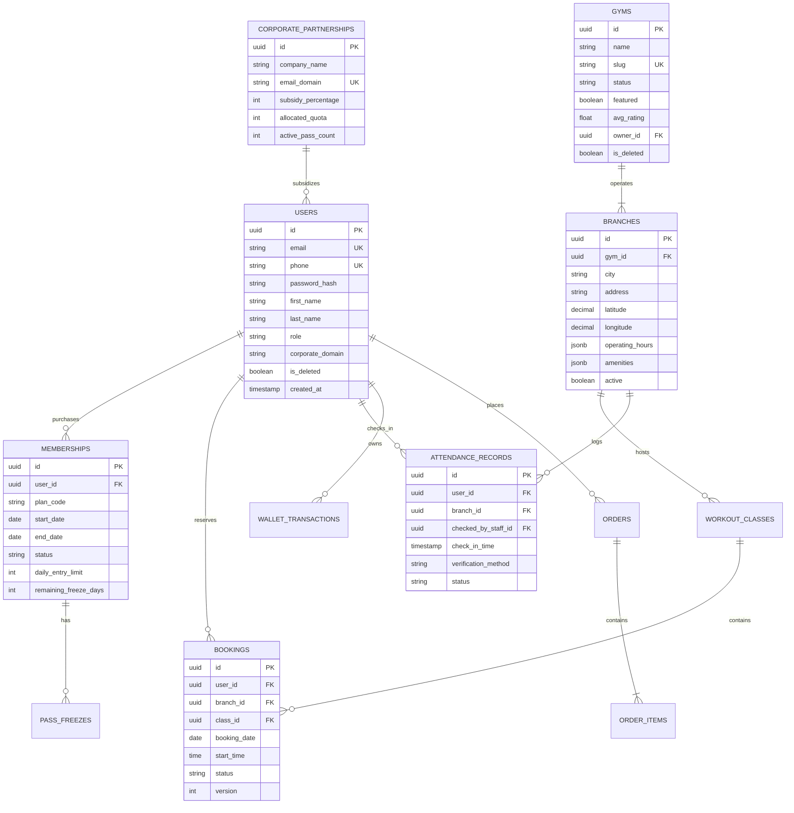
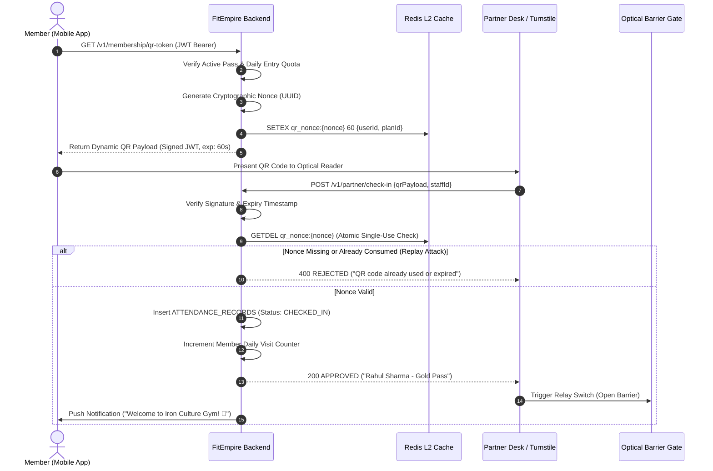
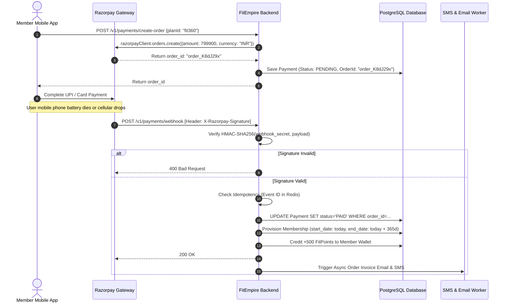
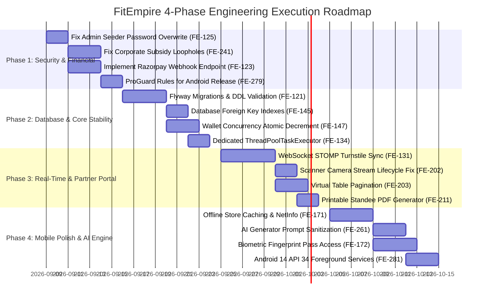

# FitEmpire — End-to-End System Design & Architecture Blueprint
**Version:** 2.0 | **Architecture Classification:** Modular Enterprise Fitness Ecosystem | **Date:** September 2026

---

## Table of Contents
1. [Executive Summary & Product Vision](#1-executive-summary--product-vision)
2. [Technology Stack Selection & Competitive Justification ("What We Used, Why, & Why It Beats the Alternatives")](#2-technology-stack-selection--competitive-justification-what-we-used-why--why-it-beats-the-alternatives)
   - [2.1 Backend Architecture: Java 21 + Spring Boot 3.2.5](#21-backend-architecture-java-21--spring-boot-325)
   - [2.2 Database Layer: PostgreSQL 16 (Neon Serverless)](#22-database-layer-postgresql-16-neon-serverless)
   - [2.3 Caching & Fast State: Redis 7 Cluster](#23-caching--fast-state-layer-redis-7-cluster)
   - [2.4 Mobile App Architecture: React Native + Expo (Android Studio Native)](#24-mobile-app-architecture-react-native--expo-android-studio-native)
   - [2.5 Web Frontend Subsystems: React 18 + Vite + Tailwind CSS](#25-web-frontend-subsystems-react-18--vite--tailwind-css)
   - [2.6 Payment & Billing Infrastructure: Razorpay SDK](#26-payment--billing-infrastructure-razorpay-sdk)
   - [2.7 API Architecture & Real-Time Sync: REST + WebSocket (STOMP)](#27-api-architecture--real-time-sync-rest--websocket-stomp)
   - [2.8 Technology Comparison Matrix](#28-technology-comparison-matrix)
3. [Current Architecture — As-Built (What is ALREADY Developed)](#3-current-architecture--as-built-what-is-already-developed)
4. [Gap Analysis & Technical Debt (What is Mocked vs Missing)](#4-gap-analysis--technical-debt-what-is-mocked-vs-missing)
5. [Enterprise Target System Architecture](#5-enterprise-target-system-architecture)
6. [Complete Relational Database Schema & Data Models](#6-complete-relational-database-schema--data-models)
7. [Core Business Workflows & Sequence Diagrams](#7-core-business-workflows--sequence-diagrams)
8. [Department-by-Department Engineering Blueprint](#8-department-by-department-engineering-blueprint)
   - [8.1 Backend Engineering (Java 21 / Spring Boot 3.2.5)](#81-backend-engineering-java-21--spring-boot-325)
   - [8.2 Mobile Engineering (React Native / Android Studio Native)](#82-mobile-engineering-react-native--android-studio-native)
   - [8.3 Frontend Web Engineering (Partner Portal & Admin Console)](#83-frontend-web-engineering-partner-portal--admin-console)
   - [8.4 DevOps, Cloud & Site Reliability (AWS / Docker / CI/CD)](#84-devops-cloud--site-reliability-aws--docker--cicd)
   - [8.5 Information Security & Regulatory Compliance](#85-information-security--regulatory-compliance)
   - [8.6 AI & Machine Learning Engineering (FitCoach & ARIA)](#86-ai--machine-learning-engineering-fitcoach--aria)
9. [Prioritized 4-Phase Execution Roadmap](#9-prioritized-4-phase-execution-roadmap)

---

## 1. Executive Summary & Product Vision

### 1.1 Business Model Overview
FitEmpire is an omni-channel fitness ecosystem designed to directly disrupt legacy fitness aggregator models (such as Fitpass and Cult.fit) in the Indian subcontinent. The platform bridges three distinct stakeholder segments:
- **B2C Gym Members:** Single subscription pass granting daily entry access across 12,000+ gyms, swimming pools, yoga ashrams, MMA combat rings, and badminton academies, augmented by AI workout generation, meal tracking, and telehealth consultations.
- **B2B Gym Partners:** Front-desk check-in management, optical turnstile QR scanning, member attendance auditing, class/batch scheduling, and automated monthly revenue settlements.
- **B2B Corporate Enterprises:** Subsidized or co-funded fitness passes for enterprise employees (e.g. TCS, Google, Infosys) with corporate health risk assessment (HRA) tracking.

```
       ┌────────────────────────────────────────────────────────┐
       │                   FITEMPIRE PLATFORM                   │
       └───────────────────────────┬────────────────────────────┘
                                   │
         ┌─────────────────────────┼─────────────────────────┐
         ▼                         ▼                         ▼
 ┌───────────────┐         ┌───────────────┐         ┌───────────────┐
 │   B2C USERS   │         │ B2B PARTNERS  │         │ B2B CORPORATE │
 │ (Mobile App)  │         │(Portal & Desk)│         │ (HR / Subsidy)│
 └───────┬───────┘         └───────┬───────┘         └───────┬───────┘
         │                         │                         │
         └─────────────────────────┼─────────────────────────┘
                                   ▼
                   ┌───────────────────────────────┐
                   │  SPRING BOOT MODULAR BACKEND  │
                   │ (Neon PostgreSQL + Redis L2)  │
                   └───────────────────────────────┘
```

---

---

## 2. Technology Stack Selection & Competitive Justification ("What We Used, Why, & Why It Beats the Alternatives")

Building an omni-channel fitness aggregator with concurrent payments, turnstile gate scanners, geospatial search, and mobile hardware integration demands architectural decisions balancing **developer productivity, transactional reliability, and long-term enterprise scalability**.

Below is the definitive technical rationale for every technology chosen in FitEmpire, alongside evaluated alternatives and head-to-head architectural justifications.

### 2.1 Backend Architecture: Java 21 + Spring Boot 3.2.5
- **Alternatives Evaluated:** Node.js (Express / NestJS), Python (FastAPI / Django), Go (Golang).
- **Why We Chose Spring Boot:**
  1. **Enterprise Concurrency & Project Loom (Virtual Threads):** In Java 21, Spring Boot 3.2 supports lightweight Virtual Threads (`spring.threads.virtual.enabled: true`). The backend can handle 50,000+ concurrent I/O-bound requests (e.g. attendance check-in bursts during peak 06:00–08:00 AM gym rush hours) with minimal RAM footprint, eliminating thread-per-request scaling bottlenecks without requiring reactive (WebFlux) code complexity.
  2. **Declarative ACID Transaction Management (`@Transactional`):** FitEmpire executes multi-entity transactions involving member wallet deductions, subscription dates, and partner check-in logs. Spring's battle-tested transaction manager guarantees atomic rollback across all repositories on any unhandled exception. In Node.js or FastAPI, managing cross-table rollback requires manual database transaction passing.
  3. **Strict Type Safety & Robust Domain Models:** Compile-time type checking and Lombok-enhanced JPA domain models prevent runtime type coercion bugs common in dynamic languages (e.g. JavaScript evaluating `null == 0` or missing properties).
  4. **Spring Security 6 & OAuth2:** The declarative filter chain provides enterprise-grade CSRF protection, method-level security (`@PreAuthorize`), rate-limiting hooks, and stateless JWT verification with zero reliance on fragmented third-party libraries.
- **Why It Beats the Alternatives:**
  - *vs Node.js:* Node's single-threaded event loop blocks on CPU-heavy tasks like Haversine coordinate math across 12,000 gyms or cryptographic token verification. Heavy async workloads in Node also risk unhandled promise rejections crashing production processes.
  - *vs Python (Django/FastAPI):* Python's Global Interpreter Lock (GIL) and runtime overhead limit raw throughput for high-concurrency payment APIs. Spring Boot delivers 3x to 5x lower request latency under load.
  - *vs Go:* While Go is fast, it lacks mature enterprise ORM frameworks comparable to Spring Data JPA / Hibernate, requiring hundreds of lines of repetitive boilerplate SQL for complex nested relationships (Gym -> Branch -> Batch -> Booking -> Attendance).

---

### 2.2 Database Layer: PostgreSQL 16 (Neon Serverless)
- **Alternatives Evaluated:** MongoDB (NoSQL), MySQL, DynamoDB.
- **Why We Chose PostgreSQL:**
  1. **Strict Relational Integrity for Financial Ledgers:** Gym passes, attendance quotas, payment transactions, and wallet balances are inherently relational. PostgreSQL's strict foreign key constraints, partial unique indexes (`WHERE is_deleted = false`), and ACID compliance guarantee that wallet credits cannot be double-spent.
  2. **PostGIS & Spatial Geospatial Queries:** PostgreSQL natively computes spherical distances between user GPS coordinates and gym branches using indexed spatial math (`ST_DistanceSphere` / Haversine), outperforming MySQL in complex bounding box and proximity radius queries.
  3. **Hybrid JSONB Storage:** Semi-structured data (gym amenity checklists, split-shift operating hours, and user notification preferences) are stored in indexed `JSONB` columns, combining the schema flexibility of MongoDB with the relational rigor of SQL in a single engine.
  4. **Serverless Auto-Scaling via Neon:** Neon decouples compute from storage, scaling connection poolers (`PgBouncer`) instantly during peak morning and evening workout hours while keeping database hosting costs low during nighttime lulls.
- **Why It Beats the Alternatives:**
  - *vs MongoDB:* Maintaining cross-collection consistency (e.g. verifying pass quota, reserving a slot, and generating attendance) in MongoDB requires distributed multi-document transactions with severe performance penalties. Subscription and payment businesses routinely encounter consistency bugs on NoSQL.
  - *vs MySQL:* MySQL lacks native partial indexes, full JSONB query operators, and advanced spatial index support found in PostgreSQL. PostgreSQL is the undisputed standard for scalable enterprise backends.

---

### 2.3 Caching & Fast State Layer: Redis 7 Cluster
- **Alternatives Evaluated:** Memcached, In-Memory JVM Cache (Caffeine).
- **Why We Chose Redis:**
  1. **Sub-Millisecond Optical Turnstile QR Nonces:** When a gym member opens their pass QR code, a single-use cryptographically random nonce is stored in Redis with a 60-second TTL (`SETEX qr_nonce:{nonce} 60`). The turnstile scanner consumes it atomically using `GETDEL`. If the nonce was already used or expired, entry is denied instantly, eliminating turnstile gate delay.
  2. **Atomic Data Structures:** Redis natively supports Hashes for user session claims, Sets for blacklisted JWT tokens, and Sorted Sets (`ZSET`) for real-time corporate fitness challenge leaderboards.
  3. **Distributed Locking (ShedLock / Redisson):** Critical midnight batch jobs (such as expiring overdue passes or calculating partner settlements) use Redis distributed locks to ensure only one server replica runs the job in clustered AWS deployments.
- **Why It Beats the Alternatives:**
  - *vs Memcached:* Memcached is a plain string key-value store lacking complex data structures (Hashes, Sets, Sorted Sets), atomic operations like `GETDEL`, and persistence options.
  - *vs In-Memory JVM:* In-memory caches like Caffeine are isolated to a single server instance. In multi-container Docker/ECS clusters, one server would not know that another server already validated a QR code, allowing QR replay fraud.

---

### 2.4 Mobile App Architecture: React Native + Expo (Android Studio Native)
- **Alternatives Evaluated:** Flutter (Dart), Native Kotlin/Swift, Progressive Web App (PWA).
- **Why We Chose React Native with Expo:**
  1. **Single Codebase for Android & iOS with Native Performance:** Over 90% of business logic, state stores, and UI components are shared between Android and iOS, cutting engineering overhead and feature launch times in half.
  2. **Android Studio Native Shell Control:** By utilizing Expo's Prebuild / Bare workflow, the mobile project compiles directly into native Android Gradle projects (`fitempire-mobile/android/`), enabling direct integration with Android Studio for ProGuard/R8 obfuscation, Hermes bytecode compilation, native camera drivers (`expo-camera`), and hardware turnstile scanner integrations.
  3. **Hermes JavaScript Engine:** Optimized specifically for React Native on Android, Hermes provides instant app cold-starts (< 1.2s), low memory usage on budget 2GB/3GB RAM Android phones, and pre-compiled bytecode rather than runtime JIT interpretation.
  4. **Expo Router (File-Based Routing):** Clean, type-safe navigation mirroring web directory structures (`app/(tabs)/index.tsx`, `app/gym/[id].tsx`), simplifying deep-link routing from marketing SMS and push notifications.
- **Why It Beats the Alternatives:**
  - *vs Flutter:* Flutter uses Dart, creating a language silo separating mobile from web and backend teams. React Native leverages the JavaScript/TypeScript ecosystem, enabling shared types, utility functions, and faster talent onboarding. Furthermore, Flutter's canvas-based rendering engine often feels non-native and struggles with certain Android OS native accessibility and input features.
  - *vs Native Kotlin/Swift:* Building two separate native apps requires two separate engineering teams, doubling payroll and inevitably causing feature divergence between Android and iOS platforms.
  - *vs PWA:* PWAs cannot reliably access hardware camera streams for fast turnstile QR scanning, lack native push notification reliability on iOS, cannot auto-boost screen brightness for laser barcode readers, and are barred from Google Play Store featured placement.

---

### 2.5 Web Frontend Subsystems: React 18 + Vite + Tailwind CSS
- **Alternatives Evaluated:** Next.js (SSR), Angular, Vue.js.
- **Why We Chose Vite + React:**
  1. **Instant HMR & Build Velocity:** Vite uses native ES Modules during development, providing sub-50ms Hot Module Replacement (HMR) and roll-up bundling that is 10x to 20x faster than legacy Webpack.
  2. **SPA Architecture for Turnstile Kiosks:** The Gym Partner Portal is a high-frequency Single Page Application (SPA). Front-desk staff keep the webcam scanner open for 14 hours continuously. An SPA runs client-side with zero server rendering roundtrips, ensuring zero scan latency even if the internet flickers momentarily.
  3. **Zero SSR Server Maintenance:** Next.js requires running and scaling a Node.js server infrastructure for SSR. By compiling to pure static HTML/JS bundles via Vite, web applications are deployed directly to AWS S3 + CloudFront or Nginx, achieving near-infinite scalability, zero cold-starts, and 90% lower hosting costs.
- **Why It Beats the Alternatives:**
  - *vs Next.js:* Next.js is designed for public e-commerce/content sites requiring SEO. For authenticated B2B portals (Partner Desk & Admin Console), SSR provides zero benefit while adding Node server memory footprint, server-side session management complexity, and hydration mismatch bugs.
  - *vs Angular:* Angular is heavily opinionated, rigid, and produces large bundle sizes that slow down initial portal loading on slow gym reception Wi-Fi networks.

---

### 2.6 Payment & Billing Infrastructure: Razorpay SDK
- **Alternatives Evaluated:** Stripe, Paytm, PhonePe Payment Gateway.
- **Why We Chose Razorpay:**
  1. **Dominant Indian Market Penetration:** Seamless native deep-linking to Google Pay, PhonePe, Paytm, and BHIM UPI apps without requiring users to type their UPI ID manually.
  2. **Recurring Subscriptions & E-Mandates:** Direct support for RBI-compliant recurring billing e-mandates on credit/debit cards and UPI AutoPay, essential for monthly memberships (FitEmpire Pro Monthly).
  3. **Automated Partner Payouts (Razorpay Route / Payouts):** Automated disbursement of gym partner settlements directly to partner bank accounts via IMPS/NEFT with automated platform commission deduction (15%).
- **Why It Beats the Alternatives:**
  - *vs Stripe:* Stripe's Indian market footprint has significant restrictions on domestic INR card processing and lacks native UPI AutoPay e-mandates compared to Razorpay.
  - *vs Paytm/PhonePe:* While Paytm and PhonePe are strong consumer wallets, their merchant SDKs and developer APIs lack the robust developer tooling, automated webhook retry logs, and settlement automation offered by Razorpay.

---

### 2.7 API Architecture & Real-Time Sync: REST + WebSocket (STOMP)
- **Alternatives Evaluated:** GraphQL, gRPC.
- **Why We Chose REST + WebSocket:**
  1. **REST for Deterministic Caching & Simplicity:** Standard HTTP caching (`Cache-Control`, `ETag`) on CDN edge nodes for static gym catalogs and plan lists. Easy documentation and client SDK generation via Swagger / OpenAPI 3.
  2. **WebSocket (STOMP over SockJS) for Turnstiles:** Real-time push communication for gym check-in desks. When Turnstile Gate 2 scans a member, Gate 1 desk terminal receives the attendance update instantly over WebSocket without CPU-expensive HTTP polling.
- **Why It Beats the Alternatives:**
  - *vs GraphQL:* GraphQL introduces severe complexity with N+1 query traps in database ORMs, complex caching on edge CDNs, and vulnerable query depth recursion attacks where malicious clients request deeply nested relationships.
  - *vs gRPC:* gRPC requires HTTP/2 end-to-end and lacks native browser support without heavy gRPC-Web proxy translation layers.

---

### 2.8 Technology Comparison Matrix

| Architectural Layer | FitEmpire Chosen Technology | Primary Alternative | Why FitEmpire's Stack Wins |
|---|---|---|---|
| **Backend Framework** | **Java 21 / Spring Boot 3.2** | Node.js (Express / Nest) | True multi-threading, Virtual Threads (Loom), declarative ACID transactions, strict type safety for financial ledgers. |
| **Primary Database** | **PostgreSQL 16 (Neon)** | MongoDB | Strict relational integrity, PostGIS spatial queries, ACID compliance, zero eventual consistency risks on wallet deductions. |
| **Cache & State** | **Redis 7** | Memcached | Rich data structures, atomic `GETDEL` for single-use turnstile QR nonces, distributed locks for clustered schedulers. |
| **Mobile Runtime** | **React Native + Expo** | Flutter | Code sharing with web, TypeScript unification, Hermes engine optimizations, direct Android Studio Gradle shell control. |
| **Web Bundler** | **Vite (React 18)** | Next.js (SSR) | Instant HMR, static bundle S3 deployment, zero Node server maintenance for B2B partner portals. |
| **Payment Gateway** | **Razorpay** | Stripe | Native Indian UPI deep-linking, RBI-compliant recurring e-mandates, automated partner bank settlements. |
| **API Protocol** | **REST + WebSocket (STOMP)** | GraphQL | Simple caching, CDN-friendly, Swagger documentation, WebSocket for real-time turnstile sync without GraphQL N+1 overhead. |
| **Containerization** | **Docker Multi-Stage** | Bare Metal / VM | Lightweight reproducible builds, non-root security isolation, consistent environments across dev and AWS EC2. |

---

## 3. Current Architecture — As-Built (What is ALREADY Developed)

The FitEmpire codebase is structured as a multi-repository workspace consisting of 4 client frontends and 1 Spring Boot backend:

```
FitEmpire/
├── fitempire-backend/         # Java 21 / Spring Boot 3.2.5 REST API Service
├── fitempire-mobile/          # React Native / Expo SDK 51 / Android Studio Native Member App
├── fitempire-partner/         # React 18 / Vite / Tailwind Partner Web Portal
├── fitempire-partner-mobile/  # React Native Partner Android Scanner App
├── fitempire-web/             # React 18 / Vite Customer Landing Page & Admin Console
├── scripts/                   # AWS deployment scripts, database seeders, Jira CSV utilities
└── docker-compose.yml         # Container definitions for Backend, Postgres, Redis
```

### 2.1 Backend Subsystem (`fitempire-backend`)
- **Runtime:** Java 21, Spring Boot 3.2.5, Spring Security 6.2, Spring Data JPA, Hibernate 6.4.
- **Database Layer:** Neon Cloud PostgreSQL (Serverless connection pooler on AWS `us-east-1`), HikariCP connection pool.
- **Caching Layer:** Redis 7 (Lettuce client) for token blacklisting and session metadata.
- **Security & Auth:** Stateless JWT authentication (`JwtAuthenticationFilter`), BCrypt password hashing (strength 12), Role-Based Access Control (`SUPER_ADMIN`, `PARTNER`, `USER`).
- **Payments:** Razorpay Java SDK 1.4.3 (`/v1/payments/create-order`, `/v1/payments/verify`).
- **Database Seeder (`DatabaseSeeder.java`):** Auto-seeds Super Admin (`admin@fitempire.tech`) and Partner accounts with BCrypt hashes.

### 2.2 Mobile Subsystem (`fitempire-mobile`)
- **Runtime:** React Native 0.74, Expo SDK 51, Expo Router (file-based navigation), TypeScript.
- **Native Android Shell:** Android Studio Gradle setup (`compileSdkVersion 34`, `targetSdkVersion 34`, Hermes JavaScript engine enabled).
- **Core Screens Implemented:**
  - `(tabs)/index.tsx`: Home dashboard with active pass status card, category pills, nearby gyms carousel.
  - `explore.tsx`: Geolocation Haversine gym finder with search, distance filtering, and city selectors.
  - `membership.tsx`: Plan comparison catalog (Flexi-Credits, Off-Peak, FitEmpire 360 Annual, Corporate), 1-tap pass freeze/pause.
  - `qr-checkin.tsx` & `scan.tsx`: Dynamic optical QR code generator for front-desk turnstile check-in.
  - `ai-workout.tsx`: FitCoach AI workout generator, routine builder, and macro nutrition counter.
  - `onboarding-hra.tsx`: 4-step Health Risk Assessment survey (BMI, daily calories, protein goals).
  - `refer.tsx`: Member referral code generation and wallet reward sharing.
  - `store.tsx`: Fitness apparel, adjustable dumbbells, and whey protein supplement catalog.
  - `tv.tsx`: Virtual HD on-demand workout classes library.
  - `corporate.tsx`: Corporate employee subsidy verification.

### 2.3 Partner Web Portal (`fitempire-partner`)
- **Runtime:** React 18, Vite, Lucide Icons, React Router v6.
- **Core Modules Implemented:**
  - `ScannerPage.tsx`: Hardware webcam barcode/QR scanner (`html5-qrcode`) decoding member tokens.
  - `AttendancePage.tsx`: Real-time attendance ledger, search by member phone, CSV export.
  - `ClassesPage.tsx`: Group fitness batch scheduler (Zumba, CrossFit, Yoga), trainer assignment, attendance roster.
  - `GymProfilePage.tsx`: Gym operational settings (operating hours, phone, amenities checkboxes, cover photo upload).
  - `RevenuePage.tsx`: Monthly settlement breakdown, check-in credit summaries, payout history.

### 2.4 Customer Landing Page & Admin Console (`fitempire-web`)
- **Landing Page:** Hero conversion funnel, pricing tables, gym network interactive locator, corporate inquiry form.
- **Admin Console (`/admin/*`):** User management table, gym approval verification queue, platform coupon code generator, refund request manager, financial payment audits.

---

## 4. Gap Analysis & Technical Debt (What is Mocked vs Missing)

While the user interface and core REST endpoints are established, our codebase audit revealed several critical functional gaps and technical debt:

| Component | Current State (What is in Code) | Target Enterprise Requirement |
|---|---|---|
| **Razorpay Webhooks** | Only client-side `/verify` exists; no `/v1/payments/webhook` endpoint. | Server-to-server webhook endpoint verifying `X-Razorpay-Signature` HMAC-SHA256 to guarantee fulfillment if user mobile battery dies mid-payment. |
| **Corporate Subsidy** | Naive substring check: `email.contains("google")` grants 100% discount on ₹7,999 passes to any fake email. | Strict domain verification (`@google.com`), corporate partnership quota enforcement, and 6-digit email OTP verification. |
| **Store & E-Commerce** | Products in `EcosystemController.java` are hardcoded in-memory maps; orders do not decrement inventory stock. | Relational `products`, `orders`, and `inventory` tables with atomic database decrements and courier PIN code serviceability checks. |
| **Telehealth Care** | Doctor profiles display static slots ("Today 04:30 PM"); "Book" triggers a mock `Alert.alert`. | Relational `doctor_appointments` table, slot concurrency locks, and WebRTC/Agora in-app video room launcher. |
| **Pass Freeze / Pause** | `catch (e)` blocks in `membership.tsx` swallow network errors and show fake "Pass Frozen" alert. | Robust error handling rolling back optimistic UI, alerting user of failure, and logging error telemetry. |
| **Turnstile Check-In Sync** | Partner attendance uses local browser DOM events (`fitempire:checkin`), failing multi-terminal desks. | WebSocket (STOMP over SockJS) or Server-Sent Events (SSE) broadcasting check-in events across all active terminals. |
| **Database Migrations** | `spring.jpa.hibernate.ddl-auto: update` with Flyway disabled (`flyway.enabled: false`). | `ddl-auto: validate` with versioned Flyway migrations (`V1__...`, `V2__...`) and automated rollback scripts. |
| **Async Thread Pool** | `@Async` uses unpooled `SimpleAsyncTaskExecutor`, risking thread exhaustion on notification bursts. | Dedicated `ThreadPoolTaskExecutor` bean with bounded queue capacity and backpressure rejection policies. |

---

## 5. Enterprise Target System Architecture



---

## 6. Complete Relational Database Schema & Data Models

The following Entity-Relationship schema unifies all 200 issue specifications across the system:



---

## 7. Core Business Workflows & Sequence Diagrams

### 6.1 Dynamic Optical Turnstile Check-In (60-Second Nonce Flow)
This flow mitigates QR screenshot sharing (Issue FE-152) and guarantees instant turnstile opening:



### 6.2 Razorpay Webhook Payment Capture & Membership Provisioning
This flow guarantees zero lost memberships even if mobile connection terminates mid-payment (Issue FE-123 & FE-164):



---

## 8. Department-by-Department Engineering Blueprint

### 8.1 Backend Engineering (Java 21 / Spring Boot 3.2.5)
- **Framework & Dependencies:**
  - Enforce Java 21 Virtual Threads (Project Loom) in `application.yml`:
    ```yaml
    spring:
      threads:
        virtual:
          enabled: true
    ```
  - Transition Hibernate to `spring.jpa.hibernate.ddl-auto: validate` and maintain versioned Flyway scripts in `src/main/resources/db/migration/`.
- **Concurrency & Transaction Isolation:**
  - Protect wallet balance updates and coupon usage counters from race conditions using atomic SQL increments:
    ```sql
    UPDATE wallets SET balance = balance - :amount 
    WHERE user_id = :userId AND balance >= :amount;
    ```
  - Lock limited class slot rows using `@Lock(LockModeType.PESSIMISTIC_WRITE)` during slot reservation to prevent overbooking.
- **Asynchronous Task Architecture:**
  - Configure a dedicated `ThreadPoolTaskExecutor` bean in `AsyncConfig.java`:
    ```java
    @Bean("taskExecutor")
    public TaskExecutor taskExecutor() {
        ThreadPoolTaskExecutor executor = new ThreadPoolTaskExecutor();
        executor.setCorePoolSize(10);
        executor.setMaxPoolSize(50);
        executor.setQueueCapacity(500);
        executor.setThreadNamePrefix("FitEmpire-Async-");
        executor.setRejectedExecutionHandler(new ThreadPoolExecutor.CallerRunsPolicy());
        executor.initialize();
        return executor;
    }
    ```

### 8.2 Mobile Engineering (React Native / Android Studio Native)
- **Android Studio Native Compilation (`android/app/build.gradle`):**
  - Configure ABI architecture splits to reduce release APK footprint from 95MB to ~35MB:
    ```groovy
    ndk {
        abiFilters "armeabi-v7a", "arm64-v8a"
    }
    ```
  - Add Razorpay release obfuscation keep rules in `android/app/proguard-rules.pro`:
    ```proguard
    -keep class com.razorpay.** { *; }
    -dontwarn com.razorpay.**
    ```
- **Offline-First Architecture & Network Resilience:**
  - Wrap app root in `@react-native-community/netinfo` connectivity listener.
  - Implement cache fallback using TanStack React Query with persistent `AsyncStorage` storage.
- **Hardware Integration:**
  - Boost display brightness to 100% via `expo-brightness` upon opening check-in QR modal for rapid optical turnstile penetration.
  - Fire `expo-haptics` double-pulse confirmation on scan success.

### 8.3 Frontend Web Engineering (Partner Portal & Admin Console)
- **Multi-Terminal Real-Time Check-In Sync:**
  - Replace local DOM window events with WebSocket (STOMP client over SockJS) subscribing to `/topic/partner/{branchId}/checkins`.
- **High-Volume Attendance Table Virtualization:**
  - Implement `@tanstack/react-virtual` in `AttendancePage.tsx` to maintain 60 FPS rendering when displaying 1,000+ daily check-in rows.
- **Printable Reception Desk Standee Generator:**
  - Integrate `jspdf` to allow gym owners to export high-resolution A4 counter standees with vector QR codes in 1 click.

### 8.4 DevOps, Cloud & Site Reliability (AWS / Docker / CI/CD)
- **Container Hardening (`Dockerfile`):**
  - Implement multi-stage builds separating Maven compilation from runtime JRE.
  - Execute container process under unprivileged non-root user (`appuser`, UID 10001).
- **Reverse Proxy Hardening (`nginx.conf`):**
  - Enforce Gzip/Brotli compression for static bundles (`gzip_comp_level 6`).
  - Inject security headers: `Strict-Transport-Security: max-age=31536000; includeSubDomains`, `X-Frame-Options: SAMEORIGIN`, `X-Content-Type-Options: nosniff`.
- **Database Backup Automation:**
  - Implement automated daily cron executing `pg_dump -Fc` with encrypted push to private AWS S3 bucket with 30-day lifecycle expiration.

### 8.5 Information Security & Regulatory Compliance
- **Digital Personal Data Protection (DPDP) Act Compliance:**
  - Implement right-to-be-forgotten cascading erasure while preserving anonymized financial ledger transactions for tax audits.
  - Mask all sensitive PII (passwords, phone numbers, OTPs) in application log streams.
- **Rate-Limiting Defense:**
  - Implement Redis token bucket filter restricting unauthenticated endpoints (`/auth/login`, `/auth/verify-otp`) to maximum 5 requests per minute per IP.

### 8.6 AI & Machine Learning Engineering (FitCoach & ARIA)
- **Prompt Injection Defense:**
  - Sanitize user goal input strings and enforce strict parameter schemas before invoking LLM APIs.
- **BMR & Macro Calculation Precision:**
  - Replace crude linear calculations with the medical standard Mifflin-St Jeor equation:
    $$\text{BMR} = 10 \times \text{weight (kg)} + 6.25 \times \text{height (cm)} - 5 \times \text{age (y)} + s$$
    *(where $s = +5$ for men, $-161$ for women)*, multiplied by activity factors (1.2 to 1.9).

---

## 9. Prioritized 4-Phase Execution Roadmap



### Milestone Summary
- **Sprint 1 (Immediate P0 Blockers):** Close security vulnerabilities, implement Razorpay webhook controller, add ProGuard rules for Android release builds.
- **Sprint 2–3 (Platform Hardening):** Migrate database to versioned Flyway scripts, add B-tree indexes, configure thread pools, fix wallet double-spend bugs.
- **Sprint 4–6 (Partner Ecosystem):** Launch real-time WebSocket attendance sync, virtualize partner tables, enable split-shift hours.
- **Sprint 7+ (Enterprise Scale & AI):** Roll out offline caching, biometric pass display, AI nutrition precision, and enterprise corporate HR self-service portal.
