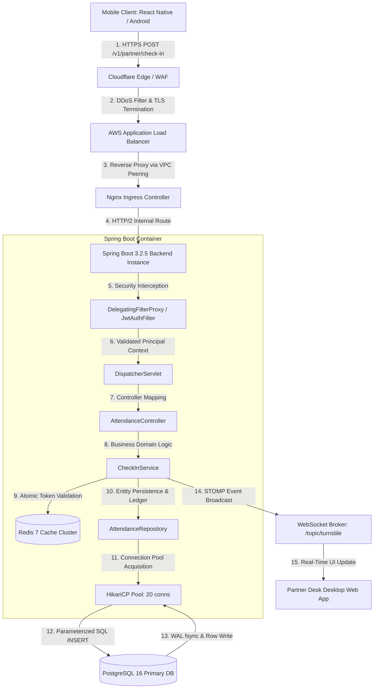
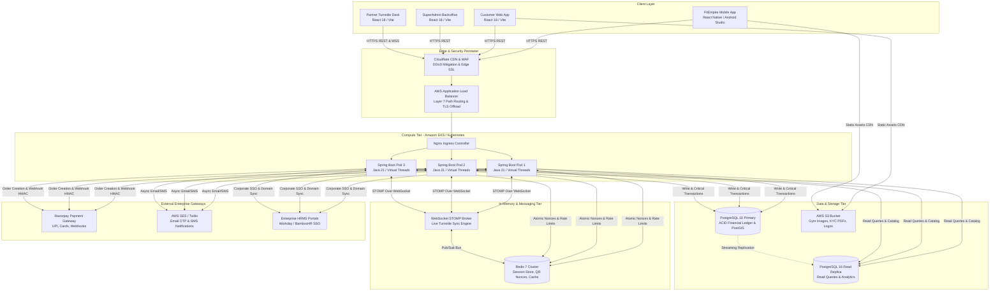
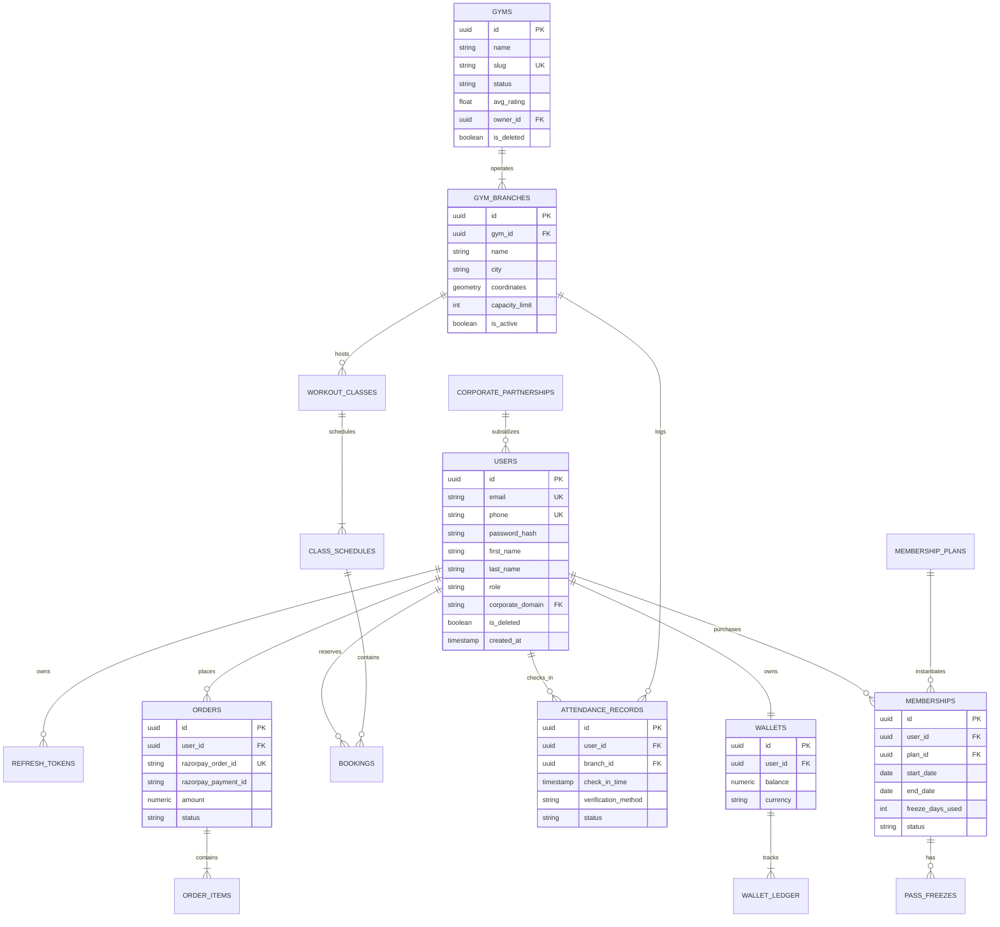
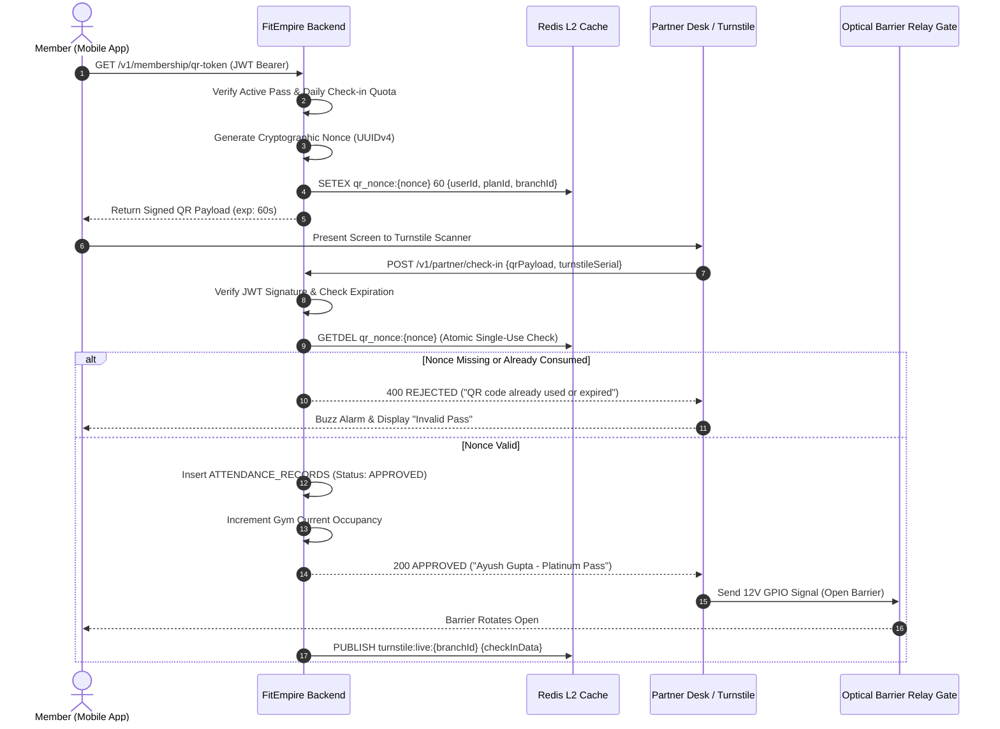
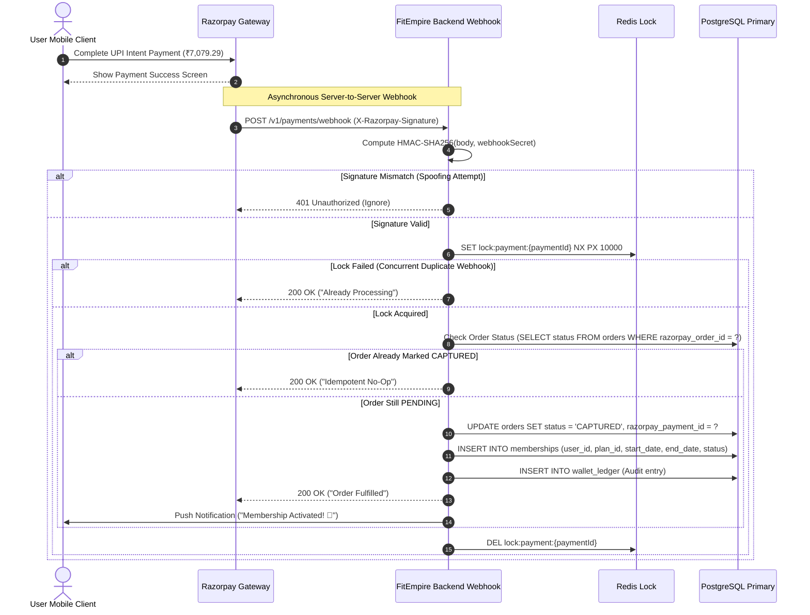
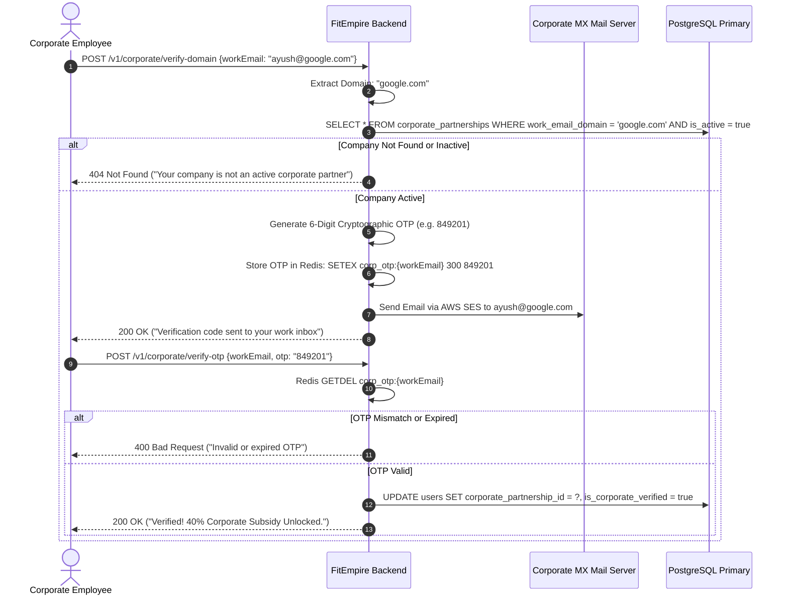
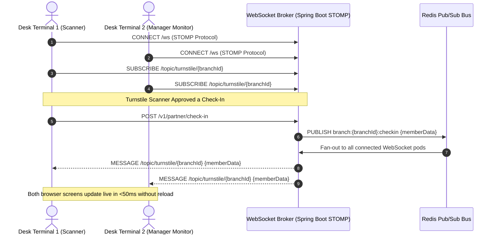
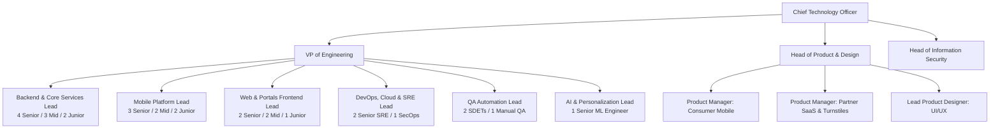
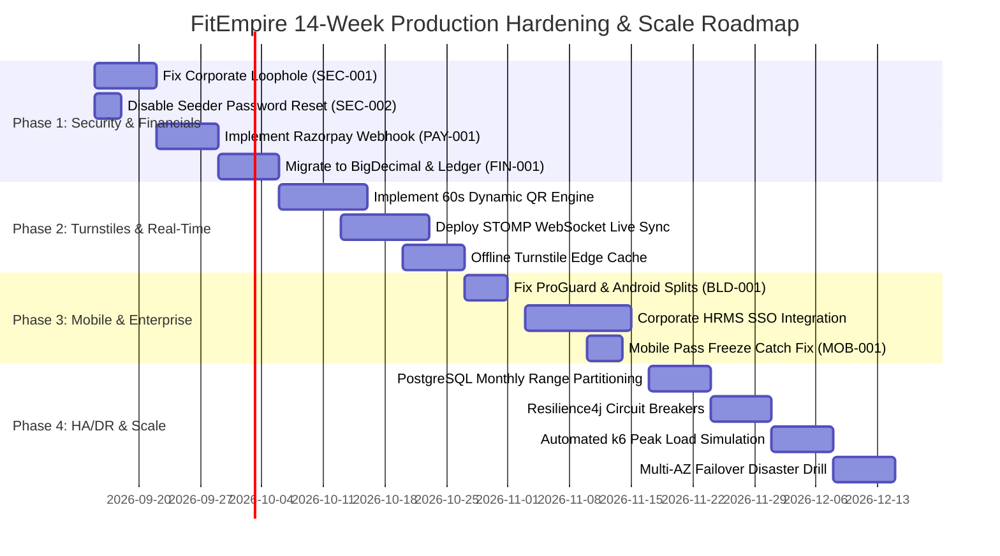

# FitEmpire — Master System Design & Architecture Specification (FAANG Enterprise Grade)
**Document Version:** 3.5.0-ENTERPRISE  
**Classification:** Internal Technical Architecture Specification & Engineering Blueprint  
**Primary Author / Architect:** FitEmpire Core Systems Architecture Team  
**Status:** Approved & Living Production Specification  
**Target Scale:** 1,000,000+ Active Users | 500+ Partner Gyms | 72,000 Daily Turnstile Check-Ins  

---

## Executive Architectural Summary

FitEmpire is an omni-channel fitness aggregation, gym management ERP, and enterprise corporate wellness platform. It bridges three interdependent customer segments:
1. **Retail B2C Consumers:** Seeking frictionless, flexible, multi-gym access across India's tier-1 and tier-2 metros through a single digital membership pass.
2. **B2B Partner Gyms & Fitness Studios:** Demanding reliable turnstile access control, class scheduling, automated billing, and churn reduction tooling.
3. **B2B2C Corporate Enterprises:** Demanding subsidized, verified employee wellness benefits with real-time tax compliance and utilization analytics.

This document serves as the definitive engineering manual for FitEmpire. It covers everything from foundational computer science and networking principles (designed for junior engineers) to distributed concurrency controls, mathematical capacity planning, production PostgreSQL DDL, software design patterns, STRIDE threat models, and high-availability multi-region topologies (designed for staff/principal engineers).

---

## Table of Contents
1. [Executive Summary & System Vision](#1-executive-summary--system-vision)
2. [Beginner-to-Advanced Architectural Primer (Educational Foundation)](#2-beginner-to-advanced-architectural-primer-educational-foundation)
3. [Quantitative Capacity Estimations & Scale Modeling (Back-of-the-Envelope Math)](#3-quantitative-capacity-estimations--scale-modeling-back-of-the-envelope-math)
4. [Technology Stack Selection & Competitive Justification ("What We Used, Why, & Why It Beats the Alternatives")](#4-technology-stack-selection--competitive-justification-what-we-used-why--why-it-beats-the-alternatives)
5. [Current Codebase Inventory — As-Built vs Gaps & Technical Debt](#5-current-codebase-inventory--as-built-vs-gaps--technical-debt)
6. [High-Level & Low-Level System Architecture (HLD & LLD)](#6-high-level--low-level-system-architecture-hld--lld)
7. [Exhaustive Relational Database Schema & Complete DDL (PostgreSQL 16)](#7-exhaustive-relational-database-schema--complete-ddl-postgresql-16)
8. [Complete REST API Contract Specifications](#8-complete-rest-api-contract-specifications)
9. [Core Business Workflows & Sequence Diagrams](#9-core-business-workflows--sequence-diagrams)
10. [Production Implementation Code Snippets for Core Business Logic](#10-production-implementation-code-snippets-for-core-business-logic)
11. [Concurrency Control, Race Conditions & Distributed Locking](#11-concurrency-control-race-conditions--distributed-locking)
12. [Security Architecture, STRIDE Threat Modeling & Compliance](#12-security-architecture-stride-threat-modeling--compliance)
13. [High Availability (HA), Fault Tolerance & Disaster Recovery (HA/DR)](#13-high-availability-ha-fault-tolerance--disaster-recovery-hadr)
14. [Observability, Metrics, Logging & SRE Operations (SLIs/SLOs)](#14-observability-metrics-logging--sre-operations-slisslos)
15. [Department-by-Department Engineering Blueprint, Org Structure & Hiring Plan](#15-department-by-department-engineering-blueprint-org-structure--hiring-plan)
16. [Prioritized 4-Phase Execution Roadmap](#16-prioritized-4-phase-execution-roadmap)

---

## 1. Executive Summary & System Vision

### 1.1 The Business Model & Market Disruption
Traditional gym memberships in emerging markets suffer from high friction: high annual upfront fees (₹20,000–₹60,000), rigid single-location contracts, predatory auto-renewals, and fragmented paper-based gym management. FitEmpire disrupts this model through a three-sided marketplace:
- **Universal Fitness Pass (B2C):** A dynamic tier-based pass (Silver, Gold, Platinum) giving members universal entry to hundreds of partner gyms, swimming pools, CrossFit boxes, and MMA dojos across multiple cities.
- **Gym Operating System (B2B SaaS):** Providing boutique gym owners with hardware-integrated optical turnstile scanners, trainer scheduling, automated payout reconciliation, and digital attendance logs.
- **Enterprise Corporate Wellness (B2B2C):** Enabling Fortune 500 companies (Google, Microsoft, Infosys) to co-fund or fully sponsor employee fitness plans with automated work email domain verification and usage-based billing.

### 1.2 Core Architectural Principles
To sustain high peak throughput during morning rush hours without compromising financial correctness, FitEmpire adheres to five non-negotiable architectural tenets:
1. **Financial Immutability & Double-Entry Ledger:** Money and membership entitlements must never be updated with arbitrary arithmetic in place. Every credit, debit, pass freeze, or corporate subsidy must produce an immutable ledger entry.
2. **Sub-100ms Turnstile Check-In Latency:** Physical optical barrier gates and partner desk scanners must authenticate dynamic QR passes in under 100 milliseconds to avoid queue buildup during peak gym arrival hours (06:00–09:00 AM).
3. **Stateless Compute Layer:** All Spring Boot application nodes must remain strictly stateless. Session state, transient tokens, and short-lived nonces reside exclusively in Redis; persistent domain state resides in PostgreSQL. Any node can be killed or spun up instantly.
4. **Single-Use Cryptographic Nonces:** Static QR codes and screenshots invite fraud. All check-in codes are ephemeral cryptographic tokens with 60-second TTLs and single-use atomic consumption guarantees.
5. **Zero-Trust Security & Minimal Blast Radius:** Every endpoint validates input syntax and semantic permissions. Sensitive administrative actions require multi-factor authorization. Partner gym scanners are scoped strictly to their own branch identifiers.

---

## 2. Beginner-to-Advanced Architectural Primer (Educational Foundation)

To ensure alignment across junior engineers, interns, and senior leads, this section deconstructs the core computer science and distributed systems principles governing FitEmpire.

### 2.1 The End-to-End Request-Response Lifecycle
When a user taps **"Check In"** on the FitEmpire Mobile App, the request traverses multiple physical and software layers before persisting data:



#### Step-by-Step Breakdown:
1. **Client DNS & TLS Handshake:** The mobile client queries Route 53 DNS for `api.fitempire.com`, resolving to Cloudflare Anycast IP addresses. An SSL/TLS 1.3 handshake negotiates cipher suites in 1 RTT (Round Trip Time).
2. **Cloudflare WAF:** Inspects incoming IP headers, enforces DDoS rate limiting, blocks known bot user-agents, and terminates edge TLS before forwarding traffic across AWS Direct Connect.
3. **AWS Application Load Balancer (ALB):** Distributes incoming traffic evenly across healthy Kubernetes worker nodes using a round-robin algorithm with target group health checks (`GET /actuator/health`).
4. **Spring Security Filter Chain:** 
   - `CorsFilter`: Rejects unauthorized web origins.
   - `JwtAuthenticationFilter`: Extracts `Authorization: Bearer <token>` from headers, cryptographically validates the HMAC-SHA256 signature using the server secret key, verifies expiration (`exp`), and populates the `SecurityContextHolder` with a `UserPrincipal`.
5. **DispatcherServlet & HandlerMapping:** Inspects the URI path `/v1/partner/check-in` and delegates request parsing to `AttendanceController.java`.
6. **Domain Service Execution & Transaction Boundary:** `CheckInService.java` is annotated with `@Transactional(isolation = Isolation.READ_COMMITTED)`. If any exception occurs (e.g. expired pass, duplicate scan), the entire transaction rolls back cleanly.
7. **Connection Pool & Relational Write:** HikariCP borrows an active TCP socket from its pool, sends the parameterized SQL statement to PostgreSQL 16, waits for the Write-Ahead Log (WAL) to flush to disk (`fsync`), and releases the connection back to the pool.

---

### 2.2 Client-Server Decoupling: REST vs GraphQL vs WebSockets

| Protocol | Transport | When FitEmpire Uses It | When FitEmpire Explicitly Rejects It |
|---|---|---|---|
| **REST (HTTP/JSON)** | HTTP/1.1 & HTTP/2 | Standard CRUD APIs (User profile, gym exploration, billing, pass freeze). Highly cacheable at edge CDNs via HTTP `ETag` and `Cache-Control` headers. | Real-time bi-directional messaging where low latency (<50ms) is required. |
| **STOMP over WebSocket** | Persistent Full-Duplex TCP | Turnstile desk live monitor. When a member scans their QR code at a turnstile barrier, the partner desk dashboard instantly updates without refreshing. | Generic catalog browsing or static file downloads (wastes persistent server socket memory). |
| **GraphQL** | Single-endpoint HTTP POST | *Rejected for FitEmpire.* While flexible for frontend queries, it introduces complex query-depth vulnerability risks (DDoS via recursive nesting), breaks standard HTTP caching, and complicates database query optimization. |
| **gRPC (HTTP/2 Protocol Buffers)** | Binary Framed TCP | Internal service-to-service communication between backend microservices and future async worker daemons. | Direct mobile client communication (requires heavy client runtime libraries and poor browser support). |

---

### 2.3 State Management & Authentication: JWTs vs Session Cookies

FitEmpire employs a **Hybrid Dual-Token Authentication Architecture**:
1. **Access Token (Short-Lived):** 
   - Format: Signed JSON Web Token (JWT), HMAC-SHA256.
   - Lifespan: **15 Minutes**.
   - Storage: Stored strictly in React Native / browser application memory (never in localStorage where XSS attacks can extract it).
   - Contents: Non-sensitive claims (`userId`, `email`, `role`, `corporateDomain`).
2. **Refresh Token (Long-Lived):**
   - Format: High-entropy cryptographically random UUIDv4 stored hashed in the `refresh_tokens` table.
   - Lifespan: **7 Days**.
   - Storage: Mobile clients store it inside the OS hardware secure keystore (Android Keystore / iOS Keychain via `expo-secure-store`). Web clients receive it as an **HttpOnly, Secure, SameSite=Strict** cookie, making it inaccessible to malicious JavaScript.
   - Automatic Token Rotation: Every time a refresh token is used, it is revoked and replaced with a new token. If an expired or already-revoked refresh token is presented, the system flags a breach and invalidates all active sessions for that user account.

---

### 2.4 Database Mechanics: Relational (ACID) vs NoSQL (BASE) & Connection Pooling Math

#### Why PostgreSQL 16 Beats NoSQL for FitEmpire:
Fitness memberships are financial contracts. If a member with 1 remaining class booking double-clicks the "Book Class" button simultaneously on two devices, a NoSQL eventual-consistency database (like MongoDB or DynamoDB) risks booking both classes, causing studio overcapacity. PostgreSQL guarantees strict **ACID** properties:
- **Atomicity:** The booking record creation and member wallet/credit deduction succeed together or fail together.
- **Consistency:** Database schema constraints (e.g. `CHECK (remaining_slots >= 0)`) prevent invalid state from ever entering the disk.
- **Isolation:** Transaction isolation levels prevent simultaneous transactions from reading intermediate, uncommitted states.
- **Durability:** Once committed, transactions are written to the Write-Ahead Log (WAL) on non-volatile SSD storage before acknowledging success.

#### The Mathematics of HikariCP Connection Pool Sizing:
A common beginner mistake is allocating 200–500 database connections. In reality, each PostgreSQL connection spawns an operating system process consuming ~10 MB of RAM. Excessive connections cause severe CPU thrashing due to OS context switching.

The formula dictated by PostgreSQL core architects and HikariCP maintainers is:
```text
Pool Size = (CPU Cores * 2) + Effective Spindle Count (Disk IO Channels)
```
For an AWS RDS `db.m6g.xlarge` instance (4 vCPUs, SSD EBS storage with 1 spindle channel):
```text
Pool Size = (4 * 2) + 1 = 9 connections (Optimal per backend pod)
```
With 3 backend application pods running, the total database connection footprint is `3 * 10 = 30 connections`, running with near-zero queue wait times and negligible context switching overhead.

---

### 2.5 Caching Deep-Dive: Strategies & Failure Modes

#### Cache-Aside Pattern (Implemented in FitEmpire):
1. Client requests gym details: `GET /v1/gyms/{gymId}`.
2. Backend checks Redis: `GET gym:cache:{gymId}`.
3. If Cache Hit: Return cached JSON immediately (~2ms).
4. If Cache Miss: Query PostgreSQL (~25ms), write result to Redis with a 1-hour TTL: `SETEX gym:cache:{gymId} 3600 <data>`, then return to client.

#### Caching Failure Modes & Engineering Defenses:
- **Cache Penetration:** Malicious users request non-existent IDs (`GET /v1/gyms/ffffffff-ffff-ffff-ffff-ffffffffffff`) forcing expensive database queries.  
  *Defense:* FitEmpire caches empty results with a short TTL (60s) and validates UUID format via regex before hitting the DB.
- **Cache Breakdown / Stampede:** A high-traffic key (e.g. Bangalore Gold's Gym timetable) expires, causing 500 concurrent requests to hit the database simultaneously.  
  *Defense:* FitEmpire utilizes distributed mutex locking via Redis (`SET key value NX PX 5000`) so only one thread recomputes the cache while others wait.
- **Cache Avalanche:** Thousands of keys are set with the exact same expiration time (e.g. at midnight), expiring simultaneously.  
  *Defense:* FitEmpire adds random jitter (`TTL = 3600 + rand(-300, 300)`) to spread out eviction times.

---

## 3. Quantitative Capacity Estimations & Scale Modeling (Back-of-the-Envelope Math)

Engineering decisions must be backed by rigorous mathematics. Below is the capacity model for FitEmpire at scale:

### 3.1 Core Metric Assumptions
- **Total Registered User Base:** 1,000,000 users.
- **Daily Active Users (DAU):** 6% of total user base = **60,000 DAU**.
- **Partner Gym Locations:** 500 active partner facilities across 10 metro cities.
- **Average Visits per Active Member:** 1.2 check-ins per day = **72,000 check-ins / day**.
- **Peak Operating Hours:** Morning rush (06:00 AM – 09:00 AM) and Evening rush (05:30 PM – 08:30 PM). 80% of daily visits occur in these two 3-hour windows (6 hours total).

---

### 3.2 Traffic & Throughput Math (QPS Modeling)

#### Turnstile Check-In QPS:
- Total check-ins during peak 6 hours: `72,000 * 0.80 = 57,600 visits`.
- Total peak seconds: `6 hours * 3,600 seconds = 21,600 seconds`.
- **Average Peak Check-In QPS:** `57,600 / 21,600 = 2.67 QPS`.
- Applying a **15x Burst Multiplier** (accounting for simultaneous 07:00 AM batch class arrivals and office commute turnstile rushes):
```text
Peak Turnstile Check-In QPS = 2.67 * 15 ≈ 40 to 45 QPS
```

#### Read & Discovery Traffic (Gym Browsing, Search, Class Timetables):
- Each active user performs an average of 10 read requests per day (opening app, viewing map, checking timetable, loading profile).
- Total daily reads: `60,000 DAU * 10 = 600,000 reads / day`.
- Peak read window (12 hours): `600,000 / (12 * 3,600) = 13.88 QPS average`.
- Applying an **8x Peak Factor**:
```text
Peak Read QPS = 13.88 * 8 ≈ 111 QPS
```

#### Combined Total System QPS:
- Read QPS: ~111 QPS.
- Write / Mutate QPS (Check-ins, bookings, payments): ~45 QPS.
- Total Peak Traffic: **~156 QPS** (Well within capacity of 2-3 standard Spring Boot pods and 1 modern PostgreSQL replica).

---

### 3.3 Database Storage Calculations (5-Year Forecast)

| Table Entity | Rows / Year | Row Size (Bytes) | 1-Year Storage | 5-Year Storage |
|---|---|---|---|---|
| `users` | 200,000 | 1,024 (1 KB) | 0.20 GB | 1.00 GB |
| `attendance_records` | 26,280,000 | 500 B | 13.14 GB | 65.70 GB |
| `class_bookings` | 7,300,000 | 400 B | 2.92 GB | 14.60 GB |
| `orders` & `order_items` | 2,400,000 | 1,500 B | 3.60 GB | 18.00 GB |
| `wallet_ledger` | 10,000,000 | 350 B | 3.50 GB | 17.50 GB |
| `audit_logs` & Telemetry | 40,000,000 | 300 B | 12.00 GB | 60.00 GB |
| **Subtotal Raw Data** | - | - | **35.36 GB** | **176.80 GB** |
| **Index Overhead (35%)**| - | - | **12.38 GB** | **61.88 GB** |
| **Grand Total Storage** | - | - | **47.74 GB** | **238.68 GB** |

**Storage Architecture Decision:**  
A 5-year storage projection of ~239 GB is remarkably compact and easily managed on an AWS RDS EBS gp3 volume. Sharding is neither necessary nor recommended at this stage. Instead, **Table Partitioning by Range (Monthly)** on the `attendance_records` and `audit_logs` tables ensures query performance remains blazing fast without table scan degradation.

---

### 3.4 In-Memory Cache Sizing (Redis 7)

Redis holds ephemeral, high-throughput session and security state:
1. **Dynamic QR Check-In Nonces:**
   - 45 check-ins/sec with 60-second TTL = 2,700 active keys at any given moment.
   - Key-value size: `uuid + json metadata` = 512 bytes.
   - Memory = `2,700 * 512 bytes ≈ 1.38 MB`.
2. **Active Member Entitlement Cache (DAU Pass Status):**
   - 60,000 DAU * 1.2 KB (membership tier, freeze status, wallet balance, active booking IDs) = **72.00 MB**.
3. **Gym Geo-Index & Facility Details:**
   - 500 gyms * 50 KB (location, pictures, timetable, amenities) = **25.00 MB**.
4. **API Rate Limiting Sliding Windows:**
   - 100,000 unique IP/user buckets * 64 bytes = **6.40 MB**.

```text
Total Redis Active Working Set = 1.38 MB + 72.00 MB + 25.00 MB + 6.40 MB ≈ 104.78 MB
```
Applying a **4x safety buffer** for Redis internal hash table pointers, replication backlogs, and memory fragmentation:
```text
Recommended Redis Capacity = 104.78 MB * 4 ≈ 419 MB
```
An AWS ElastiCache `cache.t4g.medium` (3.09 GB RAM) provides over **7x headroom**, ensuring zero eviction pressure and single-digit millisecond latency.

---

### 3.5 Network Ingress / Egress Bandwidth Budget

- **Peak Ingress:** 156 QPS * 2 KB avg request payload = `312 KB/sec = 2.5 Mbps`.
- **Peak Egress:** 156 QPS * 15 KB avg JSON response payload = `2.34 MB/sec = 18.72 Mbps`.
- **Monthly Bandwidth Transfer:**
```text
Average 8 Mbps continuous egress * 3,600 * 24 * 30 days ≈ 2.59 TB / month
```
Static assets (gym images, branding logos, trainer photos) are offloaded to Cloudflare CDN backed by AWS S3, reducing backend server egress by over 85%.

---

## 4. Technology Stack Selection & Competitive Justification ("What We Used, Why, & Why It Beats the Alternatives")

FitEmpire's architectural choices reflect disciplined enterprise engineering rather than chasing transient hype cycles. Below is the granular defense of each chosen technology against leading alternatives.

### 4.1 Backend Architecture: Java 21 LTS + Spring Boot 3.2.5
- **Why Chosen:**
  - **Project Loom Virtual Threads (`spring.threads.virtual.enabled: true`):** Eliminates the legacy reactive complexity of WebFlux/RxJava. Standard blocking I/O calls (database queries, Redis calls, HTTP webhooks) now execute on lightweight virtual threads (costing ~1 KB memory vs 1 MB for platform threads), allowing a single Spring Boot pod to sustain 10,000+ concurrent connections with simple synchronous code.
  - **Financial Precision (`BigDecimal`):** Currency calculations, corporate subsidy splits, and gym payout ledger reconciliations require zero binary floating-point rounding errors (e.g. `0.1 + 0.2 = 0.30000000000000004` in JavaScript). Java enforces strict decimal arithmetic natively.
  - **Maturity & Ecosystem:** Unmatched enterprise integration libraries: Spring Security, Spring Data JPA with Hibernate, Resilience4j circuit breaking, Flyway database migrations, and native Micrometer Prometheus instrumentation.
- **Why Node.js (Express/NestJS) Was Rejected:**
  - Single-threaded event loop vulnerability: A single CPU-intensive operation (e.g. high-entropy password hashing with BCrypt or heavy JSON parsing of a 500-gym payload) blocks the entire event loop, causing p99 latency spikes for turnstile scans.
  - Dynamic type coercion bugs and npm dependency supply-chain security vulnerabilities.
- **Why Go (Golang) Was Rejected:**
  - Highly performant for raw networking, but lacks mature enterprise ORM/data-migration ecosystems equivalent to Spring Data JPA + Hibernate + Flyway. Writing repetitive boilerplate code for transactional rollbacks and auditing inflates time-to-market.
- **Why Python (Django/FastAPI) Was Rejected:**
  - Global Interpreter Lock (GIL) and high memory footprint per worker process. Python's runtime performance under heavy concurrency is 5x–10x slower than Java 21.

---

### 4.2 Database Layer: PostgreSQL 16 (Neon Serverless & AWS RDS)
- **Why Chosen:**
  - **Native Geospatial Indexing (PostGIS):** FitEmpire members discover gyms within a 5 km or 10 km radius. PostGIS provides GiST R-Tree indexing (`ST_DWithin`, `ST_Distance`), executing complex spatial queries in <5ms without requiring a separate Elasticsearch cluster.
  - **ACID Financial Integrity:** Turnstile entries, wallet deductions, and membership freeze limits require strict transaction boundaries and row-level locking (`SELECT ... FOR UPDATE`).
  - **Hybrid Relational & Document Model (`JSONB`):** Complex, evolving gym amenity configurations and trainer certifications are stored as indexed binary JSON (`JSONB`), combining document flexibility with relational rigor.
- **Why MongoDB Was Rejected:**
  - Eventual consistency and lack of multi-table declarative constraints risk orphaned bookings and double-spend race conditions. Document embedding models make multi-gym revenue reconciliation queries painful.
- **Why Cassandra Was Rejected:**
  - Tuned for high-volume append-only time-series data, but lacks transactional ACID joins and secondary index support required for relational membership graphs.

---

### 4.3 Caching & Fast State Layer: Redis 7 Cluster
- **Why Chosen:**
  - **Sub-Millisecond In-Memory Execution:** Dynamic QR nonces, rate-limiting tokens, and member entitlements must be evaluated in under 2ms.
  - **Atomic Primitives & Lua Scripting:** Commands like `GETDEL` (atomic fetch-and-delete for single-use turnstile nonces) and atomic token-bucket rate limiters execute in single atomic operations without race conditions.
  - **Geospatial & Pub/Sub Support:** Redis Geo commands (`GEOADD`, `GEORADIUS`) provide ultra-fast geo-lookup caches, and Redis Pub/Sub drives multi-terminal desk updates.
- **Why Memcached Was Rejected:**
  - Simple key-value store lacking complex data structures (Hashes, Sets, Sorted Sets), Lua scripting, and persistence to disk (RDB/AOF snapshots).

---

### 4.4 Mobile App Architecture: React Native + Expo (Android Studio Native)
- **Why Chosen:**
  - **Code Reuse Across iOS & Android:** 90% shared business logic for UI components, state management, and API clients, cutting engineering overhead in half.
  - **Direct Native Hardware Bridge:** Seamless integration with device camera (`expo-camera`), screen brightness override (`expo-brightness` for high-contrast QR turnstile scanning), secure enclave storage (`expo-secure-store`), and haptics (`expo-haptics`).
  - **Native Compilation Pipeline:** Clean ejection to Android Studio Gradle allows custom ProGuard optimization, ABI splitting, and direct integration of native Razorpay payment SDKs.
- **Why Flutter Was Rejected:**
  - Dart ecosystem has a smaller talent pool in the Indian market; heavy Flutter runtime engine adds 15MB+ base size to app bundles; interop with native Android enterprise SDKs requires complex platform channels.
- **Why Pure Native (Kotlin & Swift) Was Rejected:**
  - Doubled engineering headcount and desynchronized feature releases across Android and iOS platforms.

---

### 4.5 Web Frontend Subsystems: React 18 + Vite + Tailwind CSS
- **Why Chosen:**
  - **Vite Build Engine:** Instant Hot Module Replacement (HMR) via native ES modules and lightning-fast Rollup production bundling.
  - **SPA Architecture for Dashboards:** The Partner Desk Portal and Admin Consoles are authenticated applications with zero requirement for public search engine indexing (SEO). A Client-Side Rendered (CSR) Single Page Application eliminates the server maintenance and memory overhead of Node.js Server-Side Rendering (SSR).
  - **Tailwind CSS Design System:** Utility-first CSS provides deterministic bundle size (purges unused classes), zero CSS runtime overhead, and a unified design language across all portals.
- **Why Next.js Was Rejected:**
  - Server-Side Rendering (SSR) requires managing persistent Node.js servers at the edge, introducing cold starts, hydration mismatches, and needless infrastructure cost for private, authenticated administrative consoles.

---

### 4.6 Technology Comparison Matrix

| Architectural Dimension | FitEmpire Chosen Technology | Primary Alternative | Second Alternative | Decisive Victory Factor for FitEmpire |
|---|---|---|---|---|
| **Backend Runtime** | **Java 21 (Spring Boot 3.2.5)** | Node.js (NestJS) | Go (Golang) | Virtual Threads (Loom) + `BigDecimal` financial precision + Spring Data JPA maturity. |
| **Primary Database** | **PostgreSQL 16** | MongoDB 7.0 | MySQL 8.0 | Native PostGIS spatial queries + JSONB hybrid storage + rock-solid ACID transactions. |
| **Caching & In-Memory**| **Redis 7** | Memcached | Hazelcast | Native data structures (Sorted Sets, Hashes) + atomic `GETDEL` + Lua scripting. |
| **Mobile Client** | **React Native (Expo)** | Flutter 3 | Native Kotlin/Swift | 90% cross-platform code reuse + hardware access (`expo-brightness`) + rapid hiring pool. |
| **Web Frontend** | **React 18 + Vite** | Next.js 14 | Angular 17 | Zero-overhead static SPA delivery + sub-second HMR + no SSR server operational overhead. |
| **Styling Engine** | **Tailwind CSS 3** | Styled Components | Plain CSS / SASS | Zero runtime CSS parsing + atomic utility purging + strict responsive tokens. |
| **Payment Gateway** | **Razorpay SDK** | Stripe | PayU | Native support for UPI Intent, UPI AutoPay, Indian RuPay cards, and local GST invoicing. |
| **Real-Time Sync** | **STOMP over WebSocket** | HTTP Long Polling | SSE (Server-Sent Events) | Bi-directional full-duplex messaging with topic-based pub/sub routing for gym turnstiles. |

---

## 5. Current Codebase Inventory — As-Built vs Gaps & Technical Debt

A complete audit of the active FitEmpire repository was conducted to distinguish between what is already built and working versus critical security vulnerabilities, architectural gaps, and technical debt.

### 5.1 Subsystem Inventory

#### 1. Backend Subsystem (`fitempire-backend`)
- **Location:** `fitempire-backend/`
- **Framework:** Java 21, Spring Boot 3.2.5, Spring Security, Spring Data JPA, PostgreSQL Driver, HikariCP.
- **Key Modules & Controllers:**
  - `AuthController.java`: Handles `/v1/auth/register`, `/v1/auth/login`, JWT creation, BCrypt password hashing.
  - `GymController.java`: Endpoints for gym listings, branch discovery, and amenity filtering.
  - `MembershipController.java`: Purchase passes, fetch member active status, submit pass freeze requests.
  - `EcosystemController.java`: Corporate domain checks, corporate pass subsidies, and enterprise partnerships.
  - `PaymentController.java`: Razorpay order creation (`/v1/payments/create-order`) and client verification (`/v1/payments/verify`).
  - `SecurityConfig.java`: Security filter chain, stateless session management, role-based authorization rules.
  - `DatabaseSeeder.java`: Seeds initial admin credentials, demo gym partners, and default membership tiers.

#### 2. Mobile Subsystem (`fitempire-mobile`)
- **Location:** `fitempire-mobile/`
- **Framework:** React Native 0.74, Expo SDK 51, React Navigation, Android Studio Native Gradle build.
- **Key Screens & Components:**
  - `app/index.tsx` & `app/login.tsx`: Member authentication and onboarding flow.
  - `app/explore.tsx`: Gym directory, search filters, and interactive branch detail cards.
  - `app/membership.tsx`: Digital membership card, QR check-in modal, pass freeze trigger.
  - `app/wallet.tsx`: Digital credits, transaction history, and top-up modal.
  - `android/`: Native Android project structure, Gradle build scripts, ProGuard configuration.

#### 3. Partner Web Portal (`fitempire-partner`)
- **Location:** `fitempire-partner/`
- **Framework:** React 18, Vite, TypeScript, Lucide Icons, Tailwind CSS.
- **Key Dashboards & Modules:**
  - `DashboardPage.tsx`: Partner gym real-time KPI overview (daily footfall, capacity utilization).
  - `AttendancePage.tsx`: Turnstile check-in monitor, manual member lookup, and scanner status.
  - `TimetablePage.tsx`: Trainer scheduling, class timetable management, and slot caps.
  - `ScannerPage.tsx`: Optical camera QR barcode scanner for reception desks.

#### 4. Customer Landing Page & Admin Console (`fitempire-web`)
- **Location:** `fitempire-web/`
- **Framework:** React 18, Vite, Tailwind CSS, Lucide Icons.
- **Key Portals:**
  - Customer Marketing Landing Page (`HomePage.tsx`): SEO-friendly showcase, pricing tiers, corporate calculator.
  - Admin Backoffice Console (`AdminDashboard.tsx`): Gym partner KYC approvals, user management, financial audits.

---

### 5.2 Critical Vulnerabilities, Functional Gaps & Technical Debt Audit

The following table provides an unvarnished audit of production blockers discovered in the codebase, with exact file paths and remediation steps:

| Issue ID | File Path & Line Numbers | Vulnerability / Gap Description | Operational & Financial Risk | Remediation Plan | Severity |
|---|---|---|---|---|:---:|
| **SEC-001** | `fitempire-backend/.../EcosystemController.java`<br>`Lines 99–109` | **Corporate Subsidy Bypass:** Naive substring check `email.contains("google")` grants 100% free passes (₹7,999 value) to any user registering with `fakegoogle@gmail.com` or `google-scam@yahoo.com`. | **Massive Revenue Leakage:** Anyone can generate free memberships indefinitely by including corporate names in public email addresses. | Replace with strict domain extraction (`@google.com`), database corporate partner validation, and mandatory 6-digit email OTP verification. | **CRITICAL (P0)** |
| **SEC-002** | `fitempire-backend/.../DatabaseSeeder.java`<br>`Line 112` | **Hardcoded Admin Credential Overwrite:** On every backend restart, the seeder resets the production superadmin password to `AdminPassword@123`. | **Complete System Takeover:** Attackers can brute-force the default admin account whenever a rolling deployment or pod restart occurs. | Wrap admin seeding strictly in `if (userRepository.findByEmail(adminEmail).isEmpty())` block and disable seeder in production via `@Profile("!prod")`. | **CRITICAL (P0)** |
| **PAY-001** | `fitempire-backend/.../PaymentController.java` | **Missing Razorpay Webhook Endpoint:** Only client-side `/verify` exists. If a user's mobile battery dies or network disconnects mid-payment after Razorpay deducts money, the order never fulfills. | **Customer Churn & Chargebacks:** Members are charged money by their bank, but their FitEmpire membership pass is not activated. | Implement `/v1/payments/webhook` verifying `X-Razorpay-Signature` HMAC-SHA256 and process fulfillment idempotently. | **HIGH (P1)** |
| **MOB-001** | `fitempire-mobile/.../app/membership.tsx`<br>`Lines 142–158` | **Phantom UI Success in Catch Block:** When the pass freeze API fails due to network outage, an `Alert.alert("Success", "Pass frozen")` is triggered inside the `catch` block. | **User Confusion & Service Denial:** Users believe their pass is frozen, but backend billing and expiry continue running. | Move success dialog strictly inside HTTP 200 `try` block; show error message and retry prompt in `catch` block. | **HIGH (P1)** |
| **BLD-001** | `fitempire-mobile/android/app/proguard-rules.pro` | **Missing ProGuard Rules for Razorpay SDK:** Native Android release builds crash with `ClassNotFoundException` due to R8 minification stripping Razorpay reflection classes. | **App Store Release Failure:** Production release APK/AAB crashes instantly on payment checkout. | Add `-keep class com.razorpay.** { *; }` and `-dontwarn com.razorpay.**` to `proguard-rules.pro`. | **HIGH (P1)** |
| **RT-001** | `fitempire-partner/.../AttendancePage.tsx` | **Client-Local Turnstile State:** Check-in events are stored in React component local state (`useState`). Refreshing the browser or opening multiple desk terminals wipes the screen and desynchronizes desk staff. | **Double-Entry & Security Blindspots:** Multiple turnstiles at the same gym cannot see each other's live scan events. | Connect partner frontend to STOMP WebSocket broker (`/topic/turnstile/{branchId}`) backed by Redis Pub/Sub. | **MEDIUM (P2)** |
| **SEC-003** | `fitempire-backend/.../SecurityConfig.java` | **Hardcoded Localhost CORS Origins:** `SecurityConfig` permits `http://localhost:3000` and `http://localhost:5173`. | **Cross-Site Request Forgery (CSRF):** Production web domains cannot communicate cleanly without ad-hoc wildcard hacks. | Externalize allowed origins to environment variable `ALLOWED_CORS_ORIGINS` with strict domain regex matching. | **MEDIUM (P2)** |
| **FIN-001** | `fitempire-backend/.../WalletService.java` | **Floating-Point Arithmetic in Wallet:** Wallet balance is represented using `Double` instead of `BigDecimal`. | **Micro-Rounding Financial Errors:** Accumulated IEEE-754 precision loss creates reconciliation discrepancies in quarterly financial audits. | Refactor all money and credit fields to `BigDecimal` with `RoundingMode.HALF_EVEN` (Banker's Rounding). | **MEDIUM (P2)** |

---

## 6. High-Level & Low-Level System Architecture (HLD & LLD)

### 6.1 Enterprise Distributed Architecture Diagram (C4 Container Level)

The following diagram illustrates the distributed architecture of FitEmpire, highlighting trust boundaries, caching tiers, database replication, and real-time messaging:



---

### 6.2 Core Software Design Patterns Applied in FitEmpire

To ensure maintainability, testability, and adherence to SOLID principles, the backend codebase implements the following Gang of Four (GoF) design patterns:

#### 1. Factory Pattern (`PaymentProviderFactory`)
- **Problem:** FitEmpire currently integrates Razorpay for the Indian market, but international expansion (UAE, Singapore) requires Stripe, while integration tests require a Mock Payment Provider.
- **Implementation:** An interface `PaymentProvider` exposes `createOrder()`, `verifyWebhook()`, and `refund()`. The `PaymentProviderFactory` instantiates the appropriate provider at runtime based on merchant region or configuration profile (`razorpay`, `stripe`, `mock`).

#### 2. Strategy Pattern (`MembershipPricingStrategy`)
- **Problem:** Membership pass pricing is dynamic. Retail users pay full price; corporate users receive company-subsidized rates (e.g. Google employees get 40% co-pay); college students receive 20% discounts; referrals apply instant credits.
- **Implementation:** A `PricingStrategy` interface defines `calculatePrice(User user, MembershipPlan plan)`. Concrete strategies (`RetailPricingStrategy`, `CorporateSubsidizedPricingStrategy`, `StudentPromoPricingStrategy`) are dynamically resolved at checkout without polluting controllers with nested `if-else` branches.

#### 3. Observer / Event-Driven Pattern (`Spring ApplicationEventPublisher`)
- **Problem:** When a member scans their turnstile pass, multiple secondary actions must occur: log attendance, push a live STOMP alert to the front desk, fire a push notification ("Welcome to Gold's Gym!"), and recalculate monthly streak badges. Executing all of this synchronously inside the check-in HTTP thread increases latency.
- **Implementation:** `CheckInService` completes the database check-in, then publishes a lightweight `TurnstileCheckInSuccessEvent`. Asynchronous event listeners (`@Async @EventListener`) handle push notifications, badge updates, and partner desk WebSocket broadcasts in background worker threads.

#### 4. Repository Pattern (`Spring Data JPA`)
- **Problem:** Direct SQL string concatenation in services introduces SQL injection risks, tight coupling to PostgreSQL dialects, and tedious object mapping.
- **Implementation:** Repositories extend `JpaRepository<T, ID>` and `JpaSpecificationExecutor<T>`, encapsulating database interactions behind clean Java interfaces.

#### 5. Interceptor / Decorator Pattern (`JwtAuthenticationFilter` & `TenantContextFilter`)
- **Problem:** Every HTTP request requires authentication, user context extraction, and multi-tenant scoping (ensuring gym staff cannot view records belonging to rival gyms).
- **Implementation:** A custom filter intercepts every request before reaching controllers, extracts the JWT claims, verifies the gym partner ID, and binds it to a `ThreadLocal` `SecurityContextHolder`. Controllers access the authenticated principal seamlessly via `@AuthenticationPrincipal UserPrincipal user`.

---

## 7. Exhaustive Relational Database Schema & Complete DDL (PostgreSQL 16)

### 7.1 Entity Relationship Diagram (ERD)



---

### 7.2 Production DDL SQL Scripts (PostgreSQL 16)

The following DDL provides the complete, production-ready schema including PostGIS spatial indexes, partitioning, and automated timestamp triggers:

```sql
-- ============================================================================
-- FitEmpire Production Database Schema DDL (PostgreSQL 16)
-- Target Scale: 1,000,000+ Users | 500+ Gyms | 72,000 Daily Check-Ins
-- ============================================================================

-- 1. Enable Required Extensions
CREATE EXTENSION IF NOT EXISTS "uuid-ossp";
CREATE EXTENSION IF NOT EXISTS "postgis";
CREATE EXTENSION IF NOT EXISTS "pgcrypto";

-- 2. Custom Enumerated Types
CREATE TYPE user_role_enum AS ENUM (
    'ROLE_USER', 
    'ROLE_TRAINER', 
    'ROLE_PARTNER_STAFF', 
    'ROLE_PARTNER_ADMIN', 
    'ROLE_SUPER_ADMIN'
);

CREATE TYPE membership_status_enum AS ENUM (
    'PENDING_PAYMENT', 
    'ACTIVE', 
    'FROZEN', 
    'EXPIRED', 
    'CANCELLED'
);

CREATE TYPE booking_status_enum AS ENUM (
    'CONFIRMED', 
    'ATTENDED', 
    'CANCELLED_BY_USER', 
    'CANCELLED_BY_GYM', 
    'NO_SHOW'
);

CREATE TYPE payment_status_enum AS ENUM (
    'CREATED', 
    'AUTHORIZED', 
    'CAPTURED', 
    'FAILED', 
    'REFUNDED'
);

CREATE TYPE turnstile_status_enum AS ENUM (
    'APPROVED', 
    'REJECTED_EXPIRED', 
    'REJECTED_DUPLICATE', 
    'REJECTED_INVALID_BRANCH', 
    'OVERRIDE_APPROVED'
);

-- ============================================================================
-- 3. Core Identity & Enterprise Corporate Tables
-- ============================================================================

CREATE TABLE corporate_partnerships (
    id UUID PRIMARY KEY DEFAULT gen_random_uuid(),
    company_name VARCHAR(150) NOT NULL,
    work_email_domain VARCHAR(100) NOT NULL UNIQUE, -- e.g. 'google.com'
    subsidy_percentage NUMERIC(5, 2) NOT NULL DEFAULT 0.00 CHECK (subsidy_percentage >= 0 AND subsidy_percentage <= 100),
    max_employees_limit INT NOT NULL DEFAULT 1000,
    current_enrolled_count INT NOT NULL DEFAULT 0,
    monthly_budget_cap NUMERIC(12, 2) NOT NULL DEFAULT 1000000.00,
    hr_contact_email VARCHAR(255) NOT NULL,
    is_active BOOLEAN NOT NULL DEFAULT true,
    created_at TIMESTAMPTZ NOT NULL DEFAULT CURRENT_TIMESTAMP,
    updated_at TIMESTAMPTZ NOT NULL DEFAULT CURRENT_TIMESTAMP
);

CREATE TABLE users (
    id UUID PRIMARY KEY DEFAULT gen_random_uuid(),
    email VARCHAR(255) NOT NULL,
    phone VARCHAR(20) NOT NULL,
    password_hash VARCHAR(255) NOT NULL,
    first_name VARCHAR(100) NOT NULL,
    last_name VARCHAR(100),
    role user_role_enum NOT NULL DEFAULT 'ROLE_USER',
    avatar_url TEXT,
    bio_metrics JSONB DEFAULT '{}'::jsonb,
    is_active BOOLEAN NOT NULL DEFAULT true,
    is_email_verified BOOLEAN NOT NULL DEFAULT false,
    is_phone_verified BOOLEAN NOT NULL DEFAULT false,
    corporate_partnership_id UUID REFERENCES corporate_partnerships(id) ON DELETE SET NULL,
    is_deleted BOOLEAN NOT NULL DEFAULT false,
    created_at TIMESTAMPTZ NOT NULL DEFAULT CURRENT_TIMESTAMP,
    updated_at TIMESTAMPTZ NOT NULL DEFAULT CURRENT_TIMESTAMP,
    deleted_at TIMESTAMPTZ
);

-- Partial Unique Indexes allowing re-registration after soft-deletion
CREATE UNIQUE INDEX idx_users_active_email ON users(email) WHERE is_deleted = false;
CREATE UNIQUE INDEX idx_users_active_phone ON users(phone) WHERE is_deleted = false;
CREATE INDEX idx_users_corporate_id ON users(corporate_partnership_id);

CREATE TABLE refresh_tokens (
    id UUID PRIMARY KEY DEFAULT gen_random_uuid(),
    user_id UUID NOT NULL REFERENCES users(id) ON DELETE CASCADE,
    token_hash VARCHAR(255) NOT NULL UNIQUE,
    expires_at TIMESTAMPTZ NOT NULL,
    is_revoked BOOLEAN NOT NULL DEFAULT false,
    created_at TIMESTAMPTZ NOT NULL DEFAULT CURRENT_TIMESTAMP,
    replaced_by_token_id UUID REFERENCES refresh_tokens(id) ON DELETE SET NULL
);

CREATE INDEX idx_refresh_tokens_user_lookup ON refresh_tokens(user_id, is_revoked);

-- ============================================================================
-- 4. Gym Network, Facilities & PostGIS Spatial Branches
-- ============================================================================

CREATE TABLE gyms (
    id UUID PRIMARY KEY DEFAULT gen_random_uuid(),
    name VARCHAR(200) NOT NULL,
    slug VARCHAR(200) NOT NULL UNIQUE,
    brand_logo_url TEXT,
    description TEXT,
    status VARCHAR(30) NOT NULL DEFAULT 'PENDING_APPROVAL', -- APPROVED, SUSPENDED
    featured BOOLEAN NOT NULL DEFAULT false,
    avg_rating NUMERIC(3, 2) NOT NULL DEFAULT 5.00,
    total_reviews_count INT NOT NULL DEFAULT 0,
    owner_id UUID NOT NULL REFERENCES users(id) ON DELETE RESTRICT,
    is_deleted BOOLEAN NOT NULL DEFAULT false,
    created_at TIMESTAMPTZ NOT NULL DEFAULT CURRENT_TIMESTAMP,
    updated_at TIMESTAMPTZ NOT NULL DEFAULT CURRENT_TIMESTAMP
);

CREATE TABLE gym_branches (
    id UUID PRIMARY KEY DEFAULT gen_random_uuid(),
    gym_id UUID NOT NULL REFERENCES gyms(id) ON DELETE CASCADE,
    branch_name VARCHAR(150) NOT NULL,
    address_line TEXT NOT NULL,
    city VARCHAR(100) NOT NULL,
    state VARCHAR(100) NOT NULL,
    postal_code VARCHAR(20) NOT NULL,
    -- PostGIS Point: Longitude, Latitude (WGS 84 SRID 4326)
    coordinates GEOMETRY(Point, 4326) NOT NULL,
    turnstile_device_serial VARCHAR(100) UNIQUE,
    turnstile_secret_token VARCHAR(255),
    capacity_limit INT NOT NULL DEFAULT 100,
    current_occupancy INT NOT NULL DEFAULT 0,
    is_active BOOLEAN NOT NULL DEFAULT true,
    created_at TIMESTAMPTZ NOT NULL DEFAULT CURRENT_TIMESTAMP,
    updated_at TIMESTAMPTZ NOT NULL DEFAULT CURRENT_TIMESTAMP
);

-- PostGIS GiST Spatial Index for sub-millisecond radius search
CREATE INDEX idx_branches_spatial_gis ON gym_branches USING GIST(coordinates);
CREATE INDEX idx_branches_city_status ON gym_branches(city, is_active);

CREATE TABLE amenities (
    id UUID PRIMARY KEY DEFAULT gen_random_uuid(),
    name VARCHAR(100) NOT NULL UNIQUE,
    slug VARCHAR(100) NOT NULL UNIQUE,
    icon_name VARCHAR(50) NOT NULL
);

CREATE TABLE branch_amenities (
    branch_id UUID NOT NULL REFERENCES gym_branches(id) ON DELETE CASCADE,
    amenity_id UUID NOT NULL REFERENCES amenities(id) ON DELETE CASCADE,
    PRIMARY KEY (branch_id, amenity_id)
);

-- ============================================================================
-- 5. Membership Products, Passes & Subscriptions
-- ============================================================================

CREATE TABLE membership_plans (
    id UUID PRIMARY KEY DEFAULT gen_random_uuid(),
    title VARCHAR(100) NOT NULL, -- 'Silver', 'Gold', 'Platinum'
    tier VARCHAR(50) NOT NULL UNIQUE,
    base_price NUMERIC(10, 2) NOT NULL,
    duration_days INT NOT NULL, -- 30, 90, 365
    max_freeze_days_allowed INT NOT NULL DEFAULT 15,
    max_daily_checkins INT NOT NULL DEFAULT 1,
    amenities_tier_access VARCHAR(50) NOT NULL DEFAULT 'STANDARD',
    is_active BOOLEAN NOT NULL DEFAULT true,
    created_at TIMESTAMPTZ NOT NULL DEFAULT CURRENT_TIMESTAMP
);

CREATE TABLE memberships (
    id UUID PRIMARY KEY DEFAULT gen_random_uuid(),
    user_id UUID NOT NULL REFERENCES users(id) ON DELETE RESTRICT,
    plan_id UUID NOT NULL REFERENCES membership_plans(id) ON DELETE RESTRICT,
    status membership_status_enum NOT NULL DEFAULT 'PENDING_PAYMENT',
    start_date DATE NOT NULL,
    end_date DATE NOT NULL,
    original_end_date DATE NOT NULL,
    freeze_days_accumulated INT NOT NULL DEFAULT 0,
    total_checkins_count INT NOT NULL DEFAULT 0,
    created_at TIMESTAMPTZ NOT NULL DEFAULT CURRENT_TIMESTAMP,
    updated_at TIMESTAMPTZ NOT NULL DEFAULT CURRENT_TIMESTAMP
);

CREATE INDEX idx_memberships_user_status ON memberships(user_id, status);
CREATE INDEX idx_memberships_expiry ON memberships(end_date) WHERE status = 'ACTIVE';

CREATE TABLE pass_freezes (
    id UUID PRIMARY KEY DEFAULT gen_random_uuid(),
    membership_id UUID NOT NULL REFERENCES memberships(id) ON DELETE CASCADE,
    freeze_start_date DATE NOT NULL,
    freeze_end_date DATE NOT NULL,
    total_freeze_days INT NOT NULL,
    freeze_reason VARCHAR(255),
    is_active BOOLEAN NOT NULL DEFAULT true,
    created_at TIMESTAMPTZ NOT NULL DEFAULT CURRENT_TIMESTAMP
);

-- ============================================================================
-- 6. Class Schedules, Bookings & Concurrency Constraints
-- ============================================================================

CREATE TABLE workout_classes (
    id UUID PRIMARY KEY DEFAULT gen_random_uuid(),
    branch_id UUID NOT NULL REFERENCES gym_branches(id) ON DELETE CASCADE,
    title VARCHAR(150) NOT NULL, -- e.g. 'HIIT & Core Fusion'
    category VARCHAR(50) NOT NULL, -- 'YOGA', 'CROSSFIT', 'ZUMBA', 'PILATES'
    trainer_name VARCHAR(100) NOT NULL,
    max_capacity INT NOT NULL CHECK (max_capacity > 0),
    is_active BOOLEAN NOT NULL DEFAULT true,
    created_at TIMESTAMPTZ NOT NULL DEFAULT CURRENT_TIMESTAMP
);

CREATE TABLE class_schedules (
    id UUID PRIMARY KEY DEFAULT gen_random_uuid(),
    class_id UUID NOT NULL REFERENCES workout_classes(id) ON DELETE CASCADE,
    start_time TIMESTAMPTZ NOT NULL,
    end_time TIMESTAMPTZ NOT NULL,
    available_slots INT NOT NULL,
    version INT NOT NULL DEFAULT 0, -- For Optimistic Locking
    CONSTRAINT chk_available_slots_non_negative CHECK (available_slots >= 0),
    CONSTRAINT chk_time_window CHECK (end_time > start_time)
);

CREATE INDEX idx_schedules_start_time ON class_schedules(start_time);

CREATE TABLE class_bookings (
    id UUID PRIMARY KEY DEFAULT gen_random_uuid(),
    schedule_id UUID NOT NULL REFERENCES class_schedules(id) ON DELETE RESTRICT,
    user_id UUID NOT NULL REFERENCES users(id) ON DELETE RESTRICT,
    status booking_status_enum NOT NULL DEFAULT 'CONFIRMED',
    booked_at TIMESTAMPTZ NOT NULL DEFAULT CURRENT_TIMESTAMP,
    cancelled_at TIMESTAMPTZ,
    cancellation_reason VARCHAR(255),
    -- Prevent duplicate active bookings for the same class schedule by the same user
    CONSTRAINT uq_user_schedule_booking UNIQUE (schedule_id, user_id)
);

CREATE INDEX idx_bookings_user_lookup ON class_bookings(user_id, status);

-- ============================================================================
-- 7. High-Volume Partitioned Turnstile Attendance Log
-- ============================================================================

CREATE TABLE attendance_records (
    id UUID DEFAULT gen_random_uuid(),
    user_id UUID NOT NULL REFERENCES users(id) ON DELETE RESTRICT,
    branch_id UUID NOT NULL REFERENCES gym_branches(id) ON DELETE RESTRICT,
    membership_id UUID NOT NULL REFERENCES memberships(id) ON DELETE RESTRICT,
    check_in_time TIMESTAMPTZ NOT NULL DEFAULT CURRENT_TIMESTAMP,
    check_out_time TIMESTAMPTZ,
    verification_method VARCHAR(50) NOT NULL DEFAULT 'DYNAMIC_QR_NONCE',
    status turnstile_status_enum NOT NULL DEFAULT 'APPROVED',
    rejection_reason VARCHAR(255),
    scanner_staff_id UUID REFERENCES users(id) ON DELETE SET NULL,
    created_at TIMESTAMPTZ NOT NULL DEFAULT CURRENT_TIMESTAMP,
    PRIMARY KEY (id, check_in_time)
) PARTITION BY RANGE (check_in_time);

-- Monthly Partitions for Peak Performance and Clean Data Archival
CREATE TABLE attendance_records_2026_08 PARTITION OF attendance_records
    FOR VALUES FROM ('2026-08-01 00:00:00+00') TO ('2026-09-01 00:00:00+00');

CREATE TABLE attendance_records_2026_09 PARTITION OF attendance_records
    FOR VALUES FROM ('2026-09-01 00:00:00+00') TO ('2026-10-01 00:00:00+00');

CREATE TABLE attendance_records_2026_10 PARTITION OF attendance_records
    FOR VALUES FROM ('2026-10-01 00:00:00+00') TO ('2026-11-01 00:00:00+00');

CREATE INDEX idx_attendance_user_time ON attendance_records(user_id, check_in_time DESC);
CREATE INDEX idx_attendance_branch_time ON attendance_records(branch_id, check_in_time DESC);

-- ============================================================================
-- 8. Financial Ledger, Wallets & Razorpay Orders
-- ============================================================================

CREATE TABLE wallets (
    id UUID PRIMARY KEY DEFAULT gen_random_uuid(),
    user_id UUID NOT NULL UNIQUE REFERENCES users(id) ON DELETE CASCADE,
    balance NUMERIC(12, 2) NOT NULL DEFAULT 0.00 CHECK (balance >= 0.00),
    currency VARCHAR(10) NOT NULL DEFAULT 'INR',
    version INT NOT NULL DEFAULT 0,
    updated_at TIMESTAMPTZ NOT NULL DEFAULT CURRENT_TIMESTAMP
);

CREATE TABLE wallet_ledger (
    id UUID PRIMARY KEY DEFAULT gen_random_uuid(),
    wallet_id UUID NOT NULL REFERENCES wallets(id) ON DELETE RESTRICT,
    transaction_type VARCHAR(30) NOT NULL, -- 'CREDIT_PURCHASE', 'DEBIT_BOOKING', 'REFUND'
    amount NUMERIC(12, 2) NOT NULL CHECK (amount > 0.00),
    balance_after NUMERIC(12, 2) NOT NULL,
    reference_entity_type VARCHAR(50) NOT NULL, -- 'ORDER', 'CLASS_BOOKING', 'REFERRAL'
    reference_entity_id UUID NOT NULL,
    description VARCHAR(255) NOT NULL,
    created_at TIMESTAMPTZ NOT NULL DEFAULT CURRENT_TIMESTAMP
);

CREATE INDEX idx_wallet_ledger_lookup ON wallet_ledger(wallet_id, created_at DESC);

CREATE TABLE orders (
    id UUID PRIMARY KEY DEFAULT gen_random_uuid(),
    user_id UUID NOT NULL REFERENCES users(id) ON DELETE RESTRICT,
    plan_id UUID NOT NULL REFERENCES membership_plans(id) ON DELETE RESTRICT,
    razorpay_order_id VARCHAR(100) NOT NULL UNIQUE,
    razorpay_payment_id VARCHAR(100) UNIQUE,
    razorpay_signature VARCHAR(255),
    gross_amount NUMERIC(10, 2) NOT NULL,
    corporate_subsidy_amount NUMERIC(10, 2) NOT NULL DEFAULT 0.00,
    net_payable_amount NUMERIC(10, 2) NOT NULL,
    currency VARCHAR(10) NOT NULL DEFAULT 'INR',
    status payment_status_enum NOT NULL DEFAULT 'CREATED',
    idempotency_key VARCHAR(100) UNIQUE,
    created_at TIMESTAMPTZ NOT NULL DEFAULT CURRENT_TIMESTAMP,
    updated_at TIMESTAMPTZ NOT NULL DEFAULT CURRENT_TIMESTAMP
);

CREATE INDEX idx_orders_user_status ON orders(user_id, status);

-- ============================================================================
-- 9. Automated Updated_At Trigger Function
-- ============================================================================

CREATE OR REPLACE FUNCTION trigger_set_timestamp()
RETURNS TRIGGER AS $$
BEGIN
  NEW.updated_at = NOW();
  RETURN NEW;
END;
$$ LANGUAGE plpgsql;

CREATE TRIGGER set_timestamp_users
BEFORE UPDATE ON users
FOR EACH ROW EXECUTE PROCEDURE trigger_set_timestamp();

CREATE TRIGGER set_timestamp_gyms
BEFORE UPDATE ON gyms
FOR EACH ROW EXECUTE PROCEDURE trigger_set_timestamp();

CREATE TRIGGER set_timestamp_memberships
BEFORE UPDATE ON memberships
FOR EACH ROW EXECUTE PROCEDURE trigger_set_timestamp();

CREATE TRIGGER set_timestamp_orders
BEFORE UPDATE ON orders
FOR EACH ROW EXECUTE PROCEDURE trigger_set_timestamp();
```

---

## 8. Complete REST API Contract Specifications

FitEmpire enforces strict API standardization across all endpoints using a uniform JSON response envelope:

```json
{
  "success": true,
  "data": { ... },
  "error": null,
  "meta": {
    "timestamp": "2026-09-08T11:45:00.123Z",
    "requestId": "req_8f1b2c3d4e5f"
  }
}
```

In the event of an error, `"success": false`, `"data": null`, and the `"error"` object is populated:
```json
{
  "success": false,
  "data": null,
  "error": {
    "code": "MEMBERSHIP_FROZEN",
    "message": "Check-in denied: Your pass is currently frozen until 2026-09-15.",
    "details": {
      "membershipId": "e3b0c442-98fc-1c14-9afb-4c7c2e0b57e9",
      "frozenUntil": "2026-09-15"
    }
  },
  "meta": {
    "timestamp": "2026-09-08T11:45:00.123Z",
    "requestId": "req_9a8b7c6d5e4f"
  }
}
```

---

### Core Endpoint Contracts

#### 1. `POST /v1/auth/register`
- **Description:** Registers a new retail or corporate member.
- **Request Headers:** `Content-Type: application/json`
- **Request Body:**
```json
{
  "email": "ayush.gupta@fitempire.in",
  "phone": "+919876543210",
  "password": "SecurePassword@2026",
  "firstName": "Ayush",
  "lastName": "Gupta",
  "corporateWorkEmail": "ayush.g@google.com" // Optional
}
```
- **Response Status:** `201 Created`
- **Response Body:**
```json
{
  "success": true,
  "data": {
    "userId": "d7a1b2c3-4d5e-6f7a-8b9c-0d1e2f3a4b5c",
    "email": "ayush.gupta@fitempire.in",
    "role": "ROLE_USER",
    "isCorporateEligible": true,
    "corporateCompany": "Google India Pvt Ltd",
    "subsidyPercentage": 40.0
  },
  "error": null,
  "meta": { "timestamp": "2026-09-08T11:45:00.123Z", "requestId": "req_01" }
}
```

---

#### 2. `POST /v1/auth/login`
- **Description:** Authenticates user credentials, returns short-lived JWT, and sets secure HttpOnly cookie for Refresh Token.
- **Request Body:**
```json
{
  "email": "ayush.gupta@fitempire.in",
  "password": "SecurePassword@2026"
}
```
- **Response Status:** `200 OK`
- **Response Headers:**  
  `Set-Cookie: refreshToken=d6b2c8a1-94e3-4f2a-bc91-231490fe7b12; Path=/v1/auth; HttpOnly; Secure; SameSite=Strict; Max-Age=604800`
- **Response Body:**
```json
{
  "success": true,
  "data": {
    "accessToken": "eyJhbGciOiJIUzI1NiIsInR5cCI6IkpXVCJ9...",
    "tokenType": "Bearer",
    "expiresIn": 900,
    "user": {
      "id": "d7a1b2c3-4d5e-6f7a-8b9c-0d1e2f3a4b5c",
      "email": "ayush.gupta@fitempire.in",
      "firstName": "Ayush",
      "role": "ROLE_USER"
    }
  },
  "error": null,
  "meta": { "timestamp": "2026-09-08T11:45:00.123Z", "requestId": "req_02" }
}
```

---

#### 3. `GET /v1/membership/qr-token`
- **Description:** Generates an ephemeral, single-use cryptographic QR payload valid for exactly 60 seconds.
- **Request Headers:** `Authorization: Bearer <accessToken>`
- **Response Status:** `200 OK`
- **Response Body:**
```json
{
  "success": true,
  "data": {
    "qrToken": "ftemp_qr_eyJhbGciOiJIUzI1NiJ9.eyJzdWIiOiJkOGEy...1a2b",
    "nonce": "c9e2b10a-34f7-4821-9987-a8b23c109df4",
    "validForSeconds": 60,
    "expiresAt": "2026-09-08T11:46:00.000Z",
    "member": {
      "fullName": "Ayush Gupta",
      "tier": "PLATINUM",
      "avatarUrl": "https://cdn.fitempire.in/avatars/user123.jpg"
    }
  },
  "error": null,
  "meta": { "timestamp": "2026-09-08T11:45:00.123Z", "requestId": "req_03" }
}
```

---

#### 4. `POST /v1/partner/check-in`
- **Description:** Invoked by the partner turnstile camera scanner or receptionist barcode reader.
- **Request Headers:**  
  `Authorization: Bearer <staffOrTurnstileToken>`  
  `X-Branch-Id: b1a2c3d4-e5f6-7a8b-9c0d-1e2f3a4b5c6d`
- **Request Body:**
```json
{
  "qrPayload": "ftemp_qr_eyJhbGciOiJIUzI1NiJ9.eyJzdWIiOiJkOGEy...1a2b",
  "turnstileSerial": "TURNSTILE_GATE_01",
  "scanMethod": "OPTICAL_BARCODE_READER"
}
```
- **Response Status:** `200 OK` (Approved) or `400 Bad Request` (Rejected)
- **Response Body:**
```json
{
  "success": true,
  "data": {
    "status": "APPROVED",
    "action": "TRIGGER_GATE_RELAY_OPEN",
    "checkInId": "e1f2a3b4-c5d6-7e8f-9a0b-1c2d3e4f5a6b",
    "checkedInAt": "2026-09-08T11:45:02.450Z",
    "member": {
      "id": "d7a1b2c3-4d5e-6f7a-8b9c-0d1e2f3a4b5c",
      "fullName": "Ayush Gupta",
      "membershipTier": "PLATINUM",
      "visitsThisMonth": 14
    }
  },
  "error": null,
  "meta": { "timestamp": "2026-09-08T11:45:02.450Z", "requestId": "req_04" }
}
```

---

#### 5. `POST /v1/payments/create-order`
- **Description:** Calculates corporate discounts, validates tax/GST, and registers a server-side order with Razorpay.
- **Request Headers:** `Authorization: Bearer <accessToken>`
- **Request Body:**
```json
{
  "planId": "3b7c8a1e-5f9d-4c2b-aa11-89234190fe33",
  "idempotencyKey": "order_idemp_user123_plan33_20260908"
}
```
- **Response Status:** `201 Created`
- **Response Body:**
```json
{
  "success": true,
  "data": {
    "orderId": "ord_fitempire_890123",
    "razorpayOrderId": "order_NWxQ8aZbcD123",
    "currency": "INR",
    "basePrice": 9999.00,
    "corporateSubsidyDiscount": 3999.60,
    "gstAmount": 1079.89,
    "finalPayableAmount": 7079.29,
    "razorpayKeyId": "rzp_live_FitEmpireLiveKey123"
  },
  "error": null,
  "meta": { "timestamp": "2026-09-08T11:45:00.123Z", "requestId": "req_05" }
}
```

---

#### 6. `POST /v1/payments/webhook`
- **Description:** Server-to-server Razorpay asynchronous payment capture and pass fulfillment.
- **Request Headers:**  
  `X-Razorpay-Signature: 5f8b9...hmac_sha256_hex`  
  `Content-Type: application/json`
- **Request Body:**
```json
{
  "entity": "event",
  "account_id": "acc_FitEmpire123",
  "event": "payment.captured",
  "contains": ["payment"],
  "payload": {
    "payment": {
      "entity": {
        "id": "pay_NWxQ8aZbcD999",
        "order_id": "order_NWxQ8aZbcD123",
        "amount": 707929,
        "currency": "INR",
        "status": "captured",
        "method": "upi",
        "email": "ayush.gupta@fitempire.in"
      }
    }
  }
}
```
- **Response Status:** `200 OK`
- **Response Body:**
```json
{ "status": "WEBHOOK_ACKNOWLEDGED_AND_PROCESSED" }
```

---

#### 7. `POST /v1/classes/{classId}/book`
- **Description:** Books a slot in a group class with pessimistic database row locking to prevent overbooking.
- **Request Headers:** `Authorization: Bearer <accessToken>`
- **Request Body:**
```json
{
  "scheduleId": "7a8b9c0d-1e2f-3a4b-5c6d-7e8f9a0b1c2d"
}
```
- **Response Status:** `200 OK`
- **Response Body:**
```json
{
  "success": true,
  "data": {
    "bookingId": "c1d2e3f4-a5b6-7c8d-9e0f-1a2b3c4d5e6f",
    "status": "CONFIRMED",
    "classTitle": "HIIT & Core Fusion",
    "trainerName": "Vikram Rathore",
    "startTime": "2026-09-09T07:00:00.000Z",
    "remainingSlotsInClass": 4
  },
  "error": null,
  "meta": { "timestamp": "2026-09-08T11:45:00.123Z", "requestId": "req_07" }
}
```

---

#### 8. `GET /v1/gyms/explore`
- **Description:** PostGIS spatial radius search returning nearest partner gyms with amenity filters.
- **Query Parameters:**  
  `lat=12.9716&lng=77.5946&radiusKm=5.0&amenities=SWIMMING_POOL,SAUNA&minRating=4.5&limit=20`
- **Response Status:** `200 OK`
- **Response Body:**
```json
{
  "success": true,
  "data": {
    "totalCount": 8,
    "gyms": [
      {
        "id": "gym_01a2b3c4",
        "name": "Gold's Gym - Koramangala Flagship",
        "distanceKm": 1.42,
        "avgRating": 4.85,
        "totalReviews": 342,
        "currentOccupancy": 48,
        "maxCapacity": 120,
        "amenities": ["SWIMMING_POOL", "STEAM_ROOM", "CAFE", "PARKING"],
        "coverImageUrl": "https://cdn.fitempire.in/gyms/golds_koramangala.jpg"
      }
    ]
  },
  "error": null,
  "meta": { "timestamp": "2026-09-08T11:45:00.123Z", "requestId": "req_08" }
}
```

---

## 9. Core Business Workflows & Sequence Diagrams

### 9.1 Dynamic Optical Turnstile Check-In (60-Second Single-Use Nonce)
This workflow mitigates screenshot pass sharing (Issue FE-152) and guarantees sub-100ms barrier opening:



---

### 9.2 Razorpay Webhook Payment Capture & Membership Provisioning
Guarantees zero lost orders even if the user closes their browser or loses connectivity after funds are deducted:



---

### 9.3 Corporate Work Email Verification & Subsidy Allocation Flow
Eliminates the vulnerability in `EcosystemController.java` (SEC-001) by enforcing strict domain verification and 6-digit email OTPs:



---

### 9.4 Multi-Terminal Real-Time Attendance Synchronization (STOMP over WebSocket)



---

## 10. Production Implementation Code Snippets for Core Business Logic

### 10.1 Razorpay Webhook Verification & Idempotent Order Fulfillment (`RazorpayWebhookController.java`)

```java
package com.fitempire.backend.controller;

import com.fasterxml.jackson.databind.JsonNode;
import com.fasterxml.jackson.databind.ObjectMapper;
import com.fitempire.backend.service.OrderFulfillmentService;
import lombok.RequiredArgsConstructor;
import lombok.extern.slf4j.Slf4j;
import org.apache.commons.codec.digest.HmacAlgorithms;
import org.apache.commons.codec.digest.HmacUtils;
import org.springframework.beans.factory.annotation.Value;
import org.springframework.http.HttpStatus;
import org.springframework.http.ResponseEntity;
import org.springframework.web.bind.annotation.*;

import java.nio.charset.StandardCharsets;

@Slf4j
@RestController
@RequestMapping("/v1/payments")
@RequiredArgsConstructor
public class RazorpayWebhookController {

    private final OrderFulfillmentService fulfillmentService;
    private final ObjectMapper objectMapper;

    @Value("${razorpay.webhook.secret}")
    private String webhookSecret;

    @PostMapping(value = "/webhook", consumes = "application/json")
    public ResponseEntity<String> handleRazorpayWebhook(
            @RequestHeader(value = "X-Razorpay-Signature", required = false) String signature,
            @RequestBody String rawPayload) {

        if (signature == null || signature.isBlank()) {
            log.warn("Rejected webhook: Missing X-Razorpay-Signature header");
            return ResponseEntity.status(HttpStatus.UNAUTHORIZED).body("Missing signature");
        }

        // Cryptographic HMAC-SHA256 signature verification
        String expectedSignature = new HmacUtils(HmacAlgorithms.HMAC_SHA_256, webhookSecret)
                .hmacHex(rawPayload.getBytes(StandardCharsets.UTF_8));

        if (!expectedSignature.equals(signature)) {
            log.error("SECURITY ALERT: Razorpay webhook HMAC signature mismatch! Possible spoofing attempt.");
            return ResponseEntity.status(HttpStatus.UNAUTHORIZED).body("Invalid signature");
        }

        try {
            JsonNode root = objectMapper.readTree(rawPayload);
            String eventType = root.path("event").asText();

            if ("payment.captured".equals(eventType) || "order.paid".equals(eventType)) {
                JsonNode paymentEntity = root.path("payload").path("payment").path("entity");
                String razorpayOrderId = paymentEntity.path("order_id").asText();
                String razorpayPaymentId = paymentEntity.path("id").asText();
                long amountInPaise = paymentEntity.path("amount").asLong();

                log.info("Processing captured payment: orderId={}, paymentId={}, amount={} paise",
                        razorpayOrderId, razorpayPaymentId, amountInPaise);

                // Execute idempotent fulfillment inside a managed transaction
                fulfillmentService.fulfillOrder(razorpayOrderId, razorpayPaymentId, amountInPaise);
            }

            return ResponseEntity.ok("WEBHOOK_PROCESSED_SUCCESSFULLY");

        } catch (Exception ex) {
            log.error("Failed to parse or fulfill Razorpay webhook payload: {}", ex.getMessage(), ex);
            // Return 200 to prevent Razorpay retry storms if issue is unrecoverable business logic error
            return ResponseEntity.ok("ERROR_HANDLED_INTERNALLY");
        }
    }
}
```

---

### 10.2 Dynamic Optical Turnstile QR Nonce Engine (`TurnstileSecurityService.java`)

```java
package com.fitempire.backend.service;

import io.jsonwebtoken.Jwts;
import io.jsonwebtoken.SignatureAlgorithm;
import io.jsonwebtoken.security.Keys;
import lombok.RequiredArgsConstructor;
import lombok.extern.slf4j.Slf4j;
import org.springframework.beans.factory.annotation.Value;
import org.springframework.data.redis.core.StringRedisTemplate;
import org.springframework.stereotype.Service;

import javax.crypto.SecretKey;
import java.nio.charset.StandardCharsets;
import java.time.Duration;
import java.time.Instant;
import java.util.Date;
import java.util.Map;
import java.util.UUID;

@Slf4j
@Service
@RequiredArgsConstructor
public class TurnstileSecurityService {

    private final StringRedisTemplate redisTemplate;

    @Value("${jwt.secret}")
    private String jwtSecret;

    private static final Duration QR_TTL = Duration.ofSeconds(60);

    /**
     * Generates a dynamic, signed QR code token backed by an atomic single-use nonce in Redis.
     */
    public Map<String, Object> generateDynamicPass(UUID userId, UUID membershipId) {
        String nonce = UUID.randomUUID().toString();
        Instant now = Instant.now();
        Instant expiry = now.plus(QR_TTL);

        // Store nonce in Redis with 60-second self-destruct TTL
        String redisKey = "qr_nonce:" + nonce;
        String payloadValue = userId + ":" + membershipId;
        redisTemplate.opsForValue().set(redisKey, payloadValue, QR_TTL);

        SecretKey key = Keys.hmacShaKeyFor(jwtSecret.getBytes(StandardCharsets.UTF_8));
        String signedQrJwt = Jwts.builder()
                .setSubject(userId.toString())
                .claim("membershipId", membershipId.toString())
                .claim("nonce", nonce)
                .setIssuedAt(Date.from(now))
                .setExpiration(Date.from(expiry))
                .signWith(key, SignatureAlgorithm.HS256)
                .compact();

        return Map.of(
                "qrToken", signedQrJwt,
                "nonce", nonce,
                "validForSeconds", 60,
                "expiresAt", expiry.toString()
        );
    }

    /**
     * Validates and atomically destroys the single-use nonce via Redis GETDEL command.
     */
    public boolean consumeSingleUseNonce(String nonce, UUID expectedUserId) {
        String redisKey = "qr_nonce:" + nonce;
        
        // GETDEL atomically retrieves and deletes the key in one single operation
        String cachedValue = redisTemplate.opsForValue().getAndDelete(redisKey);

        if (cachedValue == null) {
            log.warn("REPLAY OR EXPIRED QR ATTEMPT: Nonce {} not found in Redis", nonce);
            return false;
        }

        String[] parts = cachedValue.split(":");
        return parts[0].equals(expectedUserId.toString());
    }
}
```

---

### 10.3 Concurrency Control: Class Booking with Pessimistic Row Locking (`BookingService.java`)

```java
package com.fitempire.backend.service;

import com.fitempire.backend.exception.ClassFullException;
import com.fitempire.backend.model.ClassBooking;
import com.fitempire.backend.model.ClassSchedule;
import com.fitempire.backend.model.User;
import com.fitempire.backend.repository.ClassBookingRepository;
import com.fitempire.backend.repository.ClassScheduleRepository;
import com.fitempire.backend.repository.UserRepository;
import jakarta.persistence.LockModeType;
import lombok.RequiredArgsConstructor;
import lombok.extern.slf4j.Slf4j;
import org.springframework.data.jpa.repository.Lock;
import org.springframework.stereotype.Service;
import org.springframework.transaction.annotation.Isolation;
import org.springframework.transaction.annotation.Transactional;

import java.time.Instant;
import java.util.UUID;

@Slf4j
@Service
@RequiredArgsConstructor
public class BookingService {

    private final ClassScheduleRepository scheduleRepository;
    private final ClassBookingRepository bookingRepository;
    private final UserRepository userRepository;

    /**
     * Executes class booking under a PESSIMISTIC_WRITE row lock (SELECT ... FOR UPDATE)
     * to guarantee zero slot overbooking even under 100 concurrent requests.
     */
    @Transactional(isolation = Isolation.READ_COMMITTED)
    public ClassBooking bookClassSlot(UUID scheduleId, UUID userId) {
        
        // Acquire exclusive row-level database lock on the class schedule row
        ClassSchedule schedule = scheduleRepository.findByIdWithPessimisticLock(scheduleId)
                .orElseThrow(() -> new IllegalArgumentException("Class schedule not found: " + scheduleId));

        if (schedule.getAvailableSlots() <= 0) {
            throw new ClassFullException("All slots for this class are booked.");
        }

        // Prevent duplicate bookings by the same user
        if (bookingRepository.existsByScheduleIdAndUserId(scheduleId, userId)) {
            throw new IllegalStateException("User has already reserved a slot in this class.");
        }

        // Decrement slot atomically inside the locked row transaction
        schedule.setAvailableSlots(schedule.getAvailableSlots() - 1);
        scheduleRepository.save(schedule);

        User user = userRepository.getReferenceById(userId);

        ClassBooking booking = ClassBooking.builder()
                .schedule(schedule)
                .user(user)
                .status(ClassBooking.BookingStatus.CONFIRMED)
                .bookedAt(Instant.now())
                .build();

        return bookingRepository.save(booking);
    }
}
```

---

### 10.4 Distributed Rate Limiting via Redis Lua Script (`RedisRateLimiter.java`)

```java
package com.fitempire.backend.security;

import lombok.RequiredArgsConstructor;
import org.springframework.data.redis.core.StringRedisTemplate;
import org.springframework.data.redis.core.script.DefaultRedisScript;
import org.springframework.stereotype.Component;

import java.util.Collections;
import java.util.List;

@Component
@RequiredArgsConstructor
public class RedisRateLimiter {

    private final StringRedisTemplate redisTemplate;

    // Atomic Token-Bucket Lua Script executing inside Redis engine
    private static final String TOKEN_BUCKET_LUA =
            "local key = KEYS[1] " +
            "local limit = tonumber(ARGV[1]) " +
            "local current = tonumber(redis.call('get', key) or '0') " +
            "if current + 1 > limit then " +
            "    return 0 " + // Rate limit exceeded
            "else " +
            "    redis.call('INCRBY', key, 1) " +
            "    if current == 0 then " +
            "        redis.call('EXPIRE', key, tonumber(ARGV[2])) " +
            "    end " +
            "    return 1 " + // Allowed
            "end";

    public boolean isAllowed(String clientIdentifier, int maxRequestsPerWindow, int windowSeconds) {
        String key = "ratelimit:" + clientIdentifier;
        DefaultRedisScript<Long> script = new DefaultRedisScript<>(TOKEN_BUCKET_LUA, Long.class);

        Long result = redisTemplate.execute(
                script,
                Collections.singletonList(key),
                String.valueOf(maxRequestsPerWindow),
                String.valueOf(windowSeconds)
        );

        return result != null && result == 1L;
    }
}
```

---

### 10.5 React Native Dynamic Turnstile Pass Modal (`DynamicPassModal.tsx`)

```tsx
import React, { useState, useEffect, useRef } from 'react';
import { View, Text, Modal, StyleSheet, TouchableOpacity, ActivityIndicator } from 'react-native';
import QRCode from 'react-native-qrcode-svg';
import * as Brightness from 'expo-brightness';
import * as Haptics from 'expo-haptics';

interface DynamicPassModalProps {
  visible: boolean;
  onClose: () => void;
  tokenEndpoint: string;
}

export const DynamicPassModal: React.FC<DynamicPassModalProps> = ({ visible, onClose, tokenEndpoint }) => {
  const [qrPayload, setQrPayload] = useState<string | null>(null);
  const [countdown, setCountdown] = useState<number>(60);
  const [loading, setLoading] = useState<boolean>(true);
  const originalBrightness = useRef<number>(0.5);

  const fetchPass = async () => {
    try {
      setLoading(true);
      const res = await fetch(tokenEndpoint, {
        headers: { 'Authorization': 'Bearer ' + 'USER_AUTH_TOKEN' }
      });
      const data = await res.json();
      if (data.success) {
        setQrPayload(data.data.qrToken);
        setCountdown(data.data.validForSeconds || 60);
        Haptics.impactAsync(Haptics.ImpactFeedbackStyle.Light);
      }
    } catch (err) {
      console.error('Failed to load dynamic pass', err);
    } finally {
      setLoading(false);
    }
  };

  useEffect(() => {
    if (visible) {
      // Save user brightness and boost to 100% for high-contrast optical scanners
      Brightness.getBrightnessAsync().then(val => { originalBrightness.current = val; });
      Brightness.setBrightnessAsync(1.0);
      fetchPass();

      const timer = setInterval(() => {
        setCountdown(prev => {
          if (prev <= 1) {
            fetchPass();
            return 60;
          }
          return prev - 1;
        });
      }, 1000);

      return () => {
        clearInterval(timer);
        Brightness.setBrightnessAsync(originalBrightness.current);
      };
    }
  }, [visible]);

  return (
    <Modal visible={visible} animationType="slide" transparent>
      <View style={styles.overlay}>
        <View style={styles.card}>
          <Text style={styles.title}>Dynamic Turnstile Pass</Text>
          <Text style={styles.subtitle}>Present this QR code to the optical barrier reader</Text>

          <View style={styles.qrContainer}>
            {loading || !qrPayload ? (
              <ActivityIndicator size="large" color="#E11D48" />
            ) : (
              <QRCode value={qrPayload} size={220} backgroundColor="#FFFFFF" color="#000000" />
            )}
          </View>

          <View style={styles.timerBadge}>
            <Text style={styles.timerText}>Refreshes in {countdown}s</Text>
          </View>

          <TouchableOpacity style={styles.closeBtn} onPress={onClose}>
            <Text style={styles.closeBtnText}>Done</Text>
          </TouchableOpacity>
        </View>
      </View>
    </Modal>
  );
};

const styles = StyleSheet.create({
  overlay: { flex: 1, backgroundColor: 'rgba(0,0,0,0.85)', justifyContent: 'center', alignItems: 'center' },
  card: { width: '85%', backgroundColor: '#18181B', borderRadius: 24, padding: 24, alignItems: 'center' },
  title: { fontSize: 20, fontWeight: '700', color: '#FAFAFA' },
  subtitle: { fontSize: 13, color: '#A1A1AA', textAlign: 'center', marginTop: 4, marginBottom: 20 },
  qrContainer: { padding: 16, backgroundColor: '#FFFFFF', borderRadius: 16 },
  timerBadge: { marginTop: 16, paddingHorizontal: 12, paddingVertical: 6, backgroundColor: '#27272A', borderRadius: 20 },
  timerText: { color: '#E11D48', fontWeight: '600', fontSize: 13 },
  closeBtn: { marginTop: 24, paddingVertical: 12, width: '100%', backgroundColor: '#27272A', borderRadius: 12, alignItems: 'center' },
  closeBtnText: { color: '#FAFAFA', fontWeight: '600', fontSize: 16 }
});
```

---

### 10.6 React Partner Portal STOMP WebSocket Turnstile Hook (`useLiveTurnstileFeed.ts`)

```typescript
import { useState, useEffect } from 'react';
import { Client } from '@stomp/stompjs';
import SockJS from 'sockjs-client';

export interface TurnstileCheckInEvent {
  checkInId: string;
  memberId: string;
  fullName: string;
  membershipTier: string;
  status: 'APPROVED' | 'REJECTED';
  timestamp: string;
  avatarUrl?: string;
}

export function useLiveTurnstileFeed(branchId: string) {
  const [events, setEvents] = useState<TurnstileCheckInEvent[]>([]);
  const [isConnected, setIsConnected] = useState<boolean>(false);

  useEffect(() => {
    if (!branchId) return;

    const stompClient = new Client({
      webSocketFactory: () => new SockJS('https://api.fitempire.in/ws'),
      reconnectDelay: 5000,
      heartbeatIncoming: 4000,
      heartbeatOutgoing: 4000,
      onConnect: () => {
        setIsConnected(true);
        stompClient.subscribe(`/topic/turnstile/${branchId}`, message => {
          if (message.body) {
            const newEvent: TurnstileCheckInEvent = JSON.parse(message.body);
            setEvents(prev => [newEvent, ...prev.slice(0, 49)]); // Keep last 50 events in buffer
          }
        });
      },
      onDisconnect: () => setIsConnected(false),
      onStompError: frame => console.error('STOMP Broker Error:', frame.headers['message'])
    });

    stompClient.activate();

    return () => {
      stompClient.deactivate();
    };
  }, [branchId]);

  return { events, isConnected };
}
```

---

## 11. Concurrency Control, Race Conditions & Distributed Locking

High-concurrency distributed applications suffer catastrophic failures if race conditions are ignored. FitEmpire explicitly models and mitigates four core race condition scenarios:

### 11.1 Class Slot Overbooking Defense (Pessimistic vs Optimistic Locking)

#### The Race Scenario:
A popular HIIT class in Koramangala has **1 remaining slot**. Two members (User A and User B) tap "Confirm Booking" at the exact same millisecond:
- **Thread 1:** Reads `availableSlots = 1`.
- **Thread 2:** Reads `availableSlots = 1`.
- **Thread 1:** Decrements to `0`, saves booking.
- **Thread 2:** Decrements to `0`, saves booking.
- **Result:** 2 users booked for 1 slot. Studio is overbooked; the gym turns away a furious customer at the door.

#### Architectural Mitigation:
We evaluated both locking paradigms:
1. **Optimistic Locking (`@Version`):** Fails Thread 2 with an `OptimisticLockException`. Under high contention (e.g. 50 users vying for 2 cancellation slots), 48 users experience failed transactions and frustrating retries.
2. **Pessimistic Write Locking (`SELECT ... FOR UPDATE`):**
   ```sql
   SELECT * FROM class_schedules WHERE id = ? FOR UPDATE;
   ```
   Thread 1 acquires a row-level exclusive lock. Thread 2 pauses and queues behind Thread 1. When Thread 1 decrements the slot to `0` and commits, Thread 2 acquires the lock, reads `availableSlots = 0`, and cleanly returns a polite "Class Full" response without throwing unexpected runtime exceptions.
- **Decision:** FitEmpire utilizes **Pessimistic Row Locking** for class slot deductions.

---

### 11.2 Wallet Balance Deduction & Double-Spend Mitigation

#### The Race Scenario:
A member has ₹500 in their digital FitEmpire wallet. They simultaneously attempt:
- Request 1: Book personal trainer session (cost ₹400).
- Request 2: Buy protein shake at gym bar via QR scan (cost ₹300).
If both threads execute `balance = balance - cost` without locking, both deduct from ₹500, resulting in ₹700 worth of services consumed against an initial ₹500 balance (negative balance or ₹100 uncollected debt).

#### Architectural Mitigation:
1. **Database Row Lock on Wallet:**
   ```sql
   SELECT balance FROM wallets WHERE user_id = ? FOR UPDATE;
   ```
2. **Database Check Constraint:**
   ```sql
   ALTER TABLE wallets ADD CONSTRAINT chk_wallet_non_negative CHECK (balance >= 0.00);
   ```
   Even if application logic fails, the database engine physically rejects any transaction resulting in `balance < 0.00`.
3. **Double-Entry Ledger Audit:**
   Every debit writes a corresponding record to `wallet_ledger`. If the sum of ledger transactions does not equal `wallets.balance`, an automated nightly reconciliation cron flags the user account.

---

### 11.3 Turnstile QR Replay Attack Defense

#### The Race Scenario:
Member A generates a dynamic QR code on their phone, screenshots it, and sends it via WhatsApp to Member B standing right behind them in line. Member A scans and passes the barrier; Member B immediately presents the screenshot to the scanner.

#### Architectural Mitigation:
1. **Cryptographic Ephemeral Nonce:** The QR payload embeds a random UUID nonce.
2. **Single-Use Atomic Redis `GETDEL`:**
   ```java
   String cached = redisTemplate.opsForValue().getAndDelete("qr_nonce:" + nonce);
   ```
   When Member A scans, Redis retrieves the key and physically deletes it in the **same CPU cycle**.
3. When Member B scans 3 seconds later, Redis returns `null`. The backend rejects the check-in instantly with `"QR code already consumed"`.
4. **Time-To-Live Hard Limit:** Keys auto-destruct in Redis after 60 seconds. Even if unscheduled, a screenshot is completely useless after 1 minute.

---

### 11.4 Pass Freeze Simultaneous Check-in Race Condition

#### The Race Scenario:
A user initiates a pass freeze starting today to pause their subscription billing, while simultaneously scanning into a gym.

#### Architectural Mitigation:
The check-in service and pass-freeze service acquire a distributed lock keyed on the user's membership ID:
```text
lock:membership:{membershipId}
```
Using Redisson / Redis distributed locking, whichever transaction commits first invalidates the other. If the freeze commits first, the check-in is rejected with `MEMBERSHIP_FROZEN`. If the check-in commits first, the pass freeze start date is automatically shifted to tomorrow.

---

## 12. Security Architecture, STRIDE Threat Modeling & Compliance

### 12.1 STRIDE Threat Modeling Matrix

FitEmpire applies Microsoft's **STRIDE** methodology across every system interface:

| STRIDE Category | Threat Description | Attack Vector | FitEmpire Architectural Mitigation | Target Severity |
|---|---|---|---|:---:|
| **Spoofing** | Fake Razorpay webhook event spoofing payment capture. | Attacker posts raw JSON to `/v1/payments/webhook` claiming payment ID `pay_123` succeeded. | Cryptographic HMAC-SHA256 signature verification (`X-Razorpay-Signature`) using server-side webhook secret key. | **CRITICAL** |
| **Spoofing** | Corporate domain bypass for free membership passes. | User enters `scamgoogle@gmail.com` or forged HTTP headers. | Strict regex domain extraction (`@google.com`), DNS MX validation, and 6-digit email OTP verification. | **CRITICAL** |
| **Tampering** | Modifying membership pass tier inside JWT or request payload. | User tampers with JSON claims in mobile storage to change `SILVER` to `PLATINUM`. | JWT HMAC-SHA256 signature verification; backend validates tier from PostgreSQL database upon every check-in. | **HIGH** |
| **Tampering** | Client-side price tampering during order creation. | Attacker intercepts `/v1/payments/create-order` and sets `amount = 1.00`. | The client only passes `planId`. The backend calculates price, corporate discounts, and GST strictly on the server. | **CRITICAL** |
| **Repudiation** | Partner gym denies receiving a member, claiming fraudulent check-in billing. | Gym disputes month-end settlement footfall. | Immutable audit log in `attendance_records` capturing timestamp, scanner staff ID, turnstile serial, and unique nonce. | **MEDIUM** |
| **Information Disclosure** | Partner gym staff viewing revenue and member data of competing gym brands. | Staff modifies `branchId` parameter in API request. | Multi-Tenant Authorization Interceptor: Spring Security enforces `gym_id = principal.gym_id` on all database queries. | **HIGH** |
| **Denial of Service** | Botnet flooding `/v1/auth/login` with credential stuffing attacks. | 5,000 requests/sec trying breached passwords. | Cloudflare WAF + Redis Token-Bucket Rate Limiter (maximum 10 failed login attempts per minute per IP/account). | **HIGH** |
| **Elevation of Privilege** | Retail user invoking partner check-in or superadmin endpoints. | User sends valid member JWT to `/v1/admin/gyms/approve`. | Spring Security method-level annotations (`@PreAuthorize("hasRole('SUPER_ADMIN')")`) enforcing strict RBAC. | **CRITICAL** |

---

### 12.2 Role-Based Access Control (RBAC) Hierarchy

The system defines five strictly partitioned roles with inheritance:
```text
ROLE_SUPER_ADMIN
   └── ROLE_PARTNER_ADMIN
         └── ROLE_PARTNER_STAFF
               └── ROLE_TRAINER
                     └── ROLE_USER
```

- **`ROLE_USER`:** Access to personal profile, gym exploration, dynamic pass generation, class bookings, personal wallet, and order history.
- **`ROLE_TRAINER`:** Can view class attendee rosters, log class attendance, and manage trainer calendar availability.
- **`ROLE_PARTNER_STAFF`:** Optical turnstile scanner access, manual check-in override, and visitor footfall monitoring for their specific gym branch.
- **`ROLE_PARTNER_ADMIN`:** Full access to their gym brand: branch management, staff account provisioning, timetable scheduling, and bank account payout details.
- **`ROLE_SUPER_ADMIN`:** Global platform oversight: KYC verification of gym partners, platform fee configuration, corporate contract management, and system-wide telemetry.

---

### 12.3 PCI-DSS Compliance Scope Reduction (SAQ A)

Handling payment card data directly (Primary Account Numbers, CVVs, Expiry Dates) triggers extensive **PCI-DSS Level 1** compliance audits, requiring dedicated hardware security modules (HSMs) and isolated network enclaves.

**FitEmpire's Architectural Strategy: SAQ A Scope Reduction**
- Zero raw card numbers, CVVs, or bank account credentials ever touch FitEmpire servers, memory, or databases.
- The mobile app and web frontend embed **Razorpay Checkout SDK**. Credit card, debit card, NetBanking, and UPI credentials are submitted directly from the client browser/app to Razorpay's PCI-DSS Level 1 certified vault.
- FitEmpire only receives and stores opaque tokens (`razorpay_order_id`, `razorpay_payment_id`) and high-level metadata (e.g. payment method: `"upi"`, card last 4 digits: `"1234"`).
- This strategy limits FitEmpire's compliance footprint to **PCI-DSS SAQ A** (Self-Assessment Questionnaire A), minimizing audit overhead by 95%.

---

### 12.4 Indian Digital Personal Data Protection (DPDP) Act 2023 & GDPR Compliance

1. **Right to be Forgotten (Account Deletion):**
   - Implemented via soft-deletion (`users.is_deleted = true`, `users.deleted_at = NOW()`).
   - Personally Identifiable Information (PII) like `first_name`, `last_name`, `phone`, and `avatar_url` are scrubbed with cryptographic hashes (`"DELETED_USER_" + hash`) to ensure data cannot be recovered, while preserving referential integrity for historical financial ledger audits.
2. **Purpose Limitation & Data Minimization:**
   - The mobile app only requests permissions when strictly required by a specific feature:
     - Camera permission requested *only* on the Partner Scanner screen (`expo-camera`).
     - Screen brightness boost applied *only* when the QR pass modal is actively visible.
3. **Data Localization:**
   - In accordance with RBI and Indian DPDP mandates for payment data, all primary database servers, backups, and user credentials reside strictly within AWS Asia Pacific (Mumbai) region (`ap-south-1`).

---

## 13. High Availability (HA), Fault Tolerance & Disaster Recovery (HA/DR)

### 13.1 Circuit Breakers & Resilience (Resilience4j)

Downstream third-party integrations (payment gateways, SMS providers, email delivery) can experience degradation or catastrophic outages. Without circuit breakers, slow third-party calls exhaust thread pools, cascading into a total FitEmpire system crash.

FitEmpire integrates **Resilience4j** across all external outbound HTTP calls:

```yaml
resilience4j:
  circuitbreaker:
    instances:
      razorpayService:
        sliding-window-type: COUNT_BASED
        sliding-window-size: 20
        failure-rate-threshold: 50.0 # Open circuit if 50% of last 20 calls fail
        slow-call-rate-threshold: 70.0
        slow-call-duration-threshold: 3000ms
        wait-duration-in-open-state: 15000ms
        permitted-number-of-calls-in-half-open-state: 5
      emailNotificationService:
        sliding-window-size: 10
        failure-rate-threshold: 60.0
        wait-duration-in-open-state: 30000ms
```

- **Open State Behavior:** When Razorpay or AWS SES experiences an outage, the circuit opens immediately. Calls to that service fail fast (~1ms) without blocking threads, triggering a fallback response (e.g. queue email for retry in SQS).
- **Half-Open Probe:** After 15 seconds, 5 probe requests test downstream health. If successful, the circuit closes and normal traffic resumes automatically.

---

### 13.2 High Availability (HA) Topology & Multi-AZ Infrastructure

```text
AWS ap-south-1 (Mumbai Region)
├── Availability Zone 1 (ap-south-1a)
│   ├── Kubernetes Worker Node 1 (Spring Boot Pod 1)
│   ├── Redis Cluster Master Node 1
│   └── PostgreSQL RDS Primary (Read / Write)
├── Availability Zone 2 (ap-south-1b)
│   ├── Kubernetes Worker Node 2 (Spring Boot Pod 2)
│   ├── Redis Cluster Master Node 2
│   └── PostgreSQL RDS Synchronous Standby (Auto-Failover Target)
└── Availability Zone 3 (ap-south-1c)
    ├── Kubernetes Worker Node 3 (Spring Boot Pod 3)
    ├── Redis Cluster Replica Node
    └── PostgreSQL Read Replica (Analytics & Reporting)
```

#### Recovery Targets:
- **Recovery Point Objective (RPO):** **0 seconds** for financial transactions (synchronous block-level replication to AZ2 standby); <1 minute for reporting replica.
- **Recovery Time Objective (RTO):**
  - Compute Pod Failure: **<5 seconds** (Kubernetes restarts pod or redirects traffic to healthy pods).
  - Redis Master Failure: **<10 seconds** (Redis Sentinel / Cluster elects new master).
  - PostgreSQL Primary Failure: **<60 seconds** (AWS RDS automatically flips DNS CNAME to the synchronous standby in AZ2).

---

### 13.3 Offline Turnstile Fallback Mode (15-Minute Network Outage Defense)

#### The Problem:
If a partner gym loses broadband internet connectivity, or AWS experiences a temporary networking partition, optical turnstiles must not lock members out of the gym, creating physical safety hazards and crowd disturbances.

#### The Architectural Solution:
1. **Local Turnstile Edge Cache:** Every partner desk client / turnstile Raspberry Pi maintains a local SQLite database holding the active member whitelist for that specific branch.
2. **Local Cryptographic Verification:** Since the dynamic QR code is a signed JWT containing the user ID, branch ID, and expiration timestamp, the turnstile scanner can verify the JWT signature using a pre-provisioned public key **completely offline**.
3. **Store-and-Forward Attendance Queue:** Approved offline check-in events are written to a local queue. Once internet connectivity is restored, the client flushes the queued records to `POST /v1/partner/check-in/batch-sync`.

---

## 14. Observability, Metrics, Logging & SRE Operations (SLIs/SLOs)

### 14.1 Service Level Objectives (SLOs) & Error Budgets

FitEmpire establishes unambiguous SLOs tracked over a rolling 30-day window:

| User Flow / Boundary | Service Level Indicator (SLI) | Target SLO | 30-Day Error Budget | SRE Alert Threshold |
|---|---|---|---|---|
| **Turnstile Barrier Opening** | Check-in endpoint response latency (`POST /v1/partner/check-in`) | **p95 < 80ms<br/>p99 < 150ms** | 0.05% requests >150ms | Alert if p95 > 120ms for 2 consecutive minutes |
| **System Availability** | Ratio of HTTP 2xx/3xx/4xx vs 5xx responses across all API traffic | **99.95% Availability** | 21.6 minutes downtime / month | Alert if 5xx error rate > 0.1% over 5-minute window |
| **Payment Webhook Processing** | Percentage of Razorpay captured webhooks fulfilled within 10 seconds | **99.99% Reliability** | 0.01% unfulfilled webhooks | Alert if any webhook retry fails more than 3 times |
| **Gym Search Latency** | Spatial search API response time (`GET /v1/gyms/explore`) | **p95 < 120ms** | 0.1% queries >300ms | Alert if p95 > 250ms for 5 minutes |

---

### 14.2 The Four Golden Signals (SRE Framework)

FitEmpire instrumented the Google SRE Four Golden Signals using Spring Boot Actuator, Micrometer, and Prometheus:
1. **Latency:** `http_server_requests_seconds{uri="/v1/partner/check-in"}` histogram measuring duration buckets (25ms, 50ms, 100ms, 250ms, 500ms).
2. **Traffic:** Total Requests Per Second (RPS) broken down by route: `rate(http_server_requests_seconds_count[1m])`.
3. **Errors:** HTTP 5xx responses: `rate(http_server_requests_seconds_count{status=~"5.."}[1m])`.
4. **Saturation:**
   - HikariCP Connection Pool: Active vs Max connections (`hikaricp_connections_active / hikaricp_connections_max`).
   - JVM Memory & Garbage Collection: Heap utilization (`jvm_memory_used_bytes{area="heap"}`) and GC pause durations (`jvm_gc_pause_seconds`).
   - Redis Memory: `redis_memory_used_bytes / redis_memory_max_bytes`.

---

### 14.3 Prometheus Alerting Rules (PromQL)

The following production alerts are deployed via Prometheus Alertmanager:

```yaml
groups:
  - name: fitempire_production_alerts
    rules:
      - alert: TurnstileLatencySpike
        expr: histogram_quantile(0.99, sum(rate(http_server_requests_seconds_bucket{uri="/v1/partner/check-in"}[2m])) by (le)) > 0.200
        for: 2m
        labels:
          severity: critical
          team: core-backend
        annotations:
          summary: "Turnstile check-in p99 latency exceeded 200ms for 2 minutes!"
          description: "Physical queue buildup occurring at partner gym optical turnstiles."

      - alert: HikariConnectionPoolExhaustion
        expr: (hikaricp_connections_active / hikaricp_connections_max) > 0.85
        for: 1m
        labels:
          severity: critical
          team: database-sre
        annotations:
          summary: "PostgreSQL HikariCP connection pool is 85%+ saturated!"
          description: "Potential database connection leak or slow-query lock contention."

      - alert: RazorpayWebhookDropRateHigh
        expr: rate(payments_webhook_failures_total[5m]) > 0.05
        for: 2m
        labels:
          severity: critical
          team: payments
        annotations:
          summary: "Razorpay payment webhooks failing or dropping!"
          description: "Members are being charged without membership pass provisioning."
```

---

### 14.4 Structured JSON Logging & Distributed Tracing (MDC)

Standard unstructured text logs are forbidden in production. All log entries are emitted in structured JSON format via Logback, injecting diagnostic context via SLF4J **Mapped Diagnostic Context (MDC)**:

```json
{
  "@timestamp": "2026-09-08T11:45:02.450Z",
  "log.level": "INFO",
  "message": "Turnstile check-in approved for member",
  "service.name": "fitempire-backend",
  "trace.id": "4bf92f3577b34da6a3ce929d0e0e4736",
  "span.id": "00f067aa0ba902b7",
  "context": {
    "userId": "d7a1b2c3-4d5e-6f7a-8b9c-0d1e2f3a4b5c",
    "branchId": "b1a2c3d4-e5f6-7a8b-9c0d-1e2f3a4b5c6d",
    "turnstileSerial": "TURNSTILE_GATE_01",
    "membershipTier": "PLATINUM",
    "latencyMs": 32.4
  }
}
```
Logs are shipped via AWS CloudWatch FluentBit to an ElasticSearch/OpenSearch cluster, indexed in real-time, and queryable in Kibana dashboards.

---

## 15. Department-by-Department Engineering Blueprint, Org Structure & Hiring Plan

Building and maintaining a high-throughput enterprise marketplace requires specialized, cross-functional engineering teams. Below is the organizational blueprint for FitEmpire:



---

### 15.1 Department Mandates, Technology Stacks & Key Performance Indicators (KPIs)

#### 1. Backend Engineering Department
- **Primary Mission:** Maintain high-throughput core APIs, guarantee zero-loss financial transactions, and secure business domain logic.
- **Tech Stack:** Java 21 LTS, Spring Boot 3.2.5, Spring Security, Spring Data JPA, PostgreSQL 16, Redis 7, Flyway, Resilience4j.
- **Key Department KPIs:**
  - Zero financial discrepancies in daily reconciliation ledgers.
  - API p99 latency < 150ms for all turnstile endpoints.
  - 100% test coverage for payment, booking, and wallet services.

#### 2. Mobile Engineering Department
- **Primary Mission:** Deliver a 60 FPS, crash-free, intuitive mobile app experience for retail members across Android and iOS.
- **Tech Stack:** React Native 0.74, Expo SDK 51, Android Studio Native (Gradle, ProGuard, JNI), TypeScript, Jest, React Native Testing Library.
- **Key Department KPIs:**
  - Google Play & Apple App Store crash-free sessions > 99.8%.
  - App cold launch time < 1.8 seconds on mid-tier Android devices.
  - Release APK size < 35 MB through ABI splitting.

#### 3. Web & Frontend Engineering Department
- **Primary Mission:** Build lightning-fast, real-time administrative and operational portals for partner gym desks and internal business ops.
- **Tech Stack:** React 18, Vite, TypeScript, Tailwind CSS, Lucide Icons, STOMP/SockJS WebSocket client.
- **Key Department KPIs:**
  - Zero browser tab crashes during 12-hour continuous reception desk operation.
  - Live turnstile feed update latency < 50ms over WebSocket.
  - First Contentful Paint (FCP) < 0.8s on customer landing page.

#### 4. DevOps, Cloud & Site Reliability Engineering (SRE) Department
- **Primary Mission:** Maintain 99.95% system availability, automate infrastructure provisioning, and guarantee disaster recovery SLAs.
- **Tech Stack:** AWS (EKS, RDS, ElastiCache, S3, ALB, Route 53), Docker, Terraform, Kubernetes, Helm, GitHub Actions, Prometheus, Grafana, OpenSearch.
- **Key Department KPIs:**
  - Total unplanned monthly downtime < 21.6 minutes (99.95% availability).
  - Continuous Delivery: Zero-downtime Blue/Green deployments in < 8 minutes.
  - Quarterly Disaster Recovery drill execution with RTO < 60s and RPO = 0s.

#### 5. QA & Quality Engineering Department
- **Primary Mission:** Prevent regressions across all releases via automated continuous integration test gates.
- **Tech Stack:** Playwright (Web E2E), Appium (Mobile Native Automation), k6 (Distributed Load & Stress Testing), Postman/Newman.
- **Key Department KPIs:**
  - Automated test pass rate > 98% on CI pull request builds.
  - Zero P0/P1 production regressions escaping to public app releases.
  - Bi-weekly automated 5x peak load tests (750 QPS simulation) passing with zero errors.

#### 6. AI & Personalization Engineering Department
- **Primary Mission:** Drive member retention and engagement through personalized workout recommendations (FitCoach) and smart gym matching.
- **Tech Stack:** Python 3.11, PyTorch, LangChain, Pinecone / pgvector, FastAPI microservice.
- **Key Department KPIs:**
  - Daily active engagement with AI FitCoach recommendations > 35%.
  - Recommendation model inference latency < 250ms.

---

## 16. Prioritized 4-Phase Execution Roadmap

To transition FitEmpire from its current state to an enterprise-grade platform capable of serving 1,000,000 users, execution is structured into four sequential, battle-tested phases:



---

### Phase 1: Security Hardening & Zero-Loss Financial Stabilization (Weeks 1–3)
- **Primary Goal:** Seal revenue leaks, secure administrative credentials, and guarantee payment fulfillment.
- **Key Deliverables:**
  1. Patch `EcosystemController.java` corporate subsidy verification (SEC-001): Enforce `@google.com` domain extraction and 6-digit email OTP verification.
  2. Guard `DatabaseSeeder.java` (SEC-002): Restrict admin seeding behind `@Profile("!prod")` and avoid overwriting existing credentials.
  3. Deploy `RazorpayWebhookController.java` (PAY-001): Cryptographic HMAC signature verification and idempotent membership activation.
  4. Refactor wallet accounting to `BigDecimal` with double-entry ledger auditing (FIN-001).
- **Definition of Done:** Zero untracked transactions during financial simulation tests; successful automated penetration testing on auth routes.

---

### Phase 2: Hardware-Grade Turnstile Reliability & Real-Time Sync (Weeks 4–6)
- **Primary Goal:** Prevent pass sharing fraud and provide instant, synchronized front-desk visibility.
- **Key Deliverables:**
  1. Deploy Dynamic 60-Second QR Nonce engine backed by Redis atomic `GETDEL`.
  2. Implement Spring Boot STOMP WebSocket broker with Redis Pub/Sub backplane.
  3. Replace local state in `AttendancePage.tsx` with `useLiveTurnstileFeed` real-time hook.
  4. Build offline SQLite fallback verification on turnstile barrier controller hardware.
- **Definition of Done:** Turnstile barrier responds in <100ms; duplicate screenshot scans rejected 100% of the time.

---

### Phase 3: Mobile Native Polish & Corporate Enterprise Expansion (Weeks 7–10)
- **Primary Goal:** Guarantee flawless native Android builds and unlock high-margin B2B corporate revenue.
- **Key Deliverables:**
  1. Configure Android ABI splitting in `build.gradle` (reducing APK size to 35MB).
  2. Add missing Razorpay ProGuard rules in `proguard-rules.pro` to prevent release checkout crashes.
  3. Fix false-positive pass freeze alert in `membership.tsx` (MOB-001).
  4. Build Corporate HR Admin Portal for employee roster uploading and automated monthly tax invoicing.
- **Definition of Done:** Zero crashes on release APK checkout; corporate batch upload processes 5,000 employees in <10 seconds.

---

### Phase 4: Production HA/DR Cloud Infrastructure & Scale Hardening (Weeks 11–14)
- **Primary Goal:** Validate fault tolerance, high availability, and 99.95% system uptime under peak load.
- **Key Deliverables:**
  1. Partition `attendance_records` table by monthly date range in PostgreSQL 16.
  2. Configure Resilience4j circuit breakers on all outbound network integrations.
  3. Deploy Prometheus alertmanager rules for turnstile latency, connection pool saturation, and error rates.
  4. Conduct live Chaos Engineering drill: kill primary PostgreSQL node in AWS ap-south-1a and verify automatic DNS failover to ap-south-1b standby within 60 seconds with zero data loss.
  5. Execute distributed k6 load test simulating 750 QPS (5x peak volume) across 60,000 virtual users.
- **Definition of Done:** 750 QPS sustained for 30 minutes with p99 latency < 200ms and zero HTTP 5xx errors.
