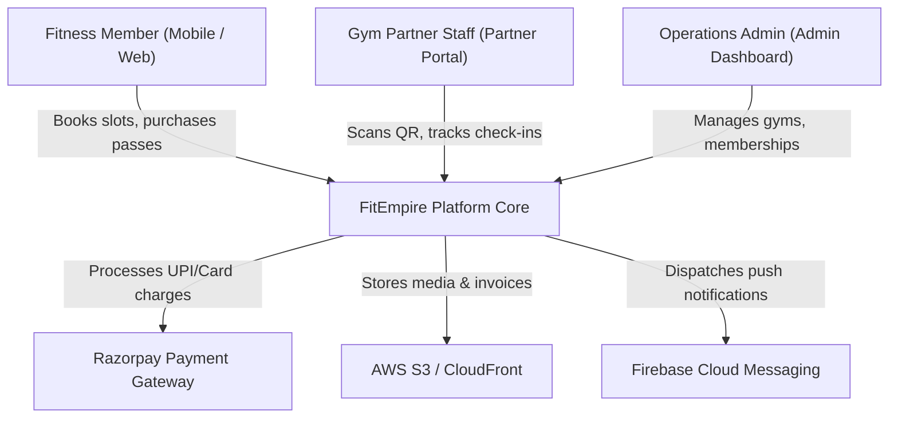
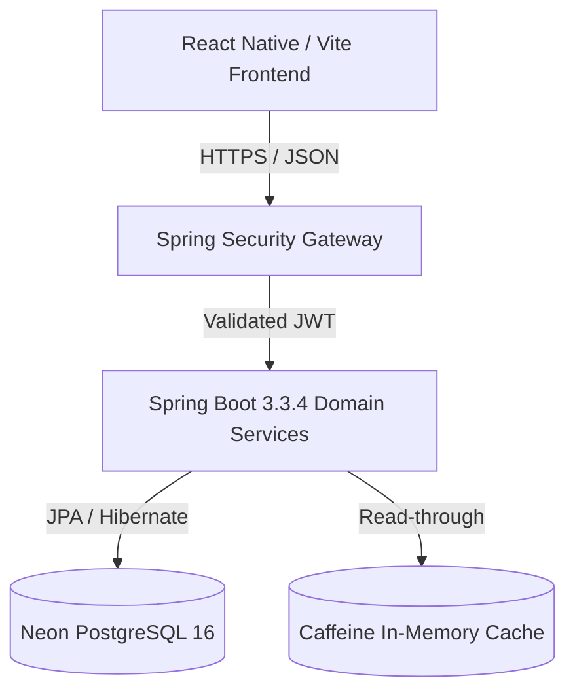

# FitEmpire C4 Architecture Specification

## 1. System Context Diagram

```mermaid
graph TD
    Member["Fitness Member (Mobile / Web)"]
    Partner["Gym Partner Staff (Partner Portal)"]
    Admin["Operations Admin (Admin Dashboard)"]

    FitEmpire["FitEmpire Platform Core"]
    Razorpay["Razorpay Payment Gateway"]
    AWS["AWS S3 / CloudFront"]
    FCM["Firebase Cloud Messaging"]

    Member -->|Books slots, purchases passes| FitEmpire
    Partner -->|Scans QR, tracks check-ins| FitEmpire
    Admin -->|Manages gyms, memberships| FitEmpire

    FitEmpire -->|Processes UPI/Card charges| Razorpay
    FitEmpire -->|Stores media & invoices| AWS
    FitEmpire -->|Dispatches push notifications| FCM
```

## 2. Container Diagram

```mermaid
graph TD
    Client["React Native / Vite Frontend"]
    Gateway["Spring Security Gateway"]
    Services["Spring Boot 3.3.4 Domain Services"]
    DB[("Neon PostgreSQL 16")]
    Cache[("Caffeine In-Memory Cache")]

    Client -->|HTTPS / JSON| Gateway
    Gateway -->|Validated JWT| Services
    Services -->|JPA / Hibernate| DB
    Services -->|Read-through| Cache
```
