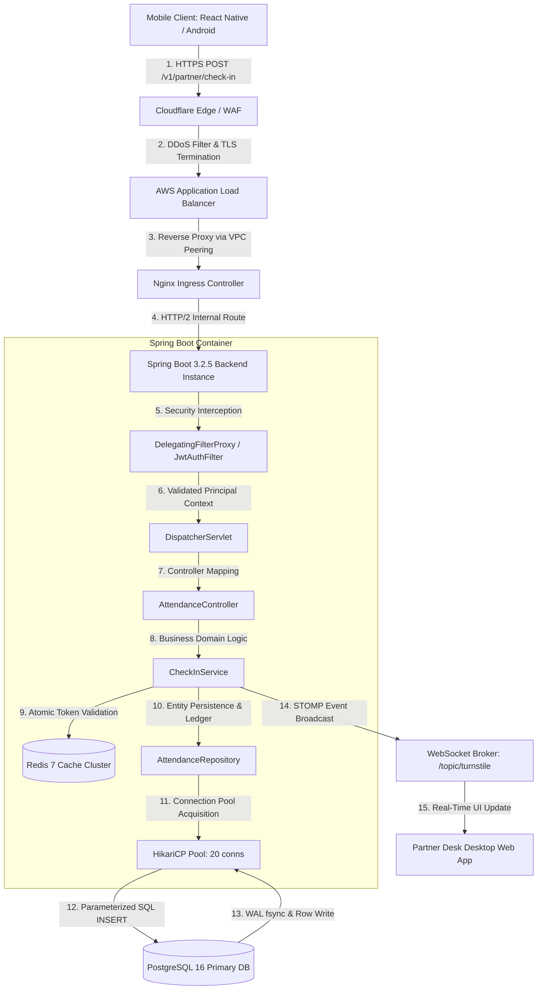

---

## 2. Beginner-to-Advanced Architectural Primer (Educational Foundation)

To ensure alignment across junior engineers, interns, and senior leads, this section deconstructs the core computer science and distributed systems principles governing FitEmpire.

### 2.1 The End-to-End Request-Response Lifecycle
When a user taps **"Check In"** on the FitEmpire Mobile App, the request traverses multiple physical and software layers before persisting data:



#### Step-by-Step Breakdown:
1. **Client DNS & TLS Handshake:** The mobile client queries Route 53 DNS for `api.fitempire.com`, resolving to Cloudflare Anycast IP addresses. An SSL/TLS 1.3 handshake negotiates cipher suites in 1 RTT (Round Trip Time).
2. **Cloudflare WAF:** Inspects incoming IP headers, enforces DDoS rate limiting, blocks known bot user-agents, and terminates edge TLS before forwarding traffic across AWS Direct Connect.
3. **AWS Application Load Balancer (ALB):** Distributes incoming traffic evenly across healthy Kubernetes worker nodes using a round-robin algorithm with target group health checks (`GET /actuator/health`).
4. **Spring Security Filter Chain:** 
   - `CorsFilter`: Rejects unauthorized web origins.
   - `JwtAuthenticationFilter`: Extracts `Authorization: Bearer <token>` from headers, cryptographically validates the HMAC-SHA256 signature using the server secret key, verifies expiration (`exp`), and populates the `SecurityContextHolder` with a `UserPrincipal`.
5. **DispatcherServlet & HandlerMapping:** Inspects the URI path `/v1/partner/check-in` and delegates request parsing to `AttendanceController.java`.
6. **Domain Service Execution & Transaction Boundary:** `CheckInService.java` is annotated with `@Transactional(isolation = Isolation.READ_COMMITTED)`. If any exception occurs (e.g. expired pass, duplicate scan), the entire transaction rolls back cleanly.
7. **Connection Pool & Relational Write:** HikariCP borrows an active TCP socket from its pool, sends the parameterized SQL statement to PostgreSQL 16, waits for the Write-Ahead Log (WAL) to flush to disk (`fsync`), and releases the connection back to the pool.

---

### 2.2 Client-Server Decoupling: REST vs GraphQL vs WebSockets

| Protocol | Transport | When FitEmpire Uses It | When FitEmpire Explicitly Rejects It |
|---|---|---|---|
| **REST (HTTP/JSON)** | HTTP/1.1 & HTTP/2 | Standard CRUD APIs (User profile, gym exploration, billing, pass freeze). Highly cacheable at edge CDNs via HTTP `ETag` and `Cache-Control` headers. | Real-time bi-directional messaging where low latency (<50ms) is required. |
| **STOMP over WebSocket** | Persistent Full-Duplex TCP | Turnstile desk live monitor. When a member scans their QR code at a turnstile barrier, the partner desk dashboard instantly updates without refreshing. | Generic catalog browsing or static file downloads (wastes persistent server socket memory). |
| **GraphQL** | Single-endpoint HTTP POST | *Rejected for FitEmpire.* While flexible for frontend queries, it introduces complex query-depth vulnerability risks (DDoS via recursive nesting), breaks standard HTTP caching, and complicates database query optimization. |
| **gRPC (HTTP/2 Protocol Buffers)** | Binary Framed TCP | Internal service-to-service communication between backend microservices and future async worker daemons. | Direct mobile client communication (requires heavy client runtime libraries and poor browser support). |

---

### 2.3 State Management & Authentication: JWTs vs Session Cookies

FitEmpire employs a **Hybrid Dual-Token Authentication Architecture**:
1. **Access Token (Short-Lived):** 
   - Format: Signed JSON Web Token (JWT), HMAC-SHA256.
   - Lifespan: **15 Minutes**.
   - Storage: Stored strictly in React Native / browser application memory (never in localStorage where XSS attacks can extract it).
   - Contents: Non-sensitive claims (`userId`, `email`, `role`, `corporateDomain`).
2. **Refresh Token (Long-Lived):**
   - Format: High-entropy cryptographically random UUIDv4 stored hashed in the `refresh_tokens` table.
   - Lifespan: **7 Days**.
   - Storage: Mobile clients store it inside the OS hardware secure keystore (Android Keystore / iOS Keychain via `expo-secure-store`). Web clients receive it as an **HttpOnly, Secure, SameSite=Strict** cookie, making it inaccessible to malicious JavaScript.
   - Automatic Token Rotation: Every time a refresh token is used, it is revoked and replaced with a new token. If an expired or already-revoked refresh token is presented, the system flags a breach and invalidates all active sessions for that user account.

---

### 2.4 Database Mechanics: Relational (ACID) vs NoSQL (BASE) & Connection Pooling Math

#### Why PostgreSQL 16 Beats NoSQL for FitEmpire:
Fitness memberships are financial contracts. If a member with 1 remaining class booking double-clicks the "Book Class" button simultaneously on two devices, a NoSQL eventual-consistency database (like MongoDB or DynamoDB) risks booking both classes, causing studio overcapacity. PostgreSQL guarantees strict **ACID** properties:
- **Atomicity:** The booking record creation and member wallet/credit deduction succeed together or fail together.
- **Consistency:** Database schema constraints (e.g. `CHECK (remaining_slots >= 0)`) prevent invalid state from ever entering the disk.
- **Isolation:** Transaction isolation levels prevent simultaneous transactions from reading intermediate, uncommitted states.
- **Durability:** Once committed, transactions are written to the Write-Ahead Log (WAL) on non-volatile SSD storage before acknowledging success.

#### The Mathematics of HikariCP Connection Pool Sizing:
A common beginner mistake is allocating 200–500 database connections. In reality, each PostgreSQL connection spawns an operating system process consuming ~10 MB of RAM. Excessive connections cause severe CPU thrashing due to OS context switching.

The formula dictated by PostgreSQL core architects and HikariCP maintainers is:
```text
Pool Size = (CPU Cores * 2) + Effective Spindle Count (Disk IO Channels)
```
For an AWS RDS `db.m6g.xlarge` instance (4 vCPUs, SSD EBS storage with 1 spindle channel):
```text
Pool Size = (4 * 2) + 1 = 9 connections (Optimal per backend pod)
```
With 3 backend application pods running, the total database connection footprint is `3 * 10 = 30 connections`, running with near-zero queue wait times and negligible context switching overhead.

---

### 2.5 Caching Deep-Dive: Strategies & Failure Modes

#### Cache-Aside Pattern (Implemented in FitEmpire):
1. Client requests gym details: `GET /v1/gyms/{gymId}`.
2. Backend checks Redis: `GET gym:cache:{gymId}`.
3. If Cache Hit: Return cached JSON immediately (~2ms).
4. If Cache Miss: Query PostgreSQL (~25ms), write result to Redis with a 1-hour TTL: `SETEX gym:cache:{gymId} 3600 <data>`, then return to client.

#### Caching Failure Modes & Engineering Defenses:
- **Cache Penetration:** Malicious users request non-existent IDs (`GET /v1/gyms/ffffffff-ffff-ffff-ffff-ffffffffffff`) forcing expensive database queries.  
  *Defense:* FitEmpire caches empty results with a short TTL (60s) and validates UUID format via regex before hitting the DB.
- **Cache Breakdown / Stampede:** A high-traffic key (e.g. Bangalore Gold's Gym timetable) expires, causing 500 concurrent requests to hit the database simultaneously.  
  *Defense:* FitEmpire utilizes distributed mutex locking via Redis (`SET key value NX PX 5000`) so only one thread recomputes the cache while others wait.
- **Cache Avalanche:** Thousands of keys are set with the exact same expiration time (e.g. at midnight), expiring simultaneously.  
  *Defense:* FitEmpire adds random jitter (`TTL = 3600 + rand(-300, 300)`) to spread out eviction times.
