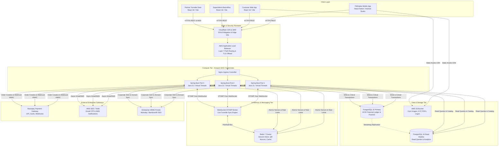

---

## 6. High-Level & Low-Level System Architecture (HLD & LLD)

### 6.1 Enterprise Distributed Architecture Diagram (C4 Container Level)

The following diagram illustrates the distributed architecture of FitEmpire, highlighting trust boundaries, caching tiers, database replication, and real-time messaging:

---

### 6.2 Core Software Design Patterns Applied in FitEmpire

To ensure maintainability, testability, and adherence to SOLID principles, the backend codebase implements the following Gang of Four (GoF) design patterns:

#### 1. Factory Pattern (`PaymentProviderFactory`)
- **Problem:** FitEmpire currently integrates Razorpay for the Indian market, but international expansion (UAE, Singapore) requires Stripe, while integration tests require a Mock Payment Provider.
- **Implementation:** An interface `PaymentProvider` exposes `createOrder()`, `verifyWebhook()`, and `refund()`. The `PaymentProviderFactory` instantiates the appropriate provider at runtime based on merchant region or configuration profile (`razorpay`, `stripe`, `mock`).

#### 2. Strategy Pattern (`MembershipPricingStrategy`)
- **Problem:** Membership pass pricing is dynamic. Retail users pay full price; corporate users receive company-subsidized rates (e.g. Google employees get 40% co-pay); college students receive 20% discounts; referrals apply instant credits.
- **Implementation:** A `PricingStrategy` interface defines `calculatePrice(User user, MembershipPlan plan)`. Concrete strategies (`RetailPricingStrategy`, `CorporateSubsidizedPricingStrategy`, `StudentPromoPricingStrategy`) are dynamically resolved at checkout without polluting controllers with nested `if-else` branches.

#### 3. Observer / Event-Driven Pattern (`Spring ApplicationEventPublisher`)
- **Problem:** When a member scans their turnstile pass, multiple secondary actions must occur: log attendance, push a live STOMP alert to the front desk, fire a push notification ("Welcome to Gold's Gym!"), and recalculate monthly streak badges. Executing all of this synchronously inside the check-in HTTP thread increases latency.
- **Implementation:** `CheckInService` completes the database check-in, then publishes a lightweight `TurnstileCheckInSuccessEvent`. Asynchronous event listeners (`@Async @EventListener`) handle push notifications, badge updates, and partner desk WebSocket broadcasts in background worker threads.

#### 4. Repository Pattern (`Spring Data JPA`)
- **Problem:** Direct SQL string concatenation in services introduces SQL injection risks, tight coupling to PostgreSQL dialects, and tedious object mapping.
- **Implementation:** Repositories extend `JpaRepository<T, ID>` and `JpaSpecificationExecutor<T>`, encapsulating database interactions behind clean Java interfaces.

#### 5. Interceptor / Decorator Pattern (`JwtAuthenticationFilter` & `TenantContextFilter`)
- **Problem:** Every HTTP request requires authentication, user context extraction, and multi-tenant scoping (ensuring gym staff cannot view records belonging to rival gyms).
- **Implementation:** A custom filter intercepts every request before reaching controllers, extracts the JWT claims, verifies the gym partner ID, and binds it to a `ThreadLocal` `SecurityContextHolder`. Controllers access the authenticated principal seamlessly via `@AuthenticationPrincipal UserPrincipal user`.
