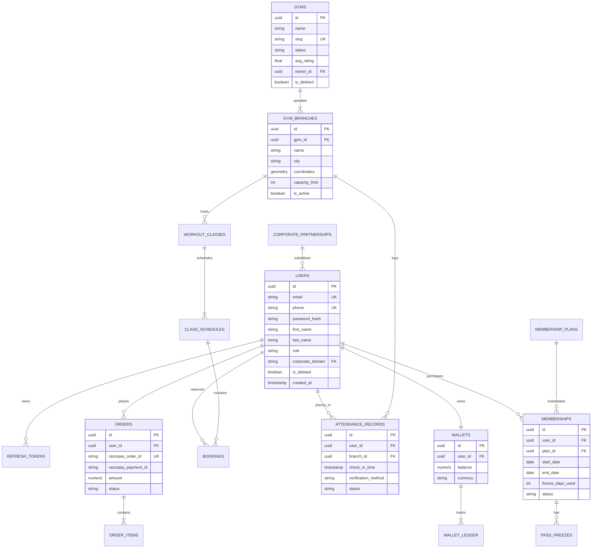

---

## 7. Exhaustive Relational Database Schema & Complete DDL (PostgreSQL 16)

### 7.1 Entity Relationship Diagram (ERD)



---

### 7.2 Production DDL SQL Scripts (PostgreSQL 16)

The following DDL provides the complete, production-ready schema including PostGIS spatial indexes, partitioning, and automated timestamp triggers:

```sql
-- ============================================================================
-- FitEmpire Production Database Schema DDL (PostgreSQL 16)
-- Target Scale: 1,000,000+ Users | 500+ Gyms | 72,000 Daily Check-Ins
-- ============================================================================

-- 1. Enable Required Extensions
CREATE EXTENSION IF NOT EXISTS "uuid-ossp";
CREATE EXTENSION IF NOT EXISTS "postgis";
CREATE EXTENSION IF NOT EXISTS "pgcrypto";

-- 2. Custom Enumerated Types
CREATE TYPE user_role_enum AS ENUM (
    'ROLE_USER', 
    'ROLE_TRAINER', 
    'ROLE_PARTNER_STAFF', 
    'ROLE_PARTNER_ADMIN', 
    'ROLE_SUPER_ADMIN'
);

CREATE TYPE membership_status_enum AS ENUM (
    'PENDING_PAYMENT', 
    'ACTIVE', 
    'FROZEN', 
    'EXPIRED', 
    'CANCELLED'
);

CREATE TYPE booking_status_enum AS ENUM (
    'CONFIRMED', 
    'ATTENDED', 
    'CANCELLED_BY_USER', 
    'CANCELLED_BY_GYM', 
    'NO_SHOW'
);

CREATE TYPE payment_status_enum AS ENUM (
    'CREATED', 
    'AUTHORIZED', 
    'CAPTURED', 
    'FAILED', 
    'REFUNDED'
);

CREATE TYPE turnstile_status_enum AS ENUM (
    'APPROVED', 
    'REJECTED_EXPIRED', 
    'REJECTED_DUPLICATE', 
    'REJECTED_INVALID_BRANCH', 
    'OVERRIDE_APPROVED'
);

-- ============================================================================
-- 3. Core Identity & Enterprise Corporate Tables
-- ============================================================================

CREATE TABLE corporate_partnerships (
    id UUID PRIMARY KEY DEFAULT gen_random_uuid(),
    company_name VARCHAR(150) NOT NULL,
    work_email_domain VARCHAR(100) NOT NULL UNIQUE, -- e.g. 'google.com'
    subsidy_percentage NUMERIC(5, 2) NOT NULL DEFAULT 0.00 CHECK (subsidy_percentage >= 0 AND subsidy_percentage <= 100),
    max_employees_limit INT NOT NULL DEFAULT 1000,
    current_enrolled_count INT NOT NULL DEFAULT 0,
    monthly_budget_cap NUMERIC(12, 2) NOT NULL DEFAULT 1000000.00,
    hr_contact_email VARCHAR(255) NOT NULL,
    is_active BOOLEAN NOT NULL DEFAULT true,
    created_at TIMESTAMPTZ NOT NULL DEFAULT CURRENT_TIMESTAMP,
    updated_at TIMESTAMPTZ NOT NULL DEFAULT CURRENT_TIMESTAMP
);

CREATE TABLE users (
    id UUID PRIMARY KEY DEFAULT gen_random_uuid(),
    email VARCHAR(255) NOT NULL,
    phone VARCHAR(20) NOT NULL,
    password_hash VARCHAR(255) NOT NULL,
    first_name VARCHAR(100) NOT NULL,
    last_name VARCHAR(100),
    role user_role_enum NOT NULL DEFAULT 'ROLE_USER',
    avatar_url TEXT,
    bio_metrics JSONB DEFAULT '{}'::jsonb,
    is_active BOOLEAN NOT NULL DEFAULT true,
    is_email_verified BOOLEAN NOT NULL DEFAULT false,
    is_phone_verified BOOLEAN NOT NULL DEFAULT false,
    corporate_partnership_id UUID REFERENCES corporate_partnerships(id) ON DELETE SET NULL,
    is_deleted BOOLEAN NOT NULL DEFAULT false,
    created_at TIMESTAMPTZ NOT NULL DEFAULT CURRENT_TIMESTAMP,
    updated_at TIMESTAMPTZ NOT NULL DEFAULT CURRENT_TIMESTAMP,
    deleted_at TIMESTAMPTZ
);

-- Partial Unique Indexes allowing re-registration after soft-deletion
CREATE UNIQUE INDEX idx_users_active_email ON users(email) WHERE is_deleted = false;
CREATE UNIQUE INDEX idx_users_active_phone ON users(phone) WHERE is_deleted = false;
CREATE INDEX idx_users_corporate_id ON users(corporate_partnership_id);

CREATE TABLE refresh_tokens (
    id UUID PRIMARY KEY DEFAULT gen_random_uuid(),
    user_id UUID NOT NULL REFERENCES users(id) ON DELETE CASCADE,
    token_hash VARCHAR(255) NOT NULL UNIQUE,
    expires_at TIMESTAMPTZ NOT NULL,
    is_revoked BOOLEAN NOT NULL DEFAULT false,
    created_at TIMESTAMPTZ NOT NULL DEFAULT CURRENT_TIMESTAMP,
    replaced_by_token_id UUID REFERENCES refresh_tokens(id) ON DELETE SET NULL
);

CREATE INDEX idx_refresh_tokens_user_lookup ON refresh_tokens(user_id, is_revoked);

-- ============================================================================
-- 4. Gym Network, Facilities & PostGIS Spatial Branches
-- ============================================================================

CREATE TABLE gyms (
    id UUID PRIMARY KEY DEFAULT gen_random_uuid(),
    name VARCHAR(200) NOT NULL,
    slug VARCHAR(200) NOT NULL UNIQUE,
    brand_logo_url TEXT,
    description TEXT,
    status VARCHAR(30) NOT NULL DEFAULT 'PENDING_APPROVAL', -- APPROVED, SUSPENDED
    featured BOOLEAN NOT NULL DEFAULT false,
    avg_rating NUMERIC(3, 2) NOT NULL DEFAULT 5.00,
    total_reviews_count INT NOT NULL DEFAULT 0,
    owner_id UUID NOT NULL REFERENCES users(id) ON DELETE RESTRICT,
    is_deleted BOOLEAN NOT NULL DEFAULT false,
    created_at TIMESTAMPTZ NOT NULL DEFAULT CURRENT_TIMESTAMP,
    updated_at TIMESTAMPTZ NOT NULL DEFAULT CURRENT_TIMESTAMP
);

CREATE TABLE gym_branches (
    id UUID PRIMARY KEY DEFAULT gen_random_uuid(),
    gym_id UUID NOT NULL REFERENCES gyms(id) ON DELETE CASCADE,
    branch_name VARCHAR(150) NOT NULL,
    address_line TEXT NOT NULL,
    city VARCHAR(100) NOT NULL,
    state VARCHAR(100) NOT NULL,
    postal_code VARCHAR(20) NOT NULL,
    -- PostGIS Point: Longitude, Latitude (WGS 84 SRID 4326)
    coordinates GEOMETRY(Point, 4326) NOT NULL,
    turnstile_device_serial VARCHAR(100) UNIQUE,
    turnstile_secret_token VARCHAR(255),
    capacity_limit INT NOT NULL DEFAULT 100,
    current_occupancy INT NOT NULL DEFAULT 0,
    is_active BOOLEAN NOT NULL DEFAULT true,
    created_at TIMESTAMPTZ NOT NULL DEFAULT CURRENT_TIMESTAMP,
    updated_at TIMESTAMPTZ NOT NULL DEFAULT CURRENT_TIMESTAMP
);

-- PostGIS GiST Spatial Index for sub-millisecond radius search
CREATE INDEX idx_branches_spatial_gis ON gym_branches USING GIST(coordinates);
CREATE INDEX idx_branches_city_status ON gym_branches(city, is_active);

CREATE TABLE amenities (
    id UUID PRIMARY KEY DEFAULT gen_random_uuid(),
    name VARCHAR(100) NOT NULL UNIQUE,
    slug VARCHAR(100) NOT NULL UNIQUE,
    icon_name VARCHAR(50) NOT NULL
);

CREATE TABLE branch_amenities (
    branch_id UUID NOT NULL REFERENCES gym_branches(id) ON DELETE CASCADE,
    amenity_id UUID NOT NULL REFERENCES amenities(id) ON DELETE CASCADE,
    PRIMARY KEY (branch_id, amenity_id)
);

-- ============================================================================
-- 5. Membership Products, Passes & Subscriptions
-- ============================================================================

CREATE TABLE membership_plans (
    id UUID PRIMARY KEY DEFAULT gen_random_uuid(),
    title VARCHAR(100) NOT NULL, -- 'Silver', 'Gold', 'Platinum'
    tier VARCHAR(50) NOT NULL UNIQUE,
    base_price NUMERIC(10, 2) NOT NULL,
    duration_days INT NOT NULL, -- 30, 90, 365
    max_freeze_days_allowed INT NOT NULL DEFAULT 15,
    max_daily_checkins INT NOT NULL DEFAULT 1,
    amenities_tier_access VARCHAR(50) NOT NULL DEFAULT 'STANDARD',
    is_active BOOLEAN NOT NULL DEFAULT true,
    created_at TIMESTAMPTZ NOT NULL DEFAULT CURRENT_TIMESTAMP
);

CREATE TABLE memberships (
    id UUID PRIMARY KEY DEFAULT gen_random_uuid(),
    user_id UUID NOT NULL REFERENCES users(id) ON DELETE RESTRICT,
    plan_id UUID NOT NULL REFERENCES membership_plans(id) ON DELETE RESTRICT,
    status membership_status_enum NOT NULL DEFAULT 'PENDING_PAYMENT',
    start_date DATE NOT NULL,
    end_date DATE NOT NULL,
    original_end_date DATE NOT NULL,
    freeze_days_accumulated INT NOT NULL DEFAULT 0,
    total_checkins_count INT NOT NULL DEFAULT 0,
    created_at TIMESTAMPTZ NOT NULL DEFAULT CURRENT_TIMESTAMP,
    updated_at TIMESTAMPTZ NOT NULL DEFAULT CURRENT_TIMESTAMP
);

CREATE INDEX idx_memberships_user_status ON memberships(user_id, status);
CREATE INDEX idx_memberships_expiry ON memberships(end_date) WHERE status = 'ACTIVE';

CREATE TABLE pass_freezes (
    id UUID PRIMARY KEY DEFAULT gen_random_uuid(),
    membership_id UUID NOT NULL REFERENCES memberships(id) ON DELETE CASCADE,
    freeze_start_date DATE NOT NULL,
    freeze_end_date DATE NOT NULL,
    total_freeze_days INT NOT NULL,
    freeze_reason VARCHAR(255),
    is_active BOOLEAN NOT NULL DEFAULT true,
    created_at TIMESTAMPTZ NOT NULL DEFAULT CURRENT_TIMESTAMP
);

-- ============================================================================
-- 6. Class Schedules, Bookings & Concurrency Constraints
-- ============================================================================

CREATE TABLE workout_classes (
    id UUID PRIMARY KEY DEFAULT gen_random_uuid(),
    branch_id UUID NOT NULL REFERENCES gym_branches(id) ON DELETE CASCADE,
    title VARCHAR(150) NOT NULL, -- e.g. 'HIIT & Core Fusion'
    category VARCHAR(50) NOT NULL, -- 'YOGA', 'CROSSFIT', 'ZUMBA', 'PILATES'
    trainer_name VARCHAR(100) NOT NULL,
    max_capacity INT NOT NULL CHECK (max_capacity > 0),
    is_active BOOLEAN NOT NULL DEFAULT true,
    created_at TIMESTAMPTZ NOT NULL DEFAULT CURRENT_TIMESTAMP
);

CREATE TABLE class_schedules (
    id UUID PRIMARY KEY DEFAULT gen_random_uuid(),
    class_id UUID NOT NULL REFERENCES workout_classes(id) ON DELETE CASCADE,
    start_time TIMESTAMPTZ NOT NULL,
    end_time TIMESTAMPTZ NOT NULL,
    available_slots INT NOT NULL,
    version INT NOT NULL DEFAULT 0, -- For Optimistic Locking
    CONSTRAINT chk_available_slots_non_negative CHECK (available_slots >= 0),
    CONSTRAINT chk_time_window CHECK (end_time > start_time)
);

CREATE INDEX idx_schedules_start_time ON class_schedules(start_time);

CREATE TABLE class_bookings (
    id UUID PRIMARY KEY DEFAULT gen_random_uuid(),
    schedule_id UUID NOT NULL REFERENCES class_schedules(id) ON DELETE RESTRICT,
    user_id UUID NOT NULL REFERENCES users(id) ON DELETE RESTRICT,
    status booking_status_enum NOT NULL DEFAULT 'CONFIRMED',
    booked_at TIMESTAMPTZ NOT NULL DEFAULT CURRENT_TIMESTAMP,
    cancelled_at TIMESTAMPTZ,
    cancellation_reason VARCHAR(255),
    -- Prevent duplicate active bookings for the same class schedule by the same user
    CONSTRAINT uq_user_schedule_booking UNIQUE (schedule_id, user_id)
);

CREATE INDEX idx_bookings_user_lookup ON class_bookings(user_id, status);

-- ============================================================================
-- 7. High-Volume Partitioned Turnstile Attendance Log
-- ============================================================================

CREATE TABLE attendance_records (
    id UUID DEFAULT gen_random_uuid(),
    user_id UUID NOT NULL REFERENCES users(id) ON DELETE RESTRICT,
    branch_id UUID NOT NULL REFERENCES gym_branches(id) ON DELETE RESTRICT,
    membership_id UUID NOT NULL REFERENCES memberships(id) ON DELETE RESTRICT,
    check_in_time TIMESTAMPTZ NOT NULL DEFAULT CURRENT_TIMESTAMP,
    check_out_time TIMESTAMPTZ,
    verification_method VARCHAR(50) NOT NULL DEFAULT 'DYNAMIC_QR_NONCE',
    status turnstile_status_enum NOT NULL DEFAULT 'APPROVED',
    rejection_reason VARCHAR(255),
    scanner_staff_id UUID REFERENCES users(id) ON DELETE SET NULL,
    created_at TIMESTAMPTZ NOT NULL DEFAULT CURRENT_TIMESTAMP,
    PRIMARY KEY (id, check_in_time)
) PARTITION BY RANGE (check_in_time);

-- Monthly Partitions for Peak Performance and Clean Data Archival
CREATE TABLE attendance_records_2026_08 PARTITION OF attendance_records
    FOR VALUES FROM ('2026-08-01 00:00:00+00') TO ('2026-09-01 00:00:00+00');

CREATE TABLE attendance_records_2026_09 PARTITION OF attendance_records
    FOR VALUES FROM ('2026-09-01 00:00:00+00') TO ('2026-10-01 00:00:00+00');

CREATE TABLE attendance_records_2026_10 PARTITION OF attendance_records
    FOR VALUES FROM ('2026-10-01 00:00:00+00') TO ('2026-11-01 00:00:00+00');

CREATE INDEX idx_attendance_user_time ON attendance_records(user_id, check_in_time DESC);
CREATE INDEX idx_attendance_branch_time ON attendance_records(branch_id, check_in_time DESC);

-- ============================================================================
-- 8. Financial Ledger, Wallets & Razorpay Orders
-- ============================================================================

CREATE TABLE wallets (
    id UUID PRIMARY KEY DEFAULT gen_random_uuid(),
    user_id UUID NOT NULL UNIQUE REFERENCES users(id) ON DELETE CASCADE,
    balance NUMERIC(12, 2) NOT NULL DEFAULT 0.00 CHECK (balance >= 0.00),
    currency VARCHAR(10) NOT NULL DEFAULT 'INR',
    version INT NOT NULL DEFAULT 0,
    updated_at TIMESTAMPTZ NOT NULL DEFAULT CURRENT_TIMESTAMP
);

CREATE TABLE wallet_ledger (
    id UUID PRIMARY KEY DEFAULT gen_random_uuid(),
    wallet_id UUID NOT NULL REFERENCES wallets(id) ON DELETE RESTRICT,
    transaction_type VARCHAR(30) NOT NULL, -- 'CREDIT_PURCHASE', 'DEBIT_BOOKING', 'REFUND'
    amount NUMERIC(12, 2) NOT NULL CHECK (amount > 0.00),
    balance_after NUMERIC(12, 2) NOT NULL,
    reference_entity_type VARCHAR(50) NOT NULL, -- 'ORDER', 'CLASS_BOOKING', 'REFERRAL'
    reference_entity_id UUID NOT NULL,
    description VARCHAR(255) NOT NULL,
    created_at TIMESTAMPTZ NOT NULL DEFAULT CURRENT_TIMESTAMP
);

CREATE INDEX idx_wallet_ledger_lookup ON wallet_ledger(wallet_id, created_at DESC);

CREATE TABLE orders (
    id UUID PRIMARY KEY DEFAULT gen_random_uuid(),
    user_id UUID NOT NULL REFERENCES users(id) ON DELETE RESTRICT,
    plan_id UUID NOT NULL REFERENCES membership_plans(id) ON DELETE RESTRICT,
    razorpay_order_id VARCHAR(100) NOT NULL UNIQUE,
    razorpay_payment_id VARCHAR(100) UNIQUE,
    razorpay_signature VARCHAR(255),
    gross_amount NUMERIC(10, 2) NOT NULL,
    corporate_subsidy_amount NUMERIC(10, 2) NOT NULL DEFAULT 0.00,
    net_payable_amount NUMERIC(10, 2) NOT NULL,
    currency VARCHAR(10) NOT NULL DEFAULT 'INR',
    status payment_status_enum NOT NULL DEFAULT 'CREATED',
    idempotency_key VARCHAR(100) UNIQUE,
    created_at TIMESTAMPTZ NOT NULL DEFAULT CURRENT_TIMESTAMP,
    updated_at TIMESTAMPTZ NOT NULL DEFAULT CURRENT_TIMESTAMP
);

CREATE INDEX idx_orders_user_status ON orders(user_id, status);

-- ============================================================================
-- 9. Automated Updated_At Trigger Function
-- ============================================================================

CREATE OR REPLACE FUNCTION trigger_set_timestamp()
RETURNS TRIGGER AS $$
BEGIN
  NEW.updated_at = NOW();
  RETURN NEW;
END;
$$ LANGUAGE plpgsql;

CREATE TRIGGER set_timestamp_users
BEFORE UPDATE ON users
FOR EACH ROW EXECUTE PROCEDURE trigger_set_timestamp();

CREATE TRIGGER set_timestamp_gyms
BEFORE UPDATE ON gyms
FOR EACH ROW EXECUTE PROCEDURE trigger_set_timestamp();

CREATE TRIGGER set_timestamp_memberships
BEFORE UPDATE ON memberships
FOR EACH ROW EXECUTE PROCEDURE trigger_set_timestamp();

CREATE TRIGGER set_timestamp_orders
BEFORE UPDATE ON orders
FOR EACH ROW EXECUTE PROCEDURE trigger_set_timestamp();
```
