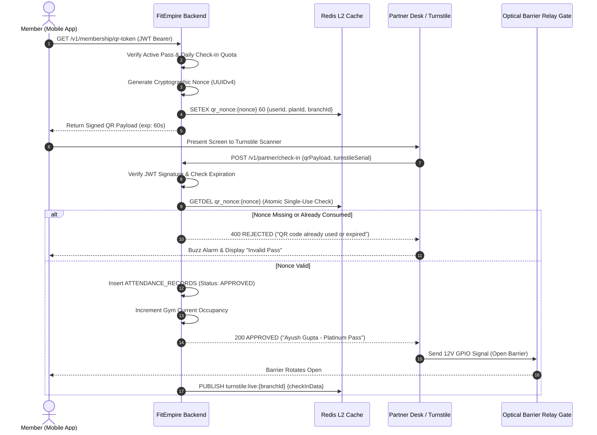
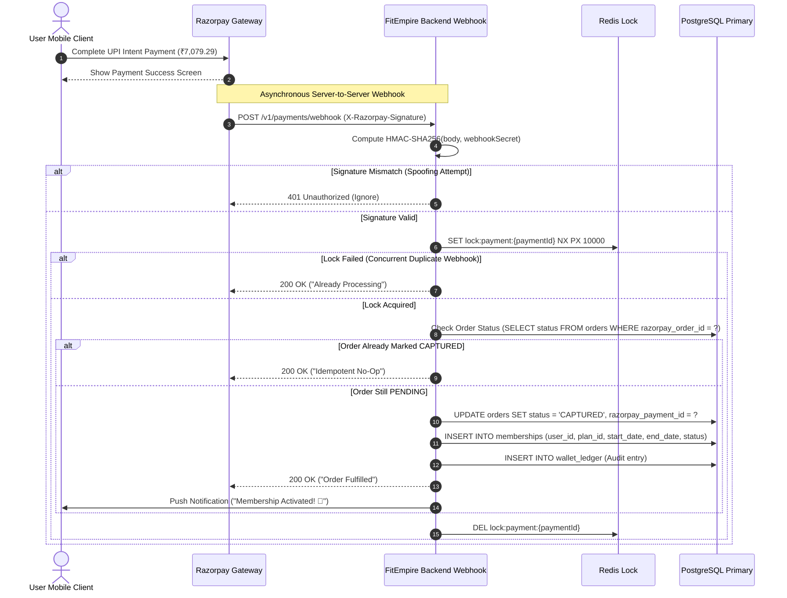
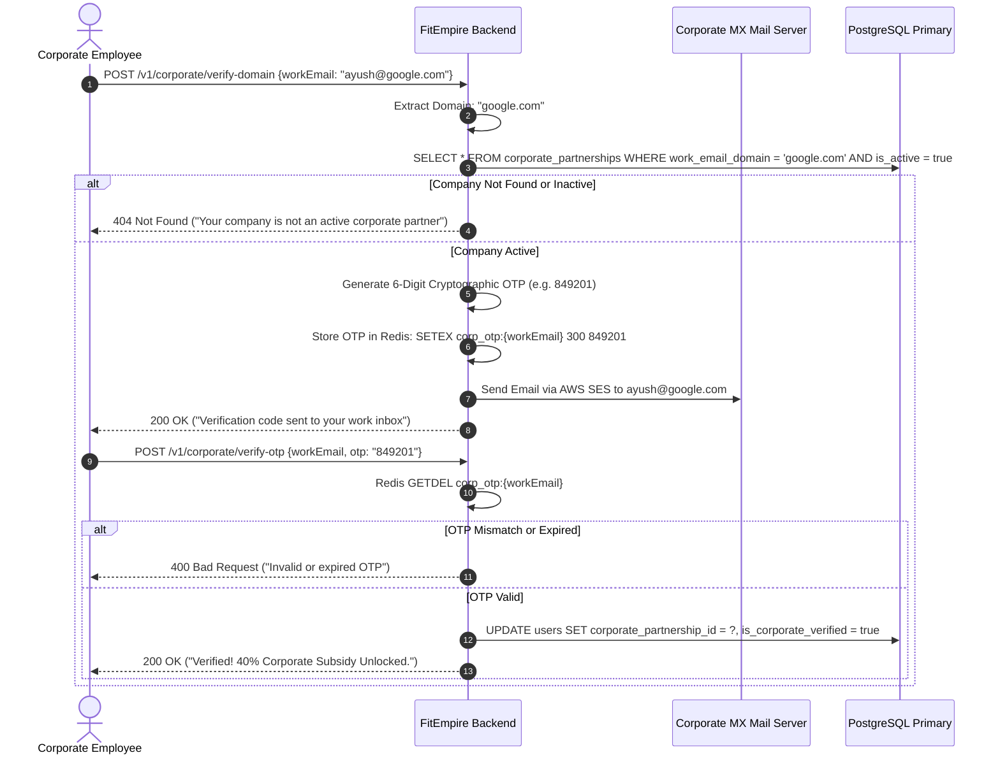
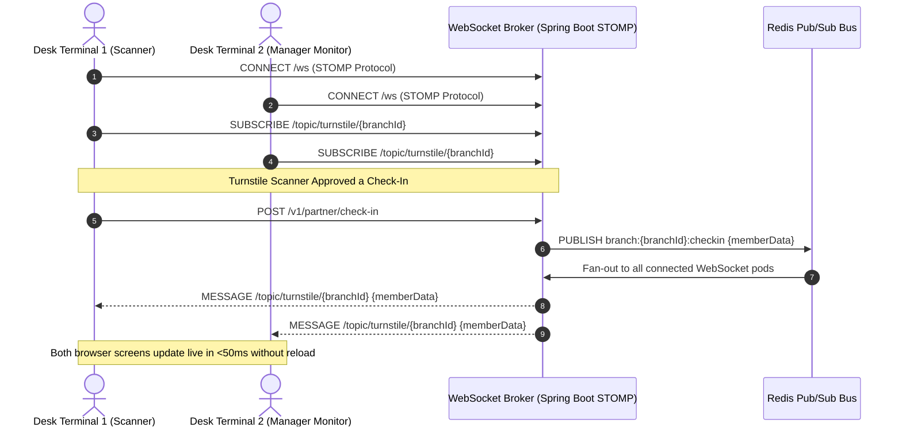

---

## 9. Core Business Workflows & Sequence Diagrams

### 9.1 Dynamic Optical Turnstile Check-In (60-Second Single-Use Nonce)
This workflow mitigates screenshot pass sharing (Issue FE-152) and guarantees sub-100ms barrier opening:

---

### 9.2 Razorpay Webhook Payment Capture & Membership Provisioning
Guarantees zero lost orders even if the user closes their browser or loses connectivity after funds are deducted:

---

### 9.3 Corporate Work Email Verification & Subsidy Allocation Flow
Eliminates the vulnerability in `EcosystemController.java` (SEC-001) by enforcing strict domain verification and 6-digit email OTPs:

---

### 9.4 Multi-Terminal Real-Time Attendance Synchronization (STOMP over WebSocket)

