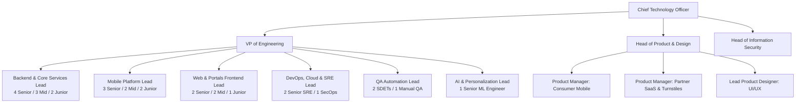

---

## 15. Department-by-Department Engineering Blueprint, Org Structure & Hiring Plan

Building and maintaining a high-throughput enterprise marketplace requires specialized, cross-functional engineering teams. Below is the organizational blueprint for FitEmpire:

---

### 15.1 Department Mandates, Technology Stacks & Key Performance Indicators (KPIs)

#### 1. Backend Engineering Department
- **Primary Mission:** Maintain high-throughput core APIs, guarantee zero-loss financial transactions, and secure business domain logic.
- **Tech Stack:** Java 21 LTS, Spring Boot 3.2.5, Spring Security, Spring Data JPA, PostgreSQL 16, Redis 7, Flyway, Resilience4j.
- **Key Department KPIs:**
  - Zero financial discrepancies in daily reconciliation ledgers.
  - API p99 latency < 150ms for all turnstile endpoints.
  - 100% test coverage for payment, booking, and wallet services.

#### 2. Mobile Engineering Department
- **Primary Mission:** Deliver a 60 FPS, crash-free, intuitive mobile app experience for retail members across Android and iOS.
- **Tech Stack:** React Native 0.74, Expo SDK 51, Android Studio Native (Gradle, ProGuard, JNI), TypeScript, Jest, React Native Testing Library.
- **Key Department KPIs:**
  - Google Play & Apple App Store crash-free sessions > 99.8%.
  - App cold launch time < 1.8 seconds on mid-tier Android devices.
  - Release APK size < 35 MB through ABI splitting.

#### 3. Web & Frontend Engineering Department
- **Primary Mission:** Build lightning-fast, real-time administrative and operational portals for partner gym desks and internal business ops.
- **Tech Stack:** React 18, Vite, TypeScript, Tailwind CSS, Lucide Icons, STOMP/SockJS WebSocket client.
- **Key Department KPIs:**
  - Zero browser tab crashes during 12-hour continuous reception desk operation.
  - Live turnstile feed update latency < 50ms over WebSocket.
  - First Contentful Paint (FCP) < 0.8s on customer landing page.

#### 4. DevOps, Cloud & Site Reliability Engineering (SRE) Department
- **Primary Mission:** Maintain 99.95% system availability, automate infrastructure provisioning, and guarantee disaster recovery SLAs.
- **Tech Stack:** AWS (EKS, RDS, ElastiCache, S3, ALB, Route 53), Docker, Terraform, Kubernetes, Helm, GitHub Actions, Prometheus, Grafana, OpenSearch.
- **Key Department KPIs:**
  - Total unplanned monthly downtime < 21.6 minutes (99.95% availability).
  - Continuous Delivery: Zero-downtime Blue/Green deployments in < 8 minutes.
  - Quarterly Disaster Recovery drill execution with RTO < 60s and RPO = 0s.

#### 5. QA & Quality Engineering Department
- **Primary Mission:** Prevent regressions across all releases via automated continuous integration test gates.
- **Tech Stack:** Playwright (Web E2E), Appium (Mobile Native Automation), k6 (Distributed Load & Stress Testing), Postman/Newman.
- **Key Department KPIs:**
  - Automated test pass rate > 98% on CI pull request builds.
  - Zero P0/P1 production regressions escaping to public app releases.
  - Bi-weekly automated 5x peak load tests (750 QPS simulation) passing with zero errors.

#### 6. AI & Personalization Engineering Department
- **Primary Mission:** Drive member retention and engagement through personalized workout recommendations (FitCoach) and smart gym matching.
- **Tech Stack:** Python 3.11, PyTorch, LangChain, Pinecone / pgvector, FastAPI microservice.
- **Key Department KPIs:**
  - Daily active engagement with AI FitCoach recommendations > 35%.
  - Recommendation model inference latency < 250ms.
