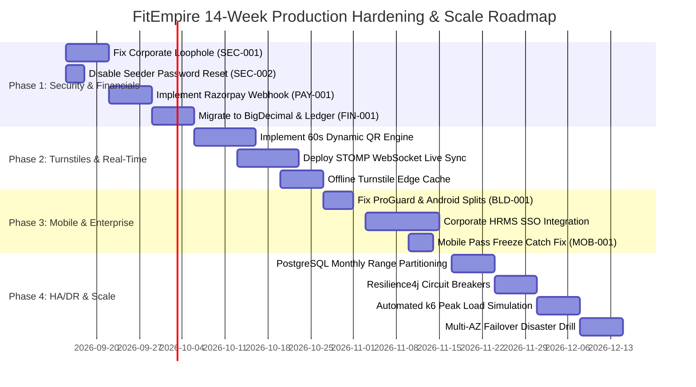

---

## 16. Prioritized 4-Phase Execution Roadmap

To transition FitEmpire from its current state to an enterprise-grade platform capable of serving 1,000,000 users, execution is structured into four sequential, battle-tested phases:

---

### Phase 1: Security Hardening & Zero-Loss Financial Stabilization (Weeks 1–3)
- **Primary Goal:** Seal revenue leaks, secure administrative credentials, and guarantee payment fulfillment.
- **Key Deliverables:**
  1. Patch `EcosystemController.java` corporate subsidy verification (SEC-001): Enforce `@google.com` domain extraction and 6-digit email OTP verification.
  2. Guard `DatabaseSeeder.java` (SEC-002): Restrict admin seeding behind `@Profile("!prod")` and avoid overwriting existing credentials.
  3. Deploy `RazorpayWebhookController.java` (PAY-001): Cryptographic HMAC signature verification and idempotent membership activation.
  4. Refactor wallet accounting to `BigDecimal` with double-entry ledger auditing (FIN-001).
- **Definition of Done:** Zero untracked transactions during financial simulation tests; successful automated penetration testing on auth routes.

---

### Phase 2: Hardware-Grade Turnstile Reliability & Real-Time Sync (Weeks 4–6)
- **Primary Goal:** Prevent pass sharing fraud and provide instant, synchronized front-desk visibility.
- **Key Deliverables:**
  1. Deploy Dynamic 60-Second QR Nonce engine backed by Redis atomic `GETDEL`.
  2. Implement Spring Boot STOMP WebSocket broker with Redis Pub/Sub backplane.
  3. Replace local state in `AttendancePage.tsx` with `useLiveTurnstileFeed` real-time hook.
  4. Build offline SQLite fallback verification on turnstile barrier controller hardware.
- **Definition of Done:** Turnstile barrier responds in <100ms; duplicate screenshot scans rejected 100% of the time.

---

### Phase 3: Mobile Native Polish & Corporate Enterprise Expansion (Weeks 7–10)
- **Primary Goal:** Guarantee flawless native Android builds and unlock high-margin B2B corporate revenue.
- **Key Deliverables:**
  1. Configure Android ABI splitting in `build.gradle` (reducing APK size to 35MB).
  2. Add missing Razorpay ProGuard rules in `proguard-rules.pro` to prevent release checkout crashes.
  3. Fix false-positive pass freeze alert in `membership.tsx` (MOB-001).
  4. Build Corporate HR Admin Portal for employee roster uploading and automated monthly tax invoicing.
- **Definition of Done:** Zero crashes on release APK checkout; corporate batch upload processes 5,000 employees in <10 seconds.

---

### Phase 4: Production HA/DR Cloud Infrastructure & Scale Hardening (Weeks 11–14)
- **Primary Goal:** Validate fault tolerance, high availability, and 99.95% system uptime under peak load.
- **Key Deliverables:**
  1. Partition `attendance_records` table by monthly date range in PostgreSQL 16.
  2. Configure Resilience4j circuit breakers on all outbound network integrations.
  3. Deploy Prometheus alertmanager rules for turnstile latency, connection pool saturation, and error rates.
  4. Conduct live Chaos Engineering drill: kill primary PostgreSQL node in AWS ap-south-1a and verify automatic DNS failover to ap-south-1b standby within 60 seconds with zero data loss.
  5. Execute distributed k6 load test simulating 750 QPS (5x peak volume) across 60,000 virtual users.
- **Definition of Done:** 750 QPS sustained for 30 minutes with p99 latency < 200ms and zero HTTP 5xx errors.
